# [📈 Live Status](https://searxng.github.io/searx-instances-uptime): <!--live status--> **🟧 Partial outage**

This repository contains the open-source uptime monitor and status page for [SearXNG](https://searxng.org), powered by [Upptime](https://github.com/upptime/upptime).

With [Upptime](https://upptime.js.org), you can get your own unlimited and free uptime monitor and status page, powered entirely by a GitHub repository. We use [Issues](https://github.com/searxng/searx-instances-uptime/issues) as incident reports, [Actions](https://github.com/searxng/searx-instances-uptime/actions) as uptime monitors, and [Pages](https://searxng.github.io/searx-instances-uptime) for the status page.

<!--start: status pages-->
<!-- This summary is generated by Upptime (https://github.com/upptime/upptime) -->
<!-- Do not edit this manually, your changes will be overwritten -->
<!-- prettier-ignore -->
| URL | Status | History | Response Time | Uptime |
| --- | ------ | ------- | ------------- | ------ |
|  [searx.space](https://searx.space) | 🟩 Up | [searx-space.yml](https://github.com/searxng/searx-instances-uptime/commits/HEAD/history/searx-space.yml) | 

 824ms
     
 | 

<a href="https://uptime.searxng.org/history/searx-space">100.00%</a>
    

|  [baresearch.org](https://baresearch.org) | 🟩 Up | [baresearch-org.yml](https://github.com/searxng/searx-instances-uptime/commits/HEAD/history/baresearch-org.yml) | 

 915ms
     
 | 

<a href="https://uptime.searxng.org/history/baresearch-org">100.00%</a>
    

|  [copp.gg](https://copp.gg) | 🟩 Up | [copp-gg.yml](https://github.com/searxng/searx-instances-uptime/commits/HEAD/history/copp-gg.yml) | 

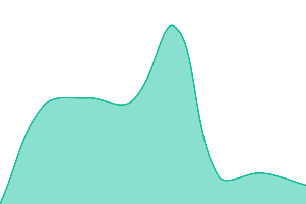 249ms
     
 | 

<a href="https://uptime.searxng.org/history/copp-gg">58.75%</a>
    

|  [etsi.me](https://etsi.me) | 🟩 Up | [etsi-me.yml](https://github.com/searxng/searx-instances-uptime/commits/HEAD/history/etsi-me.yml) | 

 413ms
     
 | 

<a href="https://uptime.searxng.org/history/etsi-me">100.00%</a>
    

|  [find.xenorio.xyz](https://find.xenorio.xyz) | 🟩 Up | [find-xenorio-xyz.yml](https://github.com/searxng/searx-instances-uptime/commits/HEAD/history/find-xenorio-xyz.yml) | 

 529ms
     
 | 

<a href="https://uptime.searxng.org/history/find-xenorio-xyz">99.23%</a>
    

|  [grep.vim.wtf](https://grep.vim.wtf) | 🟩 Up | [grep-vim-wtf.yml](https://github.com/searxng/searx-instances-uptime/commits/HEAD/history/grep-vim-wtf.yml) | 

 606ms
     
 | 

<a href="https://uptime.searxng.org/history/grep-vim-wtf">100.00%</a>
    

|  [kantan.cat](https://kantan.cat) | 🟩 Up | [kantan-cat.yml](https://github.com/searxng/searx-instances-uptime/commits/HEAD/history/kantan-cat.yml) | 

 604ms
     
 | 

<a href="https://uptime.searxng.org/history/kantan-cat">99.59%</a>
    

|  [o5.gg](https://o5.gg) | 🟩 Up | [o5-gg.yml](https://github.com/searxng/searx-instances-uptime/commits/HEAD/history/o5-gg.yml) | 

 582ms
     
 | 

<a href="https://uptime.searxng.org/history/o5-gg">100.00%</a>
    

|  [ooglester.com](https://ooglester.com) | 🟩 Up | [ooglester-com.yml](https://github.com/searxng/searx-instances-uptime/commits/HEAD/history/ooglester-com.yml) | 

 193ms
     
 | 

<a href="https://uptime.searxng.org/history/ooglester-com">100.00%</a>
    

|  [opnxng.com](https://opnxng.com) | 🟩 Up | [opnxng-com.yml](https://github.com/searxng/searx-instances-uptime/commits/HEAD/history/opnxng-com.yml) | 

 683ms
     
 | 

<a href="https://uptime.searxng.org/history/opnxng-com">100.00%</a>
    

|  [paulgo.io](https://paulgo.io) | 🟩 Up | [paulgo-io.yml](https://github.com/searxng/searx-instances-uptime/commits/HEAD/history/paulgo-io.yml) | 

 603ms
     
 | 

<a href="https://uptime.searxng.org/history/paulgo-io">92.47%</a>
    

|  [priv.au](https://priv.au) | 🟩 Up | [priv-au.yml](https://github.com/searxng/searx-instances-uptime/commits/HEAD/history/priv-au.yml) | 

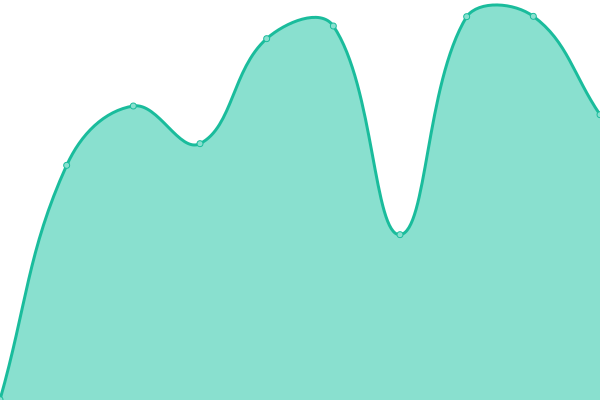 821ms
     
 | 

<a href="https://uptime.searxng.org/history/priv-au">100.00%</a>
    

|  [s.mble.dk](https://s.mble.dk) | 🟩 Up | [s-mble-dk.yml](https://github.com/searxng/searx-instances-uptime/commits/HEAD/history/s-mble-dk.yml) | 

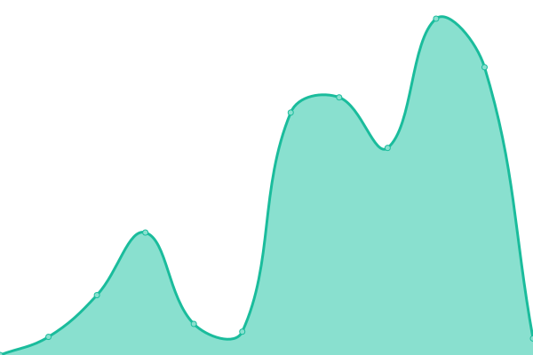 3169ms
     
 | 

<a href="https://uptime.searxng.org/history/s-mble-dk">92.91%</a>
    

|  [search.2b9t.xyz](https://search.2b9t.xyz) | 🟩 Up | [search-2b9t-xyz.yml](https://github.com/searxng/searx-instances-uptime/commits/HEAD/history/search-2b9t-xyz.yml) | 

 148ms
     
 | 

<a href="https://uptime.searxng.org/history/search-2b9t-xyz">100.00%</a>
    

|  [search.abohiccups.com](https://search.abohiccups.com) | 🟩 Up | [search-abohiccups-com.yml](https://github.com/searxng/searx-instances-uptime/commits/HEAD/history/search-abohiccups-com.yml) | 

 317ms
     
 | 

<a href="https://uptime.searxng.org/history/search-abohiccups-com">100.00%</a>
    

|  [search.anoni.net](https://search.anoni.net) | 🟩 Up | [search-anoni-net.yml](https://github.com/searxng/searx-instances-uptime/commits/HEAD/history/search-anoni-net.yml) | 

 577ms
     
 | 

<a href="https://uptime.searxng.org/history/search-anoni-net">99.76%</a>
    

|  [search.bladerunn.in](https://search.bladerunn.in) | 🟩 Up | [search-bladerunn-in.yml](https://github.com/searxng/searx-instances-uptime/commits/HEAD/history/search-bladerunn-in.yml) | 

 748ms
     
 | 

<a href="https://uptime.searxng.org/history/search-bladerunn-in">100.00%</a>
    

|  [search.catboy.house](https://search.catboy.house) | 🟩 Up | [search-catboy-house.yml](https://github.com/searxng/searx-instances-uptime/commits/HEAD/history/search-catboy-house.yml) | 

 830ms
     
 | 

<a href="https://uptime.searxng.org/history/search-catboy-house">98.75%</a>
    

|  [search.charliewhiskey.net](https://search.charliewhiskey.net) | 🟩 Up | [search-charliewhiskey-net.yml](https://github.com/searxng/searx-instances-uptime/commits/HEAD/history/search-charliewhiskey-net.yml) | 

 862ms
     
 | 

<a href="https://uptime.searxng.org/history/search-charliewhiskey-net">95.08%</a>
    

|  [search.darkness.services](https://search.darkness.services) | 🟩 Up | [search-darkness-services.yml](https://github.com/searxng/searx-instances-uptime/commits/HEAD/history/search-darkness-services.yml) | 

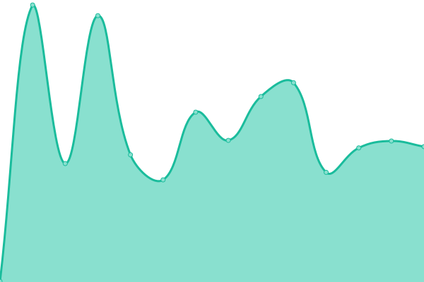 637ms
     
 | 

<a href="https://uptime.searxng.org/history/search-darkness-services">94.16%</a>
    

|  [search.einfachzocken.eu](https://search.einfachzocken.eu) | 🟩 Up | [search-einfachzocken-eu.yml](https://github.com/searxng/searx-instances-uptime/commits/HEAD/history/search-einfachzocken-eu.yml) | 

 529ms
     
 | 

<a href="https://uptime.searxng.org/history/search-einfachzocken-eu">100.00%</a>
    

|  [search.ethibox.fr](https://search.ethibox.fr) | 🟩 Up | [search-ethibox-fr.yml](https://github.com/searxng/searx-instances-uptime/commits/HEAD/history/search-ethibox-fr.yml) | 

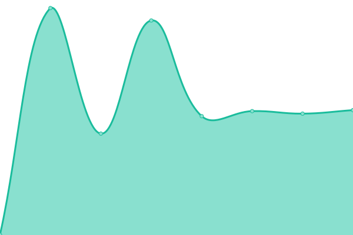 983ms
     
 | 

<a href="https://uptime.searxng.org/history/search-ethibox-fr">100.00%</a>
    

|  [search.femboy.ad](https://search.femboy.ad) | 🟩 Up | [search-femboy-ad.yml](https://github.com/searxng/searx-instances-uptime/commits/HEAD/history/search-femboy-ad.yml) | 

 265ms
     
 | 

<a href="https://uptime.searxng.org/history/search-femboy-ad">100.00%</a>
    

|  [search.freestater.org](https://search.freestater.org) | 🟩 Up | [search-freestater-org.yml](https://github.com/searxng/searx-instances-uptime/commits/HEAD/history/search-freestater-org.yml) | 

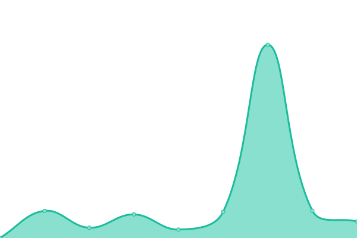 331ms
     
 | 

<a href="https://uptime.searxng.org/history/search-freestater-org">96.20%</a>
    

|  [search.hbubli.cc](https://search.hbubli.cc) | 🟩 Up | [search-hbubli-cc.yml](https://github.com/searxng/searx-instances-uptime/commits/HEAD/history/search-hbubli-cc.yml) | 

 475ms
     
 | 

<a href="https://uptime.searxng.org/history/search-hbubli-cc">100.00%</a>
    

|  [search.im-in.space](https://search.im-in.space) | 🟩 Up | [search-im-in-space.yml](https://github.com/searxng/searx-instances-uptime/commits/HEAD/history/search-im-in-space.yml) | 

 443ms
     
 | 

<a href="https://uptime.searxng.org/history/search-im-in-space">100.00%</a>
    

|  [search.indst.eu](https://search.indst.eu) | 🟩 Up | [search-indst-eu.yml](https://github.com/searxng/searx-instances-uptime/commits/HEAD/history/search-indst-eu.yml) | 

 817ms
     
 | 

<a href="https://uptime.searxng.org/history/search-indst-eu">100.00%</a>
    

|  [search.inetol.net](https://search.inetol.net) | 🟩 Up | [search-inetol-net.yml](https://github.com/searxng/searx-instances-uptime/commits/HEAD/history/search-inetol-net.yml) | 

 599ms
     
 | 

<a href="https://uptime.searxng.org/history/search-inetol-net">99.66%</a>
    

|  [search.internetsucks.net](https://search.internetsucks.net) | 🟩 Up | [search-internetsucks-net.yml](https://github.com/searxng/searx-instances-uptime/commits/HEAD/history/search-internetsucks-net.yml) | 

 891ms
     
 | 

<a href="https://uptime.searxng.org/history/search-internetsucks-net">98.31%</a>
    

|  [search.ipsys.bf](https://search.ipsys.bf) | 🟥 Down | [search-ipsys-bf.yml](https://github.com/searxng/searx-instances-uptime/commits/HEAD/history/search-ipsys-bf.yml) | 

 1620ms
     
 | 

<a href="https://uptime.searxng.org/history/search-ipsys-bf">99.08%</a>
    

|  [search.mdosch.de](https://search.mdosch.de) | 🟩 Up | [search-mdosch-de.yml](https://github.com/searxng/searx-instances-uptime/commits/HEAD/history/search-mdosch-de.yml) | 

 686ms
     
 | 

<a href="https://uptime.searxng.org/history/search-mdosch-de">100.00%</a>
    

|  [search.minus27315.dev](https://search.minus27315.dev) | 🟩 Up | [search-minus27315-dev.yml](https://github.com/searxng/searx-instances-uptime/commits/HEAD/history/search-minus27315-dev.yml) | 

 532ms
     
 | 

<a href="https://uptime.searxng.org/history/search-minus27315-dev">98.78%</a>
    

|  [search.ononoki.org](https://search.ononoki.org) | 🟩 Up | [search-ononoki-org.yml](https://github.com/searxng/searx-instances-uptime/commits/HEAD/history/search-ononoki-org.yml) | 

 238ms
     
 | 

<a href="https://uptime.searxng.org/history/search-ononoki-org">100.00%</a>
    

|  [search.pereira.is](https://search.pereira.is) | 🟩 Up | [search-pereira-is.yml](https://github.com/searxng/searx-instances-uptime/commits/HEAD/history/search-pereira-is.yml) | 

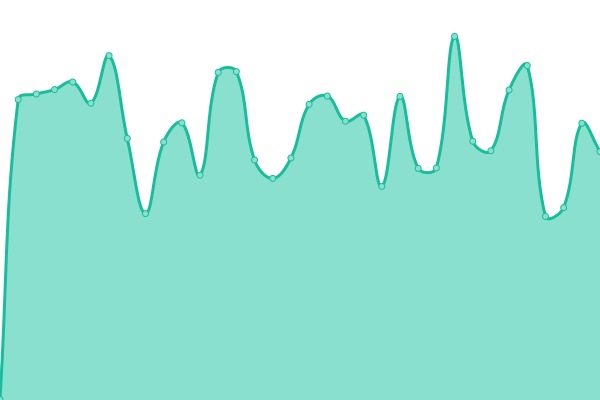 736ms
     
 | 

<a href="https://uptime.searxng.org/history/search-pereira-is">88.69%</a>
    

|  [search.pi.vps.pw](https://search.pi.vps.pw) | 🟩 Up | [search-pi-vps-pw.yml](https://github.com/searxng/searx-instances-uptime/commits/HEAD/history/search-pi-vps-pw.yml) | 

 1370ms
     
 | 

<a href="https://uptime.searxng.org/history/search-pi-vps-pw">100.00%</a>
    

|  [search.privacyredirect.com](https://search.privacyredirect.com) | 🟩 Up | [search-privacyredirect-com.yml](https://github.com/searxng/searx-instances-uptime/commits/HEAD/history/search-privacyredirect-com.yml) | 

 720ms
     
 | 

<a href="https://uptime.searxng.org/history/search-privacyredirect-com">100.00%</a>
    

|  [search.rhscz.eu](https://search.rhscz.eu) | 🟩 Up | [search-rhscz-eu.yml](https://github.com/searxng/searx-instances-uptime/commits/HEAD/history/search-rhscz-eu.yml) | 

 489ms
     
 | 

<a href="https://uptime.searxng.org/history/search-rhscz-eu">100.00%</a>
    

|  [search.rowie.at](https://search.rowie.at) | 🟩 Up | [search-rowie-at.yml](https://github.com/searxng/searx-instances-uptime/commits/HEAD/history/search-rowie-at.yml) | 

 827ms
     
 | 

<a href="https://uptime.searxng.org/history/search-rowie-at">100.00%</a>
    

|  [search.sapti.me](https://search.sapti.me) | 🟩 Up | [search-sapti-me.yml](https://github.com/searxng/searx-instances-uptime/commits/HEAD/history/search-sapti-me.yml) | 

 633ms
     
 | 

<a href="https://uptime.searxng.org/history/search-sapti-me">100.00%</a>
    

|  [search.seddens.net](https://search.seddens.net) | 🟩 Up | [search-seddens-net.yml](https://github.com/searxng/searx-instances-uptime/commits/HEAD/history/search-seddens-net.yml) | 

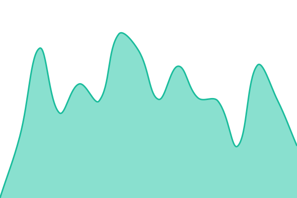 821ms
     
 | 

<a href="https://uptime.searxng.org/history/search-seddens-net">92.52%</a>
    

|  [search.serpensin.com](https://search.serpensin.com) | 🟩 Up | [search-serpensin-com.yml](https://github.com/searxng/searx-instances-uptime/commits/HEAD/history/search-serpensin-com.yml) | 

 466ms
     
 | 

<a href="https://uptime.searxng.org/history/search-serpensin-com">97.36%</a>
    

|  [search.undertale.uk](https://search.undertale.uk) | 🟩 Up | [search-undertale-uk.yml](https://github.com/searxng/searx-instances-uptime/commits/HEAD/history/search-undertale-uk.yml) | 

 514ms
     
 | 

<a href="https://uptime.searxng.org/history/search-undertale-uk">100.00%</a>
    

|  [search.unredacted.org](https://search.unredacted.org) | 🟩 Up | [search-unredacted-org.yml](https://github.com/searxng/searx-instances-uptime/commits/HEAD/history/search-unredacted-org.yml) | 

 355ms
     
 | 

<a href="https://uptime.searxng.org/history/search-unredacted-org">99.80%</a>
    

|  [search.url4irl.com](https://search.url4irl.com) | 🟩 Up | [search-url4irl-com.yml](https://github.com/searxng/searx-instances-uptime/commits/HEAD/history/search-url4irl-com.yml) | 

 554ms
     
 | 

<a href="https://uptime.searxng.org/history/search-url4irl-com">100.00%</a>
    

|  [search.wdpserver.com](https://search.wdpserver.com) | 🟩 Up | [search-wdpserver-com.yml](https://github.com/searxng/searx-instances-uptime/commits/HEAD/history/search-wdpserver-com.yml) | 

 629ms
     
 | 

<a href="https://uptime.searxng.org/history/search-wdpserver-com">100.00%</a>
    

|  [search.zina.dev](https://search.zina.dev) | 🟩 Up | [search-zina-dev.yml](https://github.com/searxng/searx-instances-uptime/commits/HEAD/history/search-zina-dev.yml) | 

 518ms
     
 | 

<a href="https://uptime.searxng.org/history/search-zina-dev">100.00%</a>
    

|  [searx.ankha.ac](https://searx.ankha.ac) | 🟩 Up | [searx-ankha-ac.yml](https://github.com/searxng/searx-instances-uptime/commits/HEAD/history/searx-ankha-ac.yml) | 

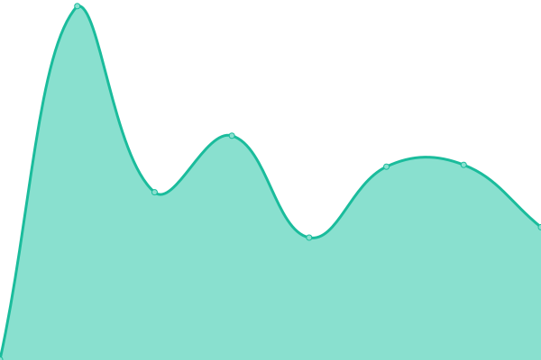 1010ms
     
 | 

<a href="https://uptime.searxng.org/history/searx-ankha-ac">99.70%</a>
    

|  [searx.dresden.network](https://searx.dresden.network) | 🟩 Up | [searx-dresden-network.yml](https://github.com/searxng/searx-instances-uptime/commits/HEAD/history/searx-dresden-network.yml) | 

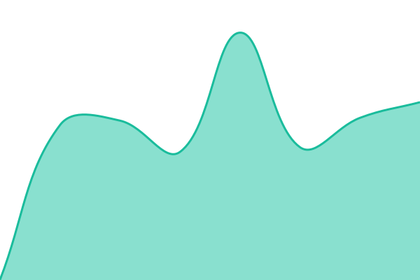 921ms
     
 | 

<a href="https://uptime.searxng.org/history/searx-dresden-network">100.00%</a>
    

|  [searx.lunar.icu](https://searx.lunar.icu) | 🟩 Up | [searx-lunar-icu.yml](https://github.com/searxng/searx-instances-uptime/commits/HEAD/history/searx-lunar-icu.yml) | 

 455ms
     
 | 

<a href="https://uptime.searxng.org/history/searx-lunar-icu">100.00%</a>
    

|  [searx.mbuf.net](https://searx.mbuf.net) | 🟩 Up | [searx-mbuf-net.yml](https://github.com/searxng/searx-instances-uptime/commits/HEAD/history/searx-mbuf-net.yml) | 

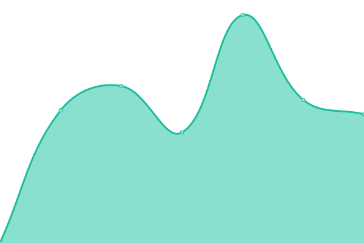 572ms
     
 | 

<a href="https://uptime.searxng.org/history/searx-mbuf-net">95.28%</a>
    

|  [searx.mxchange.org](https://searx.mxchange.org) | 🟩 Up | [searx-mxchange-org.yml](https://github.com/searxng/searx-instances-uptime/commits/HEAD/history/searx-mxchange-org.yml) | 

 861ms
     
 | 

<a href="https://uptime.searxng.org/history/searx-mxchange-org">100.00%</a>
    

|  [searx.namejeff.xyz](https://searx.namejeff.xyz) | 🟩 Up | [searx-namejeff-xyz.yml](https://github.com/searxng/searx-instances-uptime/commits/HEAD/history/searx-namejeff-xyz.yml) | 

 590ms
     
 | 

<a href="https://uptime.searxng.org/history/searx-namejeff-xyz">78.76%</a>
    

|  [searx.oloke.xyz](https://searx.oloke.xyz) | 🟩 Up | [searx-oloke-xyz.yml](https://github.com/searxng/searx-instances-uptime/commits/HEAD/history/searx-oloke-xyz.yml) | 

 656ms
     
 | 

<a href="https://uptime.searxng.org/history/searx-oloke-xyz">100.00%</a>
    

|  [searx.ox2.fr](https://searx.ox2.fr) | 🟩 Up | [searx-ox2-fr.yml](https://github.com/searxng/searx-instances-uptime/commits/HEAD/history/searx-ox2-fr.yml) | 

 814ms
     
 | 

<a href="https://uptime.searxng.org/history/searx-ox2-fr">98.46%</a>
    

|  [searx.party](https://searx.party) | 🟩 Up | [searx-party.yml](https://github.com/searxng/searx-instances-uptime/commits/HEAD/history/searx-party.yml) | 

 475ms
     
 | 

<a href="https://uptime.searxng.org/history/searx-party">99.45%</a>
    

|  [searx.perennialte.ch](https://searx.perennialte.ch) | 🟩 Up | [searx-perennialte-ch.yml](https://github.com/searxng/searx-instances-uptime/commits/HEAD/history/searx-perennialte-ch.yml) | 

 608ms
     
 | 

<a href="https://uptime.searxng.org/history/searx-perennialte-ch">100.00%</a>
    

|  [searx.rhscz.eu](https://searx.rhscz.eu) | 🟩 Up | [searx-rhscz-eu.yml](https://github.com/searxng/searx-instances-uptime/commits/HEAD/history/searx-rhscz-eu.yml) | 

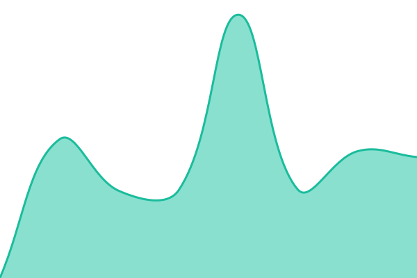 651ms
     
 | 

<a href="https://uptime.searxng.org/history/searx-rhscz-eu">100.00%</a>
    

|  [searx.ro](https://searx.ro) | 🟩 Up | [searx-ro.yml](https://github.com/searxng/searx-instances-uptime/commits/HEAD/history/searx-ro.yml) | 

 553ms
     
 | 

<a href="https://uptime.searxng.org/history/searx-ro">100.00%</a>
    

|  [searx.sev.monster](https://searx.sev.monster) | 🟩 Up | [searx-sev-monster.yml](https://github.com/searxng/searx-instances-uptime/commits/HEAD/history/searx-sev-monster.yml) | 

 428ms
     
 | 

<a href="https://uptime.searxng.org/history/searx-sev-monster">100.00%</a>
    

|  [searx.stream](https://searx.stream) | 🟥 Down | [searx-stream.yml](https://github.com/searxng/searx-instances-uptime/commits/HEAD/history/searx-stream.yml) | 

 0ms
     
 | 

<a href="https://uptime.searxng.org/history/searx-stream">0.00%</a>
    

|  [searx.tiekoetter.com](https://searx.tiekoetter.com) | 🟩 Up | [searx-tiekoetter-com.yml](https://github.com/searxng/searx-instances-uptime/commits/HEAD/history/searx-tiekoetter-com.yml) | 

 737ms
     
 | 

<a href="https://uptime.searxng.org/history/searx-tiekoetter-com">100.00%</a>
    

|  [searx.tuxcloud.net](https://searx.tuxcloud.net) | 🟩 Up | [searx-tuxcloud-net.yml](https://github.com/searxng/searx-instances-uptime/commits/HEAD/history/searx-tuxcloud-net.yml) | 

 599ms
     
 | 

<a href="https://uptime.searxng.org/history/searx-tuxcloud-net">100.00%</a>
    

|  [searxng.canine.tools](https://searxng.canine.tools) | 🟩 Up | [searxng-canine-tools.yml](https://github.com/searxng/searx-instances-uptime/commits/HEAD/history/searxng-canine-tools.yml) | 

 253ms
     
 | 

<a href="https://uptime.searxng.org/history/searxng-canine-tools">100.00%</a>
    

|  [searxng.cups.moe](https://searxng.cups.moe) | 🟩 Up | [searxng-cups-moe.yml](https://github.com/searxng/searx-instances-uptime/commits/HEAD/history/searxng-cups-moe.yml) | 

 807ms
     
 | 

<a href="https://uptime.searxng.org/history/searxng-cups-moe">100.00%</a>
    

|  [searxng.deggo.fyi](https://searxng.deggo.fyi) | 🟩 Up | [searxng-deggo-fyi.yml](https://github.com/searxng/searx-instances-uptime/commits/HEAD/history/searxng-deggo-fyi.yml) | 

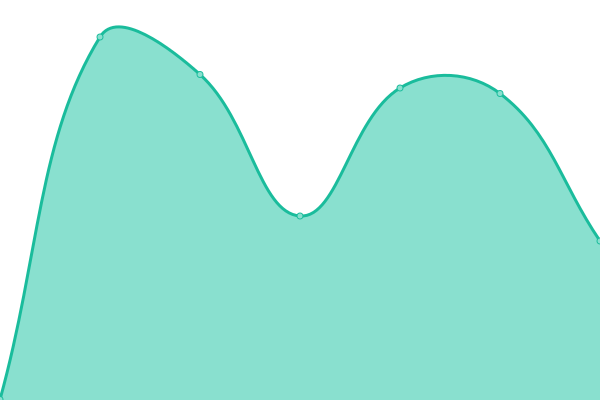 606ms
     
 | 

<a href="https://uptime.searxng.org/history/searxng-deggo-fyi">98.36%</a>
    

|  [searxng.shreven.org](https://searxng.shreven.org) | 🟩 Up | [searxng-shreven-org.yml](https://github.com/searxng/searx-instances-uptime/commits/HEAD/history/searxng-shreven-org.yml) | 

 305ms
     
 | 

<a href="https://uptime.searxng.org/history/searxng-shreven-org">100.00%</a>
    

|  [searxng.site](https://searxng.site) | 🟩 Up | [searxng-site.yml](https://github.com/searxng/searx-instances-uptime/commits/HEAD/history/searxng-site.yml) | 

 5136ms
     
 | 

<a href="https://uptime.searxng.org/history/searxng-site">100.00%</a>
    

|  [searxng.website](https://searxng.website) | 🟩 Up | [searxng-website.yml](https://github.com/searxng/searx-instances-uptime/commits/HEAD/history/searxng-website.yml) | 

 515ms
     
 | 

<a href="https://uptime.searxng.org/history/searxng-website">100.00%</a>
    

|  [seek.fyi](https://seek.fyi) | 🟩 Up | [seek-fyi.yml](https://github.com/searxng/searx-instances-uptime/commits/HEAD/history/seek-fyi.yml) | 

 470ms
     
 | 

<a href="https://uptime.searxng.org/history/seek-fyi">100.00%</a>
    

|  [sx.catgirl.cloud](https://sx.catgirl.cloud) | 🟩 Up | [sx-catgirl-cloud.yml](https://github.com/searxng/searx-instances-uptime/commits/HEAD/history/sx-catgirl-cloud.yml) | 

 620ms
     
 | 

<a href="https://uptime.searxng.org/history/sx-catgirl-cloud">99.60%</a>
    

|  [www.gruble.de](https://www.gruble.de) | 🟩 Up | [www-gruble-de.yml](https://github.com/searxng/searx-instances-uptime/commits/HEAD/history/www-gruble-de.yml) | 

 1016ms
     
 | 

<a href="https://uptime.searxng.org/history/www-gruble-de">96.53%</a>
    

|  [searx.neocities.org](https://searx.neocities.org) | 🟩 Up | [searx-neocities-org.yml](https://github.com/searxng/searx-instances-uptime/commits/HEAD/history/searx-neocities-org.yml) | 

 141ms
     
 | 

<a href="https://uptime.searxng.org/history/searx-neocities-org">100.00%</a>
    

<!--end: status pages-->

[**Visit our status website →**](https://searxng.github.io/searx-instances-uptime)

## 📄 License

- Powered by: [Upptime](https://github.com/upptime/upptime)
- Code: [MIT](./LICENSE) © [SearXNG](https://searxng.org)
- Data in the `./history` directory: [Open Database License](https://opendatacommons.org/licenses/odbl/1-0/)
