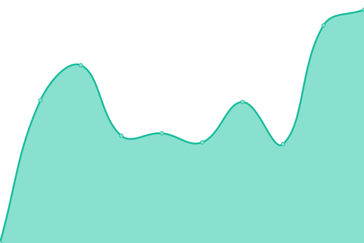

# [📈 Live Status](https://searxng.github.io/searx-instances-uptime): <!--live status--> **🟧 Partial outage**

This repository contains the open-source uptime monitor and status page for [SearXNG](https://searxng.org), powered by [Upptime](https://github.com/upptime/upptime).

With [Upptime](https://upptime.js.org), you can get your own unlimited and free uptime monitor and status page, powered entirely by a GitHub repository. We use [Issues](https://github.com/searxng/searx-instances-uptime/issues) as incident reports, [Actions](https://github.com/searxng/searx-instances-uptime/actions) as uptime monitors, and [Pages](https://searxng.github.io/searx-instances-uptime) for the status page.

<!--start: status pages-->
<!-- This summary is generated by Upptime (https://github.com/upptime/upptime) -->
<!-- Do not edit this manually, your changes will be overwritten -->
<!-- prettier-ignore -->
| URL | Status | History | Response Time | Uptime |
| --- | ------ | ------- | ------------- | ------ |
|  [searx.space](https://searx.space) | 🟩 Up | [searx-space.yml](https://github.com/searxng/searx-instances-uptime/commits/HEAD/history/searx-space.yml) | 

 602ms
     
 | 

<a href="https://uptime.searxng.org/history/searx-space">100.00%</a>
    

|  [baresearch.org](https://baresearch.org) | 🟩 Up | [baresearch-org.yml](https://github.com/searxng/searx-instances-uptime/commits/HEAD/history/baresearch-org.yml) | 

 231ms
     
 | 

<a href="https://uptime.searxng.org/history/baresearch-org">100.00%</a>
    

|  [coppedge.info](https://coppedge.info) | 🟩 Up | [coppedge-info.yml](https://github.com/searxng/searx-instances-uptime/commits/HEAD/history/coppedge-info.yml) | 

 260ms
     
 | 

<a href="https://uptime.searxng.org/history/coppedge-info">99.41%</a>
    

|  [darmarit.org](https://darmarit.org/searx) | 🟩 Up | [darmarit-org.yml](https://github.com/searxng/searx-instances-uptime/commits/HEAD/history/darmarit-org.yml) | 

 1573ms
     
 | 

<a href="https://uptime.searxng.org/history/darmarit-org">100.00%</a>
    

|  [dynabyte.ca](https://dynabyte.ca) | 🟥 Down | [dynabyte-ca.yml](https://github.com/searxng/searx-instances-uptime/commits/HEAD/history/dynabyte-ca.yml) | 

 517ms
     
 | 

<a href="https://uptime.searxng.org/history/dynabyte-ca">41.45%</a>
    

|  [etsi.me](https://etsi.me) | 🟩 Up | [etsi-me.yml](https://github.com/searxng/searx-instances-uptime/commits/HEAD/history/etsi-me.yml) | 

 614ms
     
 | 

<a href="https://uptime.searxng.org/history/etsi-me">100.00%</a>
    

|  [freesearch.club](https://freesearch.club) | 🟥 Down | [freesearch-club.yml](https://github.com/searxng/searx-instances-uptime/commits/HEAD/history/freesearch-club.yml) | 

 318ms
     
 | 

<a href="https://uptime.searxng.org/history/freesearch-club">9.68%</a>
    

|  [myprivatesrx.us](https://myprivatesrx.us) | 🟩 Up | [myprivatesrx-us.yml](https://github.com/searxng/searx-instances-uptime/commits/HEAD/history/myprivatesrx-us.yml) | 

 112ms
     
 | 

<a href="https://uptime.searxng.org/history/myprivatesrx-us">100.00%</a>
    

|  [northboot.xyz](https://northboot.xyz) | 🟩 Up | [northboot-xyz.yml](https://github.com/searxng/searx-instances-uptime/commits/HEAD/history/northboot-xyz.yml) | 

 849ms
     
 | 

<a href="https://uptime.searxng.org/history/northboot-xyz">100.00%</a>
    

|  [notsearch.uk](https://notsearch.uk) | 🟩 Up | [notsearch-uk.yml](https://github.com/searxng/searx-instances-uptime/commits/HEAD/history/notsearch-uk.yml) | 

 415ms
     
 | 

<a href="https://uptime.searxng.org/history/notsearch-uk">99.56%</a>
    

|  [offtheradar.info](https://offtheradar.info) | 🟩 Up | [offtheradar-info.yml](https://github.com/searxng/searx-instances-uptime/commits/HEAD/history/offtheradar-info.yml) | 

 338ms
     
 | 

<a href="https://uptime.searxng.org/history/offtheradar-info">87.14%</a>
    

|  [ooglester.com](https://ooglester.com) | 🟩 Up | [ooglester-com.yml](https://github.com/searxng/searx-instances-uptime/commits/HEAD/history/ooglester-com.yml) | 

 233ms
     
 | 

<a href="https://uptime.searxng.org/history/ooglester-com">100.00%</a>
    

|  [opnxng.com](https://opnxng.com) | 🟩 Up | [opnxng-com.yml](https://github.com/searxng/searx-instances-uptime/commits/HEAD/history/opnxng-com.yml) | 

 687ms
     
 | 

<a href="https://uptime.searxng.org/history/opnxng-com">100.00%</a>
    

|  [paulgo.io](https://paulgo.io) | 🟩 Up | [paulgo-io.yml](https://github.com/searxng/searx-instances-uptime/commits/HEAD/history/paulgo-io.yml) | 

 583ms
     
 | 

<a href="https://uptime.searxng.org/history/paulgo-io">100.00%</a>
    

|  [priv.au](https://priv.au) | 🟩 Up | [priv-au.yml](https://github.com/searxng/searx-instances-uptime/commits/HEAD/history/priv-au.yml) | 

 760ms
     
 | 

<a href="https://uptime.searxng.org/history/priv-au">100.00%</a>
    

|  [privatus.live](https://privatus.live) | 🟥 Down | [privatus-live.yml](https://github.com/searxng/searx-instances-uptime/commits/HEAD/history/privatus-live.yml) | 

 637ms
     
 | 

<a href="https://uptime.searxng.org/history/privatus-live">24.32%</a>
    

|  [s.frlt.one](https://s.frlt.one) | 🟩 Up | [s-frlt-one.yml](https://github.com/searxng/searx-instances-uptime/commits/HEAD/history/s-frlt-one.yml) | 

 722ms
     
 | 

<a href="https://uptime.searxng.org/history/s-frlt-one">100.00%</a>
    

|  [s.trung.fun](https://s.trung.fun) | 🟩 Up | [s-trung-fun.yml](https://github.com/searxng/searx-instances-uptime/commits/HEAD/history/s-trung-fun.yml) | 

 1142ms
     
 | 

<a href="https://uptime.searxng.org/history/s-trung-fun">99.75%</a>
    

|  [s.zhaocloud.net](https://s.zhaocloud.net) | 🟩 Up | [s-zhaocloud-net.yml](https://github.com/searxng/searx-instances-uptime/commits/HEAD/history/s-zhaocloud-net.yml) | 

 628ms
     
 | 

<a href="https://uptime.searxng.org/history/s-zhaocloud-net">100.00%</a>
    

|  [search.0xgingi.com](https://search.0xgingi.com) | 🟩 Up | [search-0xgingi-com.yml](https://github.com/searxng/searx-instances-uptime/commits/HEAD/history/search-0xgingi-com.yml) | 

 221ms
     
 | 

<a href="https://uptime.searxng.org/history/search-0xgingi-com">99.80%</a>
    

|  [search.affusio.com](https://search.affusio.com) | 🟥 Down | [search-affusio-com.yml](https://github.com/searxng/searx-instances-uptime/commits/HEAD/history/search-affusio-com.yml) | 

 1468ms
     
 | 

<a href="https://uptime.searxng.org/history/search-affusio-com">85.90%</a>
    

|  [search.berryez.xyz](https://search.berryez.xyz) | 🟥 Down | [search-berryez-xyz.yml](https://github.com/searxng/searx-instances-uptime/commits/HEAD/history/search-berryez-xyz.yml) | 

 395ms
     
 | 

<a href="https://uptime.searxng.org/history/search-berryez-xyz">43.92%</a>
    

|  [search.bus-hit.me](https://search.bus-hit.me) | 🟩 Up | [search-bus-hit-me.yml](https://github.com/searxng/searx-instances-uptime/commits/HEAD/history/search-bus-hit-me.yml) | 

 323ms
     
 | 

<a href="https://uptime.searxng.org/history/search-bus-hit-me">100.00%</a>
    

|  [search.charleseroop.com](https://search.charleseroop.com) | 🟥 Down | [search-charleseroop-com.yml](https://github.com/searxng/searx-instances-uptime/commits/HEAD/history/search-charleseroop-com.yml) | 

 119ms
     
 | 

<a href="https://uptime.searxng.org/history/search-charleseroop-com">9.95%</a>
    

|  [search.chemicals-in-the-water.eu](https://search.chemicals-in-the-water.eu) | 🟩 Up | [search-chemicals-in-the-water-eu.yml](https://github.com/searxng/searx-instances-uptime/commits/HEAD/history/search-chemicals-in-the-water-eu.yml) | 

 566ms
     
 | 

<a href="https://uptime.searxng.org/history/search-chemicals-in-the-water-eu">100.00%</a>
    

|  [search.cronobox.one](https://search.cronobox.one) | 🟩 Up | [search-cronobox-one.yml](https://github.com/searxng/searx-instances-uptime/commits/HEAD/history/search-cronobox-one.yml) | 

 814ms
     
 | 

<a href="https://uptime.searxng.org/history/search-cronobox-one">100.00%</a>
    

|  [search.disroot.org](https://search.disroot.org) | 🟩 Up | [search-disroot-org.yml](https://github.com/searxng/searx-instances-uptime/commits/HEAD/history/search-disroot-org.yml) | 

 829ms
     
 | 

<a href="https://uptime.searxng.org/history/search-disroot-org">100.00%</a>
    

|  [search.dojoro.de](https://search.dojoro.de) | 🟩 Up | [search-dojoro-de.yml](https://github.com/searxng/searx-instances-uptime/commits/HEAD/history/search-dojoro-de.yml) | 

 969ms
     
 | 

<a href="https://uptime.searxng.org/history/search-dojoro-de">100.00%</a>
    

|  [search.fascinated.cc](https://search.fascinated.cc) | 🟩 Up | [search-fascinated-cc.yml](https://github.com/searxng/searx-instances-uptime/commits/HEAD/history/search-fascinated-cc.yml) | 

 406ms
     
 | 

<a href="https://uptime.searxng.org/history/search-fascinated-cc">100.00%</a>
    

|  [search.gcomm.ch](https://search.gcomm.ch) | 🟩 Up | [search-gcomm-ch.yml](https://github.com/searxng/searx-instances-uptime/commits/HEAD/history/search-gcomm-ch.yml) | 

 453ms
     
 | 

<a href="https://uptime.searxng.org/history/search-gcomm-ch">100.00%</a>
    

|  [search.houba.rocks](https://search.houba.rocks) | 🟩 Up | [search-houba-rocks.yml](https://github.com/searxng/searx-instances-uptime/commits/HEAD/history/search-houba-rocks.yml) | 

 529ms
     
 | 

<a href="https://uptime.searxng.org/history/search-houba-rocks">100.00%</a>
    

|  [search.in.projectsegfau.lt](https://search.in.projectsegfau.lt) | 🟩 Up | [search-in-projectsegfau-lt.yml](https://github.com/searxng/searx-instances-uptime/commits/HEAD/history/search-in-projectsegfau-lt.yml) | 

 880ms
     
 | 

<a href="https://uptime.searxng.org/history/search-in-projectsegfau-lt">100.00%</a>
    

|  [search.kiwitalk.de](https://search.kiwitalk.de) | 🟩 Up | [search-kiwitalk-de.yml](https://github.com/searxng/searx-instances-uptime/commits/HEAD/history/search-kiwitalk-de.yml) | 

 575ms
     
 | 

<a href="https://uptime.searxng.org/history/search-kiwitalk-de">100.00%</a>
    

|  [search.leptons.xyz](https://search.leptons.xyz) | 🟩 Up | [search-leptons-xyz.yml](https://github.com/searxng/searx-instances-uptime/commits/HEAD/history/search-leptons-xyz.yml) | 

 343ms
     
 | 

<a href="https://uptime.searxng.org/history/search-leptons-xyz">100.00%</a>
    

|  [search.listi.me](https://search.listi.me) | 🟩 Up | [search-listi-me.yml](https://github.com/searxng/searx-instances-uptime/commits/HEAD/history/search-listi-me.yml) | 

 712ms
     
 | 

<a href="https://uptime.searxng.org/history/search-listi-me">86.44%</a>
    

|  [search.mdosch.de](https://search.mdosch.de) | 🟩 Up | [search-mdosch-de.yml](https://github.com/searxng/searx-instances-uptime/commits/HEAD/history/search-mdosch-de.yml) | 

 522ms
     
 | 

<a href="https://uptime.searxng.org/history/search-mdosch-de">100.00%</a>
    

|  [search.modalogi.com](https://search.modalogi.com) | 🟩 Up | [search-modalogi-com.yml](https://github.com/searxng/searx-instances-uptime/commits/HEAD/history/search-modalogi-com.yml) | 

 542ms
     
 | 

<a href="https://uptime.searxng.org/history/search-modalogi-com">99.62%</a>
    

|  [search.neet.works](https://search.neet.works) | 🟩 Up | [search-neet-works.yml](https://github.com/searxng/searx-instances-uptime/commits/HEAD/history/search-neet-works.yml) | 

 261ms
     
 | 

<a href="https://uptime.searxng.org/history/search-neet-works">100.00%</a>
    

|  [search.ononoki.org](https://search.ononoki.org) | 🟩 Up | [search-ononoki-org.yml](https://github.com/searxng/searx-instances-uptime/commits/HEAD/history/search-ononoki-org.yml) | 

 543ms
     
 | 

<a href="https://uptime.searxng.org/history/search-ononoki-org">100.00%</a>
    

|  [search.projectsegfau.lt](https://search.projectsegfau.lt) | 🟩 Up | [search-projectsegfau-lt.yml](https://github.com/searxng/searx-instances-uptime/commits/HEAD/history/search-projectsegfau-lt.yml) | 

 550ms
     
 | 

<a href="https://uptime.searxng.org/history/search-projectsegfau-lt">100.00%</a>
    

|  [search.rabbit-company.com](https://search.rabbit-company.com) | 🟩 Up | [search-rabbit-company-com.yml](https://github.com/searxng/searx-instances-uptime/commits/HEAD/history/search-rabbit-company-com.yml) | 

 449ms
     
 | 

<a href="https://uptime.searxng.org/history/search-rabbit-company-com">100.00%</a>
    

|  [search.rhscz.eu](https://search.rhscz.eu) | 🟩 Up | [search-rhscz-eu.yml](https://github.com/searxng/searx-instances-uptime/commits/HEAD/history/search-rhscz-eu.yml) | 

 411ms
     
 | 

<a href="https://uptime.searxng.org/history/search-rhscz-eu">100.00%</a>
    

|  [search.rowie.at](https://search.rowie.at) | 🟩 Up | [search-rowie-at.yml](https://github.com/searxng/searx-instances-uptime/commits/HEAD/history/search-rowie-at.yml) | 

 500ms
     
 | 

<a href="https://uptime.searxng.org/history/search-rowie-at">100.00%</a>
    

|  [search.sapti.me](https://search.sapti.me) | 🟩 Up | [search-sapti-me.yml](https://github.com/searxng/searx-instances-uptime/commits/HEAD/history/search-sapti-me.yml) | 

 558ms
     
 | 

<a href="https://uptime.searxng.org/history/search-sapti-me">100.00%</a>
    

|  [search.serginho.dev](https://search.serginho.dev) | 🟩 Up | [search-serginho-dev.yml](https://github.com/searxng/searx-instances-uptime/commits/HEAD/history/search-serginho-dev.yml) | 

 362ms
     
 | 

<a href="https://uptime.searxng.org/history/search-serginho-dev">100.00%</a>
    

|  [search.shininglea.dev](https://search.shininglea.dev) | 🟩 Up | [search-shininglea-dev.yml](https://github.com/searxng/searx-instances-uptime/commits/HEAD/history/search-shininglea-dev.yml) | 

 1054ms
     
 | 

<a href="https://uptime.searxng.org/history/search-shininglea-dev">100.00%</a>
    

|  [search.smnz.de](https://search.smnz.de) | 🟩 Up | [search-smnz-de.yml](https://github.com/searxng/searx-instances-uptime/commits/HEAD/history/search-smnz-de.yml) | 

 888ms
     
 | 

<a href="https://uptime.searxng.org/history/search-smnz-de">99.01%</a>
    

|  [search.stinpriza.org](https://search.stinpriza.org) | 🟩 Up | [search-stinpriza-org.yml](https://github.com/searxng/searx-instances-uptime/commits/HEAD/history/search-stinpriza-org.yml) | 

 964ms
     
 | 

<a href="https://uptime.searxng.org/history/search-stinpriza-org">100.00%</a>
    

|  [search.suenram.us](https://search.suenram.us) | 🟥 Down | [search-suenram-us.yml](https://github.com/searxng/searx-instances-uptime/commits/HEAD/history/search-suenram-us.yml) | 

 227ms
     
 | 

<a href="https://uptime.searxng.org/history/search-suenram-us">0.00%</a>
    

|  [search.trom.tf](https://search.trom.tf) | 🟩 Up | [search-trom-tf.yml](https://github.com/searxng/searx-instances-uptime/commits/HEAD/history/search-trom-tf.yml) | 

 609ms
     
 | 

<a href="https://uptime.searxng.org/history/search-trom-tf">100.00%</a>
    

|  [search.us.projectsegfau.lt](https://search.us.projectsegfau.lt) | 🟩 Up | [search-us-projectsegfau-lt.yml](https://github.com/searxng/searx-instances-uptime/commits/HEAD/history/search-us-projectsegfau-lt.yml) | 

 430ms
     
 | 

<a href="https://uptime.searxng.org/history/search-us-projectsegfau-lt">100.00%</a>
    

|  [search.zzls.xyz](https://search.zzls.xyz) | 🟩 Up | [search-zzls-xyz.yml](https://github.com/searxng/searx-instances-uptime/commits/HEAD/history/search-zzls-xyz.yml) | 

 486ms
     
 | 

<a href="https://uptime.searxng.org/history/search-zzls-xyz">100.00%</a>
    

|  [searx.baczek.me](https://searx.baczek.me) | 🟩 Up | [searx-baczek-me.yml](https://github.com/searxng/searx-instances-uptime/commits/HEAD/history/searx-baczek-me.yml) | 

 678ms
     
 | 

<a href="https://uptime.searxng.org/history/searx-baczek-me">100.00%</a>
    

|  [searx.be](https://searx.be) | 🟩 Up | [searx-be.yml](https://github.com/searxng/searx-instances-uptime/commits/HEAD/history/searx-be.yml) | 

 437ms
     
 | 

<a href="https://uptime.searxng.org/history/searx-be">100.00%</a>
    

|  [searx.becomesovran.com](https://searx.becomesovran.com) | 🟩 Up | [searx-becomesovran-com.yml](https://github.com/searxng/searx-instances-uptime/commits/HEAD/history/searx-becomesovran-com.yml) | 

 469ms
     
 | 

<a href="https://uptime.searxng.org/history/searx-becomesovran-com">100.00%</a>
    

|  [searx.bissisoft.com](https://searx.bissisoft.com) | 🟩 Up | [searx-bissisoft-com.yml](https://github.com/searxng/searx-instances-uptime/commits/HEAD/history/searx-bissisoft-com.yml) | 

 487ms
     
 | 

<a href="https://uptime.searxng.org/history/searx-bissisoft-com">100.00%</a>
    

|  [searx.catfluori.de](https://searx.catfluori.de) | 🟩 Up | [searx-catfluori-de.yml](https://github.com/searxng/searx-instances-uptime/commits/HEAD/history/searx-catfluori-de.yml) | 

 841ms
     
 | 

<a href="https://uptime.searxng.org/history/searx-catfluori-de">100.00%</a>
    

|  [searx.chocoflan.net](https://searx.chocoflan.net) | 🟩 Up | [searx-chocoflan-net.yml](https://github.com/searxng/searx-instances-uptime/commits/HEAD/history/searx-chocoflan-net.yml) | 

 308ms
     
 | 

<a href="https://uptime.searxng.org/history/searx-chocoflan-net">100.00%</a>
    

|  [searx.cthd.icu](https://searx.cthd.icu) | 🟩 Up | [searx-cthd-icu.yml](https://github.com/searxng/searx-instances-uptime/commits/HEAD/history/searx-cthd-icu.yml) | 

 550ms
     
 | 

<a href="https://uptime.searxng.org/history/searx-cthd-icu">100.00%</a>
    

|  [searx.delicta.pp.ua](https://searx.delicta.pp.ua) | 🟩 Up | [searx-delicta-pp-ua.yml](https://github.com/searxng/searx-instances-uptime/commits/HEAD/history/searx-delicta-pp-ua.yml) | 

 627ms
     
 | 

<a href="https://uptime.searxng.org/history/searx-delicta-pp-ua">100.00%</a>
    

|  [searx.divided-by-zero.eu](https://searx.divided-by-zero.eu) | 🟩 Up | [searx-divided-by-zero-eu.yml](https://github.com/searxng/searx-instances-uptime/commits/HEAD/history/searx-divided-by-zero-eu.yml) | 

 640ms
     
 | 

<a href="https://uptime.searxng.org/history/searx-divided-by-zero-eu">100.00%</a>
    

|  [searx.doofpot.nl](https://searx.doofpot.nl) | 🟩 Up | [searx-doofpot-nl.yml](https://github.com/searxng/searx-instances-uptime/commits/HEAD/history/searx-doofpot-nl.yml) | 

 544ms
     
 | 

<a href="https://uptime.searxng.org/history/searx-doofpot-nl">100.00%</a>
    

|  [searx.dresden.network](https://searx.dresden.network) | 🟩 Up | [searx-dresden-network.yml](https://github.com/searxng/searx-instances-uptime/commits/HEAD/history/searx-dresden-network.yml) | 

 822ms
     
 | 

<a href="https://uptime.searxng.org/history/searx-dresden-network">100.00%</a>
    

|  [searx.ericaftereric.top](https://searx.ericaftereric.top) | 🟩 Up | [searx-ericaftereric-top.yml](https://github.com/searxng/searx-instances-uptime/commits/HEAD/history/searx-ericaftereric-top.yml) | 

 587ms
     
 | 

<a href="https://uptime.searxng.org/history/searx-ericaftereric-top">100.00%</a>
    

|  [searx.esmailelbob.xyz](https://searx.esmailelbob.xyz) | 🟩 Up | [searx-esmailelbob-xyz.yml](https://github.com/searxng/searx-instances-uptime/commits/HEAD/history/searx-esmailelbob-xyz.yml) | 

 360ms
     
 | 

<a href="https://uptime.searxng.org/history/searx-esmailelbob-xyz">99.87%</a>
    

|  [searx.fmac.xyz](https://searx.fmac.xyz) | 🟩 Up | [searx-fmac-xyz.yml](https://github.com/searxng/searx-instances-uptime/commits/HEAD/history/searx-fmac-xyz.yml) | 

 481ms
     
 | 

<a href="https://uptime.searxng.org/history/searx-fmac-xyz">100.00%</a>
    

|  [searx.fossencdi.org](https://searx.fossencdi.org) | 🟩 Up | [searx-fossencdi-org.yml](https://github.com/searxng/searx-instances-uptime/commits/HEAD/history/searx-fossencdi-org.yml) | 

 659ms
     
 | 

<a href="https://uptime.searxng.org/history/searx-fossencdi-org">100.00%</a>
    

|  [searx.gnous.eu](https://searx.gnous.eu) | 🟩 Up | [searx-gnous-eu.yml](https://github.com/searxng/searx-instances-uptime/commits/HEAD/history/searx-gnous-eu.yml) | 

 722ms
     
 | 

<a href="https://uptime.searxng.org/history/searx-gnous-eu">100.00%</a>
    

|  [searx.gnu.style](https://searx.gnu.style) | 🟩 Up | [searx-gnu-style.yml](https://github.com/searxng/searx-instances-uptime/commits/HEAD/history/searx-gnu-style.yml) | 

 703ms
     
 | 

<a href="https://uptime.searxng.org/history/searx-gnu-style">100.00%</a>
    

|  [searx.juancord.xyz](https://searx.juancord.xyz) | 🟩 Up | [searx-juancord-xyz.yml](https://github.com/searxng/searx-instances-uptime/commits/HEAD/history/searx-juancord-xyz.yml) | 

 503ms
     
 | 

<a href="https://uptime.searxng.org/history/searx-juancord-xyz">100.00%</a>
    

|  [searx.kutay.dev](https://searx.kutay.dev) | 🟩 Up | [searx-kutay-dev.yml](https://github.com/searxng/searx-instances-uptime/commits/HEAD/history/searx-kutay-dev.yml) | 

 410ms
     
 | 

<a href="https://uptime.searxng.org/history/searx-kutay-dev">100.00%</a>
    

|  [searx.mastodontech.de](https://searx.mastodontech.de) | 🟩 Up | [searx-mastodontech-de.yml](https://github.com/searxng/searx-instances-uptime/commits/HEAD/history/searx-mastodontech-de.yml) | 

 670ms
     
 | 

<a href="https://uptime.searxng.org/history/searx-mastodontech-de">100.00%</a>
    

|  [searx.mha.fi](https://searx.mha.fi) | 🟩 Up | [searx-mha-fi.yml](https://github.com/searxng/searx-instances-uptime/commits/HEAD/history/searx-mha-fi.yml) | 

 467ms
     
 | 

<a href="https://uptime.searxng.org/history/searx-mha-fi">100.00%</a>
    

|  [searx.mxchange.org](https://searx.mxchange.org) | 🟩 Up | [searx-mxchange-org.yml](https://github.com/searxng/searx-instances-uptime/commits/HEAD/history/searx-mxchange-org.yml) | 

 739ms
     
 | 

<a href="https://uptime.searxng.org/history/searx-mxchange-org">100.00%</a>
    

|  [searx.namejeff.xyz](https://searx.namejeff.xyz) | 🟩 Up | [searx-namejeff-xyz.yml](https://github.com/searxng/searx-instances-uptime/commits/HEAD/history/searx-namejeff-xyz.yml) | 

 397ms
     
 | 

<a href="https://uptime.searxng.org/history/searx-namejeff-xyz">100.00%</a>
    

|  [searx.netzspielplatz.de](https://searx.netzspielplatz.de) | 🟩 Up | [searx-netzspielplatz-de.yml](https://github.com/searxng/searx-instances-uptime/commits/HEAD/history/searx-netzspielplatz-de.yml) | 

 550ms
     
 | 

<a href="https://uptime.searxng.org/history/searx-netzspielplatz-de">100.00%</a>
    

|  [searx.nixnet.services](https://searx.nixnet.services) | 🟩 Up | [searx-nixnet-services.yml](https://github.com/searxng/searx-instances-uptime/commits/HEAD/history/searx-nixnet-services.yml) | 

 737ms
     
 | 

<a href="https://uptime.searxng.org/history/searx-nixnet-services">100.00%</a>
    

|  [searx.oakleycord.dev](https://searx.oakleycord.dev) | 🟩 Up | [searx-oakleycord-dev.yml](https://github.com/searxng/searx-instances-uptime/commits/HEAD/history/searx-oakleycord-dev.yml) | 

 174ms
     
 | 

<a href="https://uptime.searxng.org/history/searx-oakleycord-dev">100.00%</a>
    

|  [searx.orion-hub.fr](https://searx.orion-hub.fr) | 🟩 Up | [searx-orion-hub-fr.yml](https://github.com/searxng/searx-instances-uptime/commits/HEAD/history/searx-orion-hub-fr.yml) | 

 781ms
     
 | 

<a href="https://uptime.searxng.org/history/searx-orion-hub-fr">100.00%</a>
    

|  [searx.prvcy.eu](https://searx.prvcy.eu) | 🟩 Up | [searx-prvcy-eu.yml](https://github.com/searxng/searx-instances-uptime/commits/HEAD/history/searx-prvcy-eu.yml) | 

 737ms
     
 | 

<a href="https://uptime.searxng.org/history/searx-prvcy-eu">100.00%</a>
    

|  [searx.roflcopter.fr](https://searx.roflcopter.fr) | 🟩 Up | [searx-roflcopter-fr.yml](https://github.com/searxng/searx-instances-uptime/commits/HEAD/history/searx-roflcopter-fr.yml) | 

 611ms
     
 | 

<a href="https://uptime.searxng.org/history/searx-roflcopter-fr">100.00%</a>
    

|  [searx.ru](https://searx.ru) | 🟩 Up | [searx-ru.yml](https://github.com/searxng/searx-instances-uptime/commits/HEAD/history/searx-ru.yml) | 

 962ms
     
 | 

<a href="https://uptime.searxng.org/history/searx-ru">100.00%</a>
    

|  [searx.semipvt.com](https://searx.semipvt.com) | 🟥 Down | [searx-semipvt-com.yml](https://github.com/searxng/searx-instances-uptime/commits/HEAD/history/searx-semipvt-com.yml) | 

 0ms
     
 | 

<a href="https://uptime.searxng.org/history/searx-semipvt-com">0.30%</a>
    

|  [searx.sev.monster](https://searx.sev.monster) | 🟩 Up | [searx-sev-monster.yml](https://github.com/searxng/searx-instances-uptime/commits/HEAD/history/searx-sev-monster.yml) | 

 378ms
     
 | 

<a href="https://uptime.searxng.org/history/searx-sev-monster">100.00%</a>
    

|  [searx.si](https://searx.si) | 🟩 Up | [searx-si.yml](https://github.com/searxng/searx-instances-uptime/commits/HEAD/history/searx-si.yml) | 

 624ms
     
 | 

<a href="https://uptime.searxng.org/history/searx-si">99.85%</a>
    

|  [searx.sp-codes.de](https://searx.sp-codes.de) | 🟩 Up | [searx-sp-codes-de.yml](https://github.com/searxng/searx-instances-uptime/commits/HEAD/history/searx-sp-codes-de.yml) | 

 1123ms
     
 | 

<a href="https://uptime.searxng.org/history/searx-sp-codes-de">99.87%</a>
    

|  [searx.thefloatinglab.world](https://searx.thefloatinglab.world) | 🟩 Up | [searx-thefloatinglab-world.yml](https://github.com/searxng/searx-instances-uptime/commits/HEAD/history/searx-thefloatinglab-world.yml) | 

 574ms
     
 | 

<a href="https://uptime.searxng.org/history/searx-thefloatinglab-world">100.00%</a>
    

|  [searx.tiekoetter.com](https://searx.tiekoetter.com) | 🟩 Up | [searx-tiekoetter-com.yml](https://github.com/searxng/searx-instances-uptime/commits/HEAD/history/searx-tiekoetter-com.yml) | 

 791ms
     
 | 

<a href="https://uptime.searxng.org/history/searx-tiekoetter-com">100.00%</a>
    

|  [searx.tuxcloud.net](https://searx.tuxcloud.net) | 🟩 Up | [searx-tuxcloud-net.yml](https://github.com/searxng/searx-instances-uptime/commits/HEAD/history/searx-tuxcloud-net.yml) | 

 683ms
     
 | 

<a href="https://uptime.searxng.org/history/searx-tuxcloud-net">99.75%</a>
    

|  [searx.tyil.nl](https://searx.tyil.nl) | 🟥 Down | [searx-tyil-nl.yml](https://github.com/searxng/searx-instances-uptime/commits/HEAD/history/searx-tyil-nl.yml) | 

 0ms
     
 | 

<a href="https://uptime.searxng.org/history/searx-tyil-nl">0.00%</a>
    

|  [searx.webheberg.info](https://searx.webheberg.info) | 🟩 Up | [searx-webheberg-info.yml](https://github.com/searxng/searx-instances-uptime/commits/HEAD/history/searx-webheberg-info.yml) | 

 723ms
     
 | 

<a href="https://uptime.searxng.org/history/searx-webheberg-info">100.00%</a>
    

|  [searx.work](https://searx.work) | 🟩 Up | [searx-work.yml](https://github.com/searxng/searx-instances-uptime/commits/HEAD/history/searx-work.yml) | 

 549ms
     
 | 

<a href="https://uptime.searxng.org/history/searx-work">100.00%</a>
    

|  [searx.xyz](https://searx.xyz) | 🟥 Down | [searx-xyz.yml](https://github.com/searxng/searx-instances-uptime/commits/HEAD/history/searx-xyz.yml) | 

 0ms
     
 | 

<a href="https://uptime.searxng.org/history/searx-xyz">0.00%</a>
    

|  [searx.zapashcanon.fr](https://searx.zapashcanon.fr) | 🟩 Up | [searx-zapashcanon-fr.yml](https://github.com/searxng/searx-instances-uptime/commits/HEAD/history/searx-zapashcanon-fr.yml) | 

 701ms
     
 | 

<a href="https://uptime.searxng.org/history/searx-zapashcanon-fr">100.00%</a>
    

|  [searxng.au](https://searxng.au) | 🟩 Up | [searxng-au.yml](https://github.com/searxng/searx-instances-uptime/commits/HEAD/history/searxng-au.yml) | 

 1428ms
     
 | 

<a href="https://uptime.searxng.org/history/searxng-au">100.00%</a>
    

|  [searxng.bandarawela.net](https://searxng.bandarawela.net) | 🟥 Down | [searxng-bandarawela-net.yml](https://github.com/searxng/searx-instances-uptime/commits/HEAD/history/searxng-bandarawela-net.yml) | 

 793ms
     
 | 

<a href="https://uptime.searxng.org/history/searxng-bandarawela-net">82.34%</a>
    

|  [searxng.diadz.de](https://searxng.diadz.de) | 🟩 Up | [searxng-diadz-de.yml](https://github.com/searxng/searx-instances-uptime/commits/HEAD/history/searxng-diadz-de.yml) | 

 567ms
     
 | 

<a href="https://uptime.searxng.org/history/searxng-diadz-de">97.99%</a>
    

|  [searxng.nicfab.eu](https://searxng.nicfab.eu) | 🟩 Up | [searxng-nicfab-eu.yml](https://github.com/searxng/searx-instances-uptime/commits/HEAD/history/searxng-nicfab-eu.yml) | 

 664ms
     
 | 

<a href="https://uptime.searxng.org/history/searxng-nicfab-eu">100.00%</a>
    

|  [searxng.no-logs.com](https://searxng.no-logs.com) | 🟩 Up | [searxng-no-logs-com.yml](https://github.com/searxng/searx-instances-uptime/commits/HEAD/history/searxng-no-logs-com.yml) | 

 641ms
     
 | 

<a href="https://uptime.searxng.org/history/searxng-no-logs-com">100.00%</a>
    

|  [spot.murena.io](https://spot.murena.io) | 🟩 Up | [spot-murena-io.yml](https://github.com/searxng/searx-instances-uptime/commits/HEAD/history/spot-murena-io.yml) | 

 526ms
     
 | 

<a href="https://uptime.searxng.org/history/spot-murena-io">100.00%</a>
    

|  [srx.cosmohub.io](https://srx.cosmohub.io) | 🟥 Down | [srx-cosmohub-io.yml](https://github.com/searxng/searx-instances-uptime/commits/HEAD/history/srx-cosmohub-io.yml) | 

 0ms
     
 | 

<a href="https://uptime.searxng.org/history/srx-cosmohub-io">0.00%</a>
    

|  [stalk.antelope.day](https://stalk.antelope.day) | 🟩 Up | [stalk-antelope-day.yml](https://github.com/searxng/searx-instances-uptime/commits/HEAD/history/stalk-antelope-day.yml) | 

 194ms
     
 | 

<a href="https://uptime.searxng.org/history/stalk-antelope-day">100.00%</a>
    

|  [suche.tromdienste.de](https://suche.tromdienste.de) | 🟩 Up | [suche-tromdienste-de.yml](https://github.com/searxng/searx-instances-uptime/commits/HEAD/history/suche-tromdienste-de.yml) | 

 612ms
     
 | 

<a href="https://uptime.searxng.org/history/suche-tromdienste-de">99.87%</a>
    

|  [swag.pw](https://swag.pw) | 🟩 Up | [swag-pw.yml](https://github.com/searxng/searx-instances-uptime/commits/HEAD/history/swag-pw.yml) | 

 160ms
     
 | 

<a href="https://uptime.searxng.org/history/swag-pw">100.00%</a>
    

|  [sx.catgirl.cloud](https://sx.catgirl.cloud) | 🟩 Up | [sx-catgirl-cloud.yml](https://github.com/searxng/searx-instances-uptime/commits/HEAD/history/sx-catgirl-cloud.yml) | 

 736ms
     
 | 

<a href="https://uptime.searxng.org/history/sx-catgirl-cloud">100.00%</a>
    

|  [www.gruble.de](https://www.gruble.de) | 🟩 Up | [www-gruble-de.yml](https://github.com/searxng/searx-instances-uptime/commits/HEAD/history/www-gruble-de.yml) | 

 564ms
     
 | 

<a href="https://uptime.searxng.org/history/www-gruble-de">100.00%</a>
    

|  [www.jabber-germany.de](https://www.jabber-germany.de/searx) | 🟥 Down | [www-jabber-germany-de.yml](https://github.com/searxng/searx-instances-uptime/commits/HEAD/history/www-jabber-germany-de.yml) | 

 1044ms
     
 | 

<a href="https://uptime.searxng.org/history/www-jabber-germany-de">99.32%</a>
    

|  [xo.wtf](https://xo.wtf) | 🟩 Up | [xo-wtf.yml](https://github.com/searxng/searx-instances-uptime/commits/HEAD/history/xo-wtf.yml) | 

 432ms
     
 | 

<a href="https://uptime.searxng.org/history/xo-wtf">100.00%</a>
    

|  [searx.neocities.org](https://searx.neocities.org) | 🟩 Up | [searx-neocities-org.yml](https://github.com/searxng/searx-instances-uptime/commits/HEAD/history/searx-neocities-org.yml) | 

 252ms
     
 | 

<a href="https://uptime.searxng.org/history/searx-neocities-org">100.00%</a>
    

<!--end: status pages-->

[**Visit our status website →**](https://searxng.github.io/searx-instances-uptime)

## 📄 License

- Powered by: [Upptime](https://github.com/upptime/upptime)
- Code: [MIT](./LICENSE) © [SearXNG](https://searxng.org)
- Data in the `./history` directory: [Open Database License](https://opendatacommons.org/licenses/odbl/1-0/)
