# [📈 Live Status](https://searxng.github.io/searx-instances-uptime): <!--live status--> **🟧 Partial outage**

This repository contains the open-source uptime monitor and status page for [SearXNG](https://searxng.org), powered by [Upptime](https://github.com/upptime/upptime).

With [Upptime](https://upptime.js.org), you can get your own unlimited and free uptime monitor and status page, powered entirely by a GitHub repository. We use [Issues](https://github.com/searxng/searx-instances-uptime/issues) as incident reports, [Actions](https://github.com/searxng/searx-instances-uptime/actions) as uptime monitors, and [Pages](https://searxng.github.io/searx-instances-uptime) for the status page.

<!--start: status pages-->
<!-- This summary is generated by Upptime (https://github.com/upptime/upptime) -->
<!-- Do not edit this manually, your changes will be overwritten -->
<!-- prettier-ignore -->
| URL | Status | History | Response Time | Uptime |
| --- | ------ | ------- | ------------- | ------ |
|  [searx.space](https://searx.space) | 🟩 Up | [searx-space.yml](https://github.com/searxng/searx-instances-uptime/commits/HEAD/history/searx-space.yml) | 

 839ms
     
 | 

<a href="https://uptime.searxng.org/history/searx-space">100.00%</a>
    

|  [baresearch.org](https://baresearch.org) | 🟩 Up | [baresearch-org.yml](https://github.com/searxng/searx-instances-uptime/commits/HEAD/history/baresearch-org.yml) | 

 346ms
     
 | 

<a href="https://uptime.searxng.org/history/baresearch-org">100.00%</a>
    

|  [copp.gg](https://copp.gg) | 🟩 Up | [copp-gg.yml](https://github.com/searxng/searx-instances-uptime/commits/HEAD/history/copp-gg.yml) | 

 584ms
     
 | 

<a href="https://uptime.searxng.org/history/copp-gg">99.61%</a>
    

|  [darmarit.org](https://darmarit.org/searx) | 🟩 Up | [darmarit-org.yml](https://github.com/searxng/searx-instances-uptime/commits/HEAD/history/darmarit-org.yml) | 

 858ms
     
 | 

<a href="https://uptime.searxng.org/history/darmarit-org">100.00%</a>
    

|  [etsi.me](https://etsi.me) | 🟩 Up | [etsi-me.yml](https://github.com/searxng/searx-instances-uptime/commits/HEAD/history/etsi-me.yml) | 

 276ms
     
 | 

<a href="https://uptime.searxng.org/history/etsi-me">100.00%</a>
    

|  [fairsuch.net](https://fairsuch.net) | 🟩 Up | [fairsuch-net.yml](https://github.com/searxng/searx-instances-uptime/commits/HEAD/history/fairsuch-net.yml) | 

 650ms
     
 | 

<a href="https://uptime.searxng.org/history/fairsuch-net">100.00%</a>
    

|  [find.xenorio.xyz](https://find.xenorio.xyz) | 🟩 Up | [find-xenorio-xyz.yml](https://github.com/searxng/searx-instances-uptime/commits/HEAD/history/find-xenorio-xyz.yml) | 

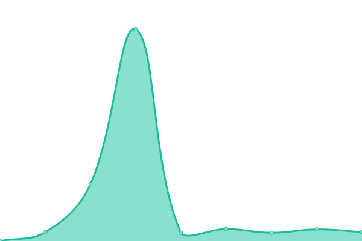 643ms
     
 | 

<a href="https://uptime.searxng.org/history/find-xenorio-xyz">100.00%</a>
    

|  [kantan.cat](https://kantan.cat) | 🟩 Up | [kantan-cat.yml](https://github.com/searxng/searx-instances-uptime/commits/HEAD/history/kantan-cat.yml) | 

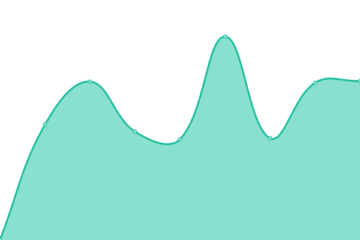 796ms
     
 | 

<a href="https://uptime.searxng.org/history/kantan-cat">100.00%</a>
    

|  [metacat.online](https://metacat.online) | 🟩 Up | [metacat-online.yml](https://github.com/searxng/searx-instances-uptime/commits/HEAD/history/metacat-online.yml) | 

 696ms
     
 | 

<a href="https://uptime.searxng.org/history/metacat-online">100.00%</a>
    

|  [northboot.xyz](https://northboot.xyz) | 🟩 Up | [northboot-xyz.yml](https://github.com/searxng/searx-instances-uptime/commits/HEAD/history/northboot-xyz.yml) | 

 1104ms
     
 | 

<a href="https://uptime.searxng.org/history/northboot-xyz">100.00%</a>
    

|  [o5.gg](https://o5.gg) | 🟩 Up | [o5-gg.yml](https://github.com/searxng/searx-instances-uptime/commits/HEAD/history/o5-gg.yml) | 

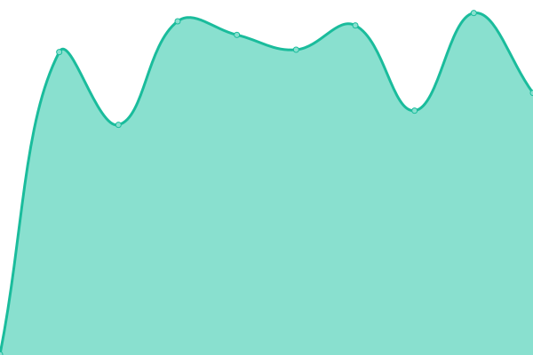 465ms
     
 | 

<a href="https://uptime.searxng.org/history/o5-gg">100.00%</a>
    

|  [ooglester.com](https://ooglester.com) | 🟥 Down | [ooglester-com.yml](https://github.com/searxng/searx-instances-uptime/commits/HEAD/history/ooglester-com.yml) | 

 8053ms
     
 | 

<a href="https://uptime.searxng.org/history/ooglester-com">99.08%</a>
    

|  [opnxng.com](https://opnxng.com) | 🟩 Up | [opnxng-com.yml](https://github.com/searxng/searx-instances-uptime/commits/HEAD/history/opnxng-com.yml) | 

 759ms
     
 | 

<a href="https://uptime.searxng.org/history/opnxng-com">99.37%</a>
    

|  [paulgo.io](https://paulgo.io) | 🟩 Up | [paulgo-io.yml](https://github.com/searxng/searx-instances-uptime/commits/HEAD/history/paulgo-io.yml) | 

 5999ms
     
 | 

<a href="https://uptime.searxng.org/history/paulgo-io">99.64%</a>
    

|  [priv.au](https://priv.au) | 🟩 Up | [priv-au.yml](https://github.com/searxng/searx-instances-uptime/commits/HEAD/history/priv-au.yml) | 

 943ms
     
 | 

<a href="https://uptime.searxng.org/history/priv-au">100.00%</a>
    

|  [s.mble.dk](https://s.mble.dk) | 🟥 Down | [s-mble-dk.yml](https://github.com/searxng/searx-instances-uptime/commits/HEAD/history/s-mble-dk.yml) | 

 539ms
     
 | 

<a href="https://uptime.searxng.org/history/s-mble-dk">78.57%</a>
    

|  [search.2b9t.xyz](https://search.2b9t.xyz) | 🟩 Up | [search-2b9t-xyz.yml](https://github.com/searxng/searx-instances-uptime/commits/HEAD/history/search-2b9t-xyz.yml) | 

 195ms
     
 | 

<a href="https://uptime.searxng.org/history/search-2b9t-xyz">100.00%</a>
    

|  [search.anoni.net](https://search.anoni.net) | 🟩 Up | [search-anoni-net.yml](https://github.com/searxng/searx-instances-uptime/commits/HEAD/history/search-anoni-net.yml) | 

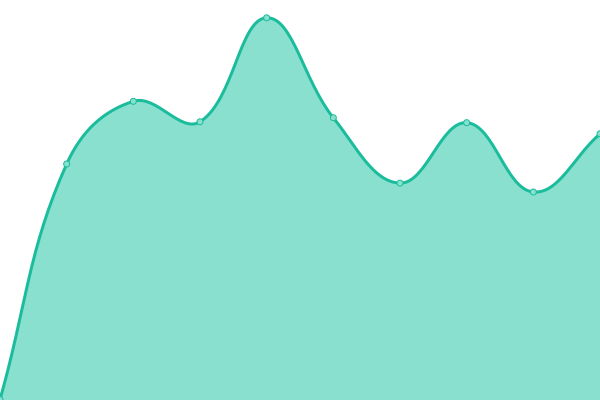 658ms
     
 | 

<a href="https://uptime.searxng.org/history/search-anoni-net">100.00%</a>
    

|  [search.bladerunn.in](https://search.bladerunn.in) | 🟩 Up | [search-bladerunn-in.yml](https://github.com/searxng/searx-instances-uptime/commits/HEAD/history/search-bladerunn-in.yml) | 

 714ms
     
 | 

<a href="https://uptime.searxng.org/history/search-bladerunn-in">98.00%</a>
    

|  [search.buddyverse.net](https://search.buddyverse.net) | 🟩 Up | [search-buddyverse-net.yml](https://github.com/searxng/searx-instances-uptime/commits/HEAD/history/search-buddyverse-net.yml) | 

 797ms
     
 | 

<a href="https://uptime.searxng.org/history/search-buddyverse-net">93.08%</a>
    

|  [search.canine.tools](https://search.canine.tools) | 🟩 Up | [search-canine-tools.yml](https://github.com/searxng/searx-instances-uptime/commits/HEAD/history/search-canine-tools.yml) | 

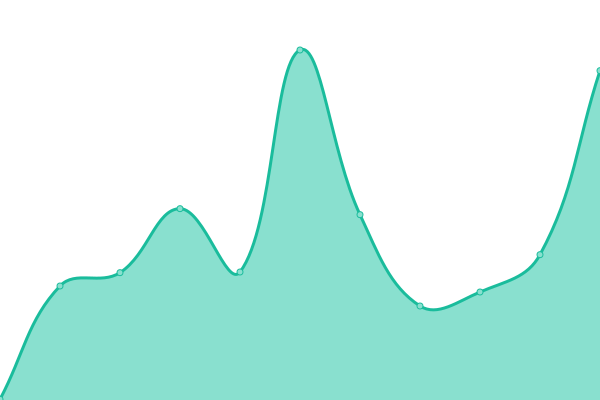 203ms
     
 | 

<a href="https://uptime.searxng.org/history/search-canine-tools">100.00%</a>
    

|  [search.catboy.house](https://search.catboy.house) | 🟩 Up | [search-catboy-house.yml](https://github.com/searxng/searx-instances-uptime/commits/HEAD/history/search-catboy-house.yml) | 

 680ms
     
 | 

<a href="https://uptime.searxng.org/history/search-catboy-house">89.52%</a>
    

|  [search.charliewhiskey.net](https://search.charliewhiskey.net) | 🟩 Up | [search-charliewhiskey-net.yml](https://github.com/searxng/searx-instances-uptime/commits/HEAD/history/search-charliewhiskey-net.yml) | 

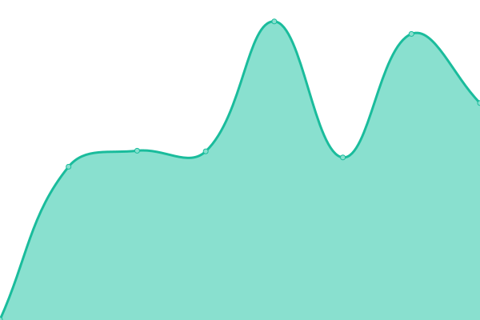 555ms
     
 | 

<a href="https://uptime.searxng.org/history/search-charliewhiskey-net">100.00%</a>
    

|  [search.einfachzocken.eu](https://search.einfachzocken.eu) | 🟩 Up | [search-einfachzocken-eu.yml](https://github.com/searxng/searx-instances-uptime/commits/HEAD/history/search-einfachzocken-eu.yml) | 

 615ms
     
 | 

<a href="https://uptime.searxng.org/history/search-einfachzocken-eu">99.69%</a>
    

|  [search.ethibox.fr](https://search.ethibox.fr) | 🟩 Up | [search-ethibox-fr.yml](https://github.com/searxng/searx-instances-uptime/commits/HEAD/history/search-ethibox-fr.yml) | 

 904ms
     
 | 

<a href="https://uptime.searxng.org/history/search-ethibox-fr">99.88%</a>
    

|  [search.femboy.ad](https://search.femboy.ad) | 🟩 Up | [search-femboy-ad.yml](https://github.com/searxng/searx-instances-uptime/commits/HEAD/history/search-femboy-ad.yml) | 

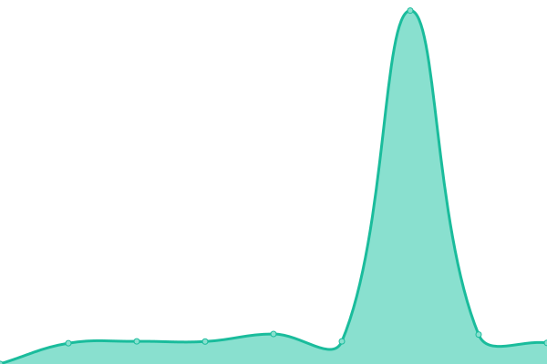 201ms
     
 | 

<a href="https://uptime.searxng.org/history/search-femboy-ad">99.85%</a>
    

|  [search.hbubli.cc](https://search.hbubli.cc) | 🟩 Up | [search-hbubli-cc.yml](https://github.com/searxng/searx-instances-uptime/commits/HEAD/history/search-hbubli-cc.yml) | 

 417ms
     
 | 

<a href="https://uptime.searxng.org/history/search-hbubli-cc">100.00%</a>
    

|  [search.iguru.gr](https://search.iguru.gr) | 🟩 Up | [search-iguru-gr.yml](https://github.com/searxng/searx-instances-uptime/commits/HEAD/history/search-iguru-gr.yml) | 

 434ms
     
 | 

<a href="https://uptime.searxng.org/history/search-iguru-gr">100.00%</a>
    

|  [search.im-in.space](https://search.im-in.space) | 🟩 Up | [search-im-in-space.yml](https://github.com/searxng/searx-instances-uptime/commits/HEAD/history/search-im-in-space.yml) | 

 2686ms
     
 | 

<a href="https://uptime.searxng.org/history/search-im-in-space">99.89%</a>
    

|  [search.indst.eu](https://search.indst.eu) | 🟩 Up | [search-indst-eu.yml](https://github.com/searxng/searx-instances-uptime/commits/HEAD/history/search-indst-eu.yml) | 

 854ms
     
 | 

<a href="https://uptime.searxng.org/history/search-indst-eu">100.00%</a>
    

|  [search.inetol.net](https://search.inetol.net) | 🟩 Up | [search-inetol-net.yml](https://github.com/searxng/searx-instances-uptime/commits/HEAD/history/search-inetol-net.yml) | 

 700ms
     
 | 

<a href="https://uptime.searxng.org/history/search-inetol-net">100.00%</a>
    

|  [search.internetsucks.net](https://search.internetsucks.net) | 🟩 Up | [search-internetsucks-net.yml](https://github.com/searxng/searx-instances-uptime/commits/HEAD/history/search-internetsucks-net.yml) | 

 704ms
     
 | 

<a href="https://uptime.searxng.org/history/search-internetsucks-net">100.00%</a>
    

|  [search.ipsys.bf](https://search.ipsys.bf) | 🟩 Up | [search-ipsys-bf.yml](https://github.com/searxng/searx-instances-uptime/commits/HEAD/history/search-ipsys-bf.yml) | 

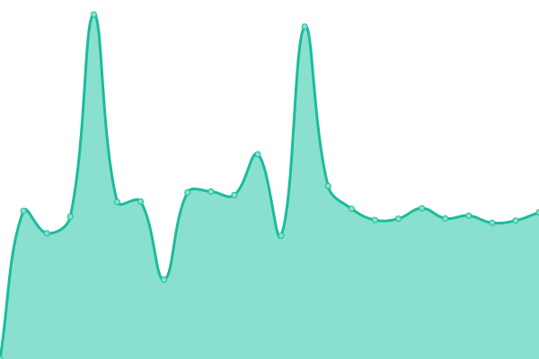 1875ms
     
 | 

<a href="https://uptime.searxng.org/history/search-ipsys-bf">100.00%</a>
    

|  [search.ipv6s.net](https://search.ipv6s.net) | 🟩 Up | [search-ipv6s-net.yml](https://github.com/searxng/searx-instances-uptime/commits/HEAD/history/search-ipv6s-net.yml) | 

 405ms
     
 | 

<a href="https://uptime.searxng.org/history/search-ipv6s-net">100.00%</a>
    

|  [search.leptons.xyz](https://search.leptons.xyz) | 🟩 Up | [search-leptons-xyz.yml](https://github.com/searxng/searx-instances-uptime/commits/HEAD/history/search-leptons-xyz.yml) | 

 377ms
     
 | 

<a href="https://uptime.searxng.org/history/search-leptons-xyz">92.57%</a>
    

|  [search.mdosch.de](https://search.mdosch.de) | 🟩 Up | [search-mdosch-de.yml](https://github.com/searxng/searx-instances-uptime/commits/HEAD/history/search-mdosch-de.yml) | 

 676ms
     
 | 

<a href="https://uptime.searxng.org/history/search-mdosch-de">100.00%</a>
    

|  [search.mycotrip.tech](https://search.mycotrip.tech) | 🟩 Up | [search-mycotrip-tech.yml](https://github.com/searxng/searx-instances-uptime/commits/HEAD/history/search-mycotrip-tech.yml) | 

 149ms
     
 | 

<a href="https://uptime.searxng.org/history/search-mycotrip-tech">100.00%</a>
    

|  [search.nerdvpn.de](https://search.nerdvpn.de) | 🟩 Up | [search-nerdvpn-de.yml](https://github.com/searxng/searx-instances-uptime/commits/HEAD/history/search-nerdvpn-de.yml) | 

 683ms
     
 | 

<a href="https://uptime.searxng.org/history/search-nerdvpn-de">100.00%</a>
    

|  [search.oh64.moe](https://search.oh64.moe) | 🟩 Up | [search-oh64-moe.yml](https://github.com/searxng/searx-instances-uptime/commits/HEAD/history/search-oh64-moe.yml) | 

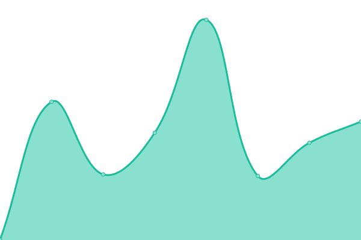 476ms
     
 | 

<a href="https://uptime.searxng.org/history/search-oh64-moe">100.00%</a>
    

|  [search.ononoki.org](https://search.ononoki.org) | 🟩 Up | [search-ononoki-org.yml](https://github.com/searxng/searx-instances-uptime/commits/HEAD/history/search-ononoki-org.yml) | 

 277ms
     
 | 

<a href="https://uptime.searxng.org/history/search-ononoki-org">99.80%</a>
    

|  [search.perditum.com](https://search.perditum.com) | 🟩 Up | [search-perditum-com.yml](https://github.com/searxng/searx-instances-uptime/commits/HEAD/history/search-perditum-com.yml) | 

 1594ms
     
 | 

<a href="https://uptime.searxng.org/history/search-perditum-com">95.16%</a>
    

|  [search.pollorebozado.com](https://search.pollorebozado.com) | 🟩 Up | [search-pollorebozado-com.yml](https://github.com/searxng/searx-instances-uptime/commits/HEAD/history/search-pollorebozado-com.yml) | 

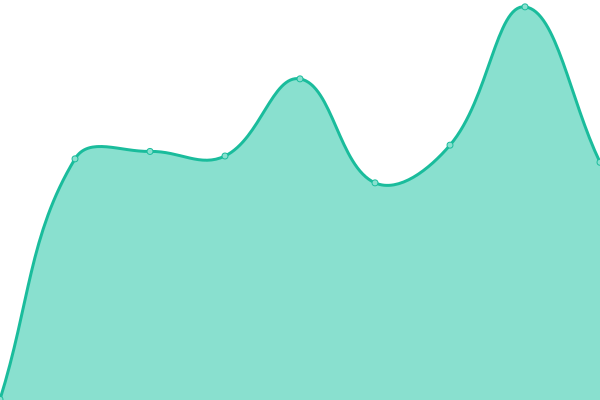 455ms
     
 | 

<a href="https://uptime.searxng.org/history/search-pollorebozado-com">100.00%</a>
    

|  [search.privacyredirect.com](https://search.privacyredirect.com) | 🟩 Up | [search-privacyredirect-com.yml](https://github.com/searxng/searx-instances-uptime/commits/HEAD/history/search-privacyredirect-com.yml) | 

 523ms
     
 | 

<a href="https://uptime.searxng.org/history/search-privacyredirect-com">100.00%</a>
    

|  [search.rhscz.eu](https://search.rhscz.eu) | 🟩 Up | [search-rhscz-eu.yml](https://github.com/searxng/searx-instances-uptime/commits/HEAD/history/search-rhscz-eu.yml) | 

 659ms
     
 | 

<a href="https://uptime.searxng.org/history/search-rhscz-eu">100.00%</a>
    

|  [search.rowie.at](https://search.rowie.at) | 🟩 Up | [search-rowie-at.yml](https://github.com/searxng/searx-instances-uptime/commits/HEAD/history/search-rowie-at.yml) | 

 643ms
     
 | 

<a href="https://uptime.searxng.org/history/search-rowie-at">100.00%</a>
    

|  [search.sapti.me](https://search.sapti.me) | 🟩 Up | [search-sapti-me.yml](https://github.com/searxng/searx-instances-uptime/commits/HEAD/history/search-sapti-me.yml) | 

 611ms
     
 | 

<a href="https://uptime.searxng.org/history/search-sapti-me">100.00%</a>
    

|  [search.system51.co.uk](https://search.system51.co.uk) | 🟩 Up | [search-system51-co-uk.yml](https://github.com/searxng/searx-instances-uptime/commits/HEAD/history/search-system51-co-uk.yml) | 

 497ms
     
 | 

<a href="https://uptime.searxng.org/history/search-system51-co-uk">100.00%</a>
    

|  [search.undertale.uk](https://search.undertale.uk) | 🟩 Up | [search-undertale-uk.yml](https://github.com/searxng/searx-instances-uptime/commits/HEAD/history/search-undertale-uk.yml) | 

 569ms
     
 | 

<a href="https://uptime.searxng.org/history/search-undertale-uk">100.00%</a>
    

|  [search.url4irl.com](https://search.url4irl.com) | 🟩 Up | [search-url4irl-com.yml](https://github.com/searxng/searx-instances-uptime/commits/HEAD/history/search-url4irl-com.yml) | 

 522ms
     
 | 

<a href="https://uptime.searxng.org/history/search-url4irl-com">100.00%</a>
    

|  [searx.ankha.ac](https://searx.ankha.ac) | 🟩 Up | [searx-ankha-ac.yml](https://github.com/searxng/searx-instances-uptime/commits/HEAD/history/searx-ankha-ac.yml) | 

 395ms
     
 | 

<a href="https://uptime.searxng.org/history/searx-ankha-ac">100.00%</a>
    

|  [searx.dresden.network](https://searx.dresden.network) | 🟩 Up | [searx-dresden-network.yml](https://github.com/searxng/searx-instances-uptime/commits/HEAD/history/searx-dresden-network.yml) | 

 704ms
     
 | 

<a href="https://uptime.searxng.org/history/searx-dresden-network">100.00%</a>
    

|  [searx.foobar.vip](https://searx.foobar.vip) | 🟩 Up | [searx-foobar-vip.yml](https://github.com/searxng/searx-instances-uptime/commits/HEAD/history/searx-foobar-vip.yml) | 

 632ms
     
 | 

<a href="https://uptime.searxng.org/history/searx-foobar-vip">100.00%</a>
    

|  [searx.foss.family](https://searx.foss.family) | 🟩 Up | [searx-foss-family.yml](https://github.com/searxng/searx-instances-uptime/commits/HEAD/history/searx-foss-family.yml) | 

 1383ms
     
 | 

<a href="https://uptime.searxng.org/history/searx-foss-family">99.73%</a>
    

|  [searx.juancord.xyz](https://searx.juancord.xyz) | 🟩 Up | [searx-juancord-xyz.yml](https://github.com/searxng/searx-instances-uptime/commits/HEAD/history/searx-juancord-xyz.yml) | 

 496ms
     
 | 

<a href="https://uptime.searxng.org/history/searx-juancord-xyz">100.00%</a>
    

|  [searx.lunar.icu](https://searx.lunar.icu) | 🟩 Up | [searx-lunar-icu.yml](https://github.com/searxng/searx-instances-uptime/commits/HEAD/history/searx-lunar-icu.yml) | 

 394ms
     
 | 

<a href="https://uptime.searxng.org/history/searx-lunar-icu">100.00%</a>
    

|  [searx.mbuf.net](https://searx.mbuf.net) | 🟩 Up | [searx-mbuf-net.yml](https://github.com/searxng/searx-instances-uptime/commits/HEAD/history/searx-mbuf-net.yml) | 

 653ms
     
 | 

<a href="https://uptime.searxng.org/history/searx-mbuf-net">99.49%</a>
    

|  [searx.mxchange.org](https://searx.mxchange.org) | 🟩 Up | [searx-mxchange-org.yml](https://github.com/searxng/searx-instances-uptime/commits/HEAD/history/searx-mxchange-org.yml) | 

 866ms
     
 | 

<a href="https://uptime.searxng.org/history/searx-mxchange-org">100.00%</a>
    

|  [searx.namejeff.xyz](https://searx.namejeff.xyz) | 🟩 Up | [searx-namejeff-xyz.yml](https://github.com/searxng/searx-instances-uptime/commits/HEAD/history/searx-namejeff-xyz.yml) | 

 371ms
     
 | 

<a href="https://uptime.searxng.org/history/searx-namejeff-xyz">100.00%</a>
    

|  [searx.oloke.xyz](https://searx.oloke.xyz) | 🟩 Up | [searx-oloke-xyz.yml](https://github.com/searxng/searx-instances-uptime/commits/HEAD/history/searx-oloke-xyz.yml) | 

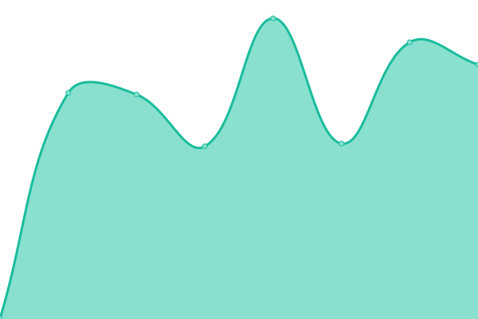 511ms
     
 | 

<a href="https://uptime.searxng.org/history/searx-oloke-xyz">99.69%</a>
    

|  [searx.ox2.fr](https://searx.ox2.fr) | 🟩 Up | [searx-ox2-fr.yml](https://github.com/searxng/searx-instances-uptime/commits/HEAD/history/searx-ox2-fr.yml) | 

 838ms
     
 | 

<a href="https://uptime.searxng.org/history/searx-ox2-fr">100.00%</a>
    

|  [searx.party](https://searx.party) | 🟩 Up | [searx-party.yml](https://github.com/searxng/searx-instances-uptime/commits/HEAD/history/searx-party.yml) | 

 393ms
     
 | 

<a href="https://uptime.searxng.org/history/searx-party">100.00%</a>
    

|  [searx.perennialte.ch](https://searx.perennialte.ch) | 🟩 Up | [searx-perennialte-ch.yml](https://github.com/searxng/searx-instances-uptime/commits/HEAD/history/searx-perennialte-ch.yml) | 

 696ms
     
 | 

<a href="https://uptime.searxng.org/history/searx-perennialte-ch">100.00%</a>
    

|  [searx.ppeb.me](https://searx.ppeb.me) | 🟩 Up | [searx-ppeb-me.yml](https://github.com/searxng/searx-instances-uptime/commits/HEAD/history/searx-ppeb-me.yml) | 

 1651ms
     
 | 

<a href="https://uptime.searxng.org/history/searx-ppeb-me">99.69%</a>
    

|  [searx.rhscz.eu](https://searx.rhscz.eu) | 🟩 Up | [searx-rhscz-eu.yml](https://github.com/searxng/searx-instances-uptime/commits/HEAD/history/searx-rhscz-eu.yml) | 

 641ms
     
 | 

<a href="https://uptime.searxng.org/history/searx-rhscz-eu">100.00%</a>
    

|  [searx.ro](https://searx.ro) | 🟩 Up | [searx-ro.yml](https://github.com/searxng/searx-instances-uptime/commits/HEAD/history/searx-ro.yml) | 

 507ms
     
 | 

<a href="https://uptime.searxng.org/history/searx-ro">100.00%</a>
    

|  [searx.sev.monster](https://searx.sev.monster) | 🟩 Up | [searx-sev-monster.yml](https://github.com/searxng/searx-instances-uptime/commits/HEAD/history/searx-sev-monster.yml) | 

 399ms
     
 | 

<a href="https://uptime.searxng.org/history/searx-sev-monster">100.00%</a>
    

|  [searx.stream](https://searx.stream) | 🟩 Up | [searx-stream.yml](https://github.com/searxng/searx-instances-uptime/commits/HEAD/history/searx-stream.yml) | 

 884ms
     
 | 

<a href="https://uptime.searxng.org/history/searx-stream">100.00%</a>
    

|  [searx.tiekoetter.com](https://searx.tiekoetter.com) | 🟩 Up | [searx-tiekoetter-com.yml](https://github.com/searxng/searx-instances-uptime/commits/HEAD/history/searx-tiekoetter-com.yml) | 

 701ms
     
 | 

<a href="https://uptime.searxng.org/history/searx-tiekoetter-com">100.00%</a>
    

|  [searx.tuxcloud.net](https://searx.tuxcloud.net) | 🟩 Up | [searx-tuxcloud-net.yml](https://github.com/searxng/searx-instances-uptime/commits/HEAD/history/searx-tuxcloud-net.yml) | 

 622ms
     
 | 

<a href="https://uptime.searxng.org/history/searx-tuxcloud-net">98.31%</a>
    

|  [searx.zhenyapav.com](https://searx.zhenyapav.com) | 🟩 Up | [searx-zhenyapav-com.yml](https://github.com/searxng/searx-instances-uptime/commits/HEAD/history/searx-zhenyapav-com.yml) | 

 919ms
     
 | 

<a href="https://uptime.searxng.org/history/searx-zhenyapav-com">100.00%</a>
    

|  [searxng.biz](https://searxng.biz) | 🟩 Up | [searxng-biz.yml](https://github.com/searxng/searx-instances-uptime/commits/HEAD/history/searxng-biz.yml) | 

 2667ms
     
 | 

<a href="https://uptime.searxng.org/history/searxng-biz">99.76%</a>
    

|  [searxng.deliberate.world](https://searxng.deliberate.world) | 🟩 Up | [searxng-deliberate-world.yml](https://github.com/searxng/searx-instances-uptime/commits/HEAD/history/searxng-deliberate-world.yml) | 

 670ms
     
 | 

<a href="https://uptime.searxng.org/history/searxng-deliberate-world">99.49%</a>
    

|  [searxng.f24o.zip](https://searxng.f24o.zip) | 🟩 Up | [searxng-f24o-zip.yml](https://github.com/searxng/searx-instances-uptime/commits/HEAD/history/searxng-f24o-zip.yml) | 

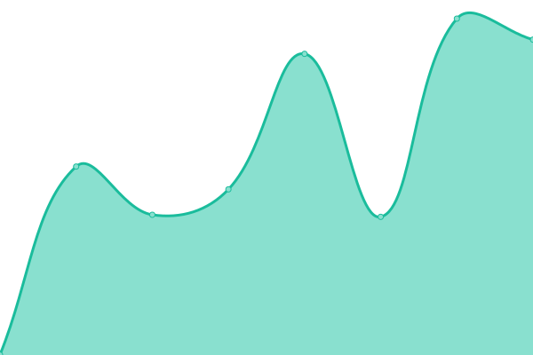 872ms
     
 | 

<a href="https://uptime.searxng.org/history/searxng-f24o-zip">100.00%</a>
    

|  [searxng.hweeren.com](https://searxng.hweeren.com) | 🟩 Up | [searxng-hweeren-com.yml](https://github.com/searxng/searx-instances-uptime/commits/HEAD/history/searxng-hweeren-com.yml) | 

 721ms
     
 | 

<a href="https://uptime.searxng.org/history/searxng-hweeren-com">94.92%</a>
    

|  [searxng.mcgee.red](https://searxng.mcgee.red) | 🟩 Up | [searxng-mcgee-red.yml](https://github.com/searxng/searx-instances-uptime/commits/HEAD/history/searxng-mcgee-red.yml) | 

 540ms
     
 | 

<a href="https://uptime.searxng.org/history/searxng-mcgee-red">100.00%</a>
    

|  [searxng.shreven.org](https://searxng.shreven.org) | 🟩 Up | [searxng-shreven-org.yml](https://github.com/searxng/searx-instances-uptime/commits/HEAD/history/searxng-shreven-org.yml) | 

 339ms
     
 | 

<a href="https://uptime.searxng.org/history/searxng-shreven-org">100.00%</a>
    

|  [searxng.site](https://searxng.site) | 🟩 Up | [searxng-site.yml](https://github.com/searxng/searx-instances-uptime/commits/HEAD/history/searxng-site.yml) | 

 420ms
     
 | 

<a href="https://uptime.searxng.org/history/searxng-site">100.00%</a>
    

|  [searxng.website](https://searxng.website) | 🟩 Up | [searxng-website.yml](https://github.com/searxng/searx-instances-uptime/commits/HEAD/history/searxng-website.yml) | 

 415ms
     
 | 

<a href="https://uptime.searxng.org/history/searxng-website">100.00%</a>
    

|  [seek.fyi](https://seek.fyi) | 🟩 Up | [seek-fyi.yml](https://github.com/searxng/searx-instances-uptime/commits/HEAD/history/seek-fyi.yml) | 

 371ms
     
 | 

<a href="https://uptime.searxng.org/history/seek-fyi">100.00%</a>
    

|  [sx.catgirl.cloud](https://sx.catgirl.cloud) | 🟩 Up | [sx-catgirl-cloud.yml](https://github.com/searxng/searx-instances-uptime/commits/HEAD/history/sx-catgirl-cloud.yml) | 

 807ms
     
 | 

<a href="https://uptime.searxng.org/history/sx-catgirl-cloud">100.00%</a>
    

|  [www.gruble.de](https://www.gruble.de) | 🟩 Up | [www-gruble-de.yml](https://github.com/searxng/searx-instances-uptime/commits/HEAD/history/www-gruble-de.yml) | 

 618ms
     
 | 

<a href="https://uptime.searxng.org/history/www-gruble-de">97.21%</a>
    

|  [searx.neocities.org](https://searx.neocities.org) | 🟩 Up | [searx-neocities-org.yml](https://github.com/searxng/searx-instances-uptime/commits/HEAD/history/searx-neocities-org.yml) | 

 226ms
     
 | 

<a href="https://uptime.searxng.org/history/searx-neocities-org">100.00%</a>
    

<!--end: status pages-->

[**Visit our status website →**](https://searxng.github.io/searx-instances-uptime)

## 📄 License

- Powered by: [Upptime](https://github.com/upptime/upptime)
- Code: [MIT](./LICENSE) © [SearXNG](https://searxng.org)
- Data in the `./history` directory: [Open Database License](https://opendatacommons.org/licenses/odbl/1-0/)
