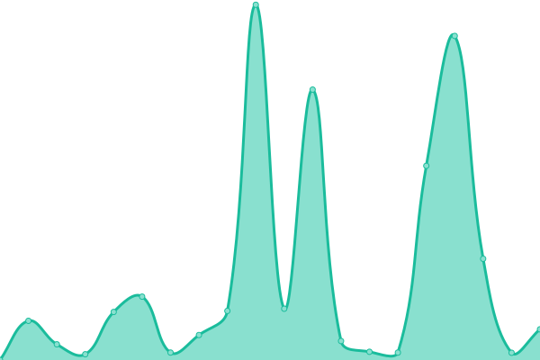
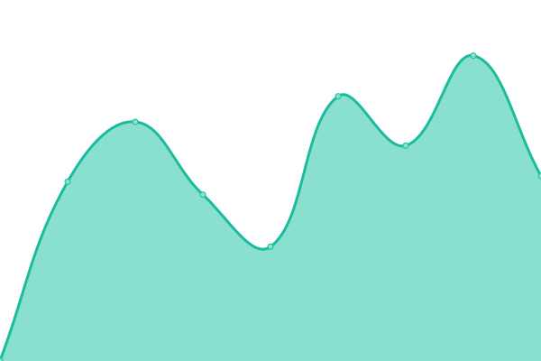
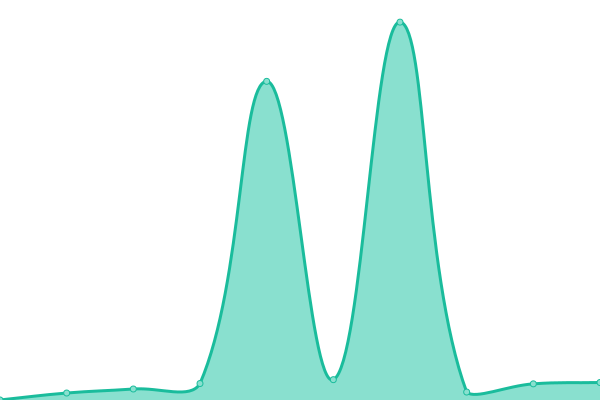
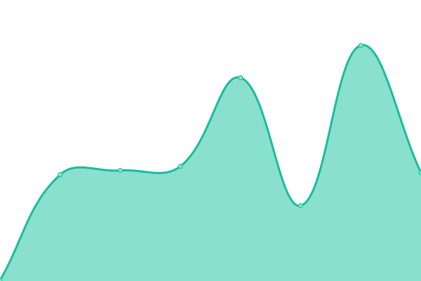
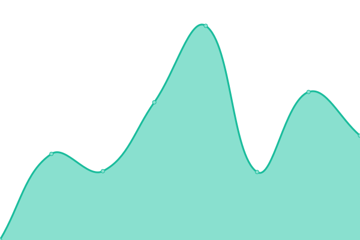
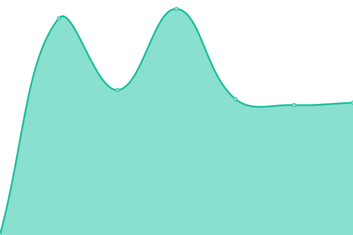

# [📈 Live Status](https://searxng.github.io/searx-instances-uptime): <!--live status--> **🟧 Partial outage**

This repository contains the open-source uptime monitor and status page for [SearXNG](https://searxng.org), powered by [Upptime](https://github.com/upptime/upptime).

With [Upptime](https://upptime.js.org), you can get your own unlimited and free uptime monitor and status page, powered entirely by a GitHub repository. We use [Issues](https://github.com/searxng/searx-instances-uptime/issues) as incident reports, [Actions](https://github.com/searxng/searx-instances-uptime/actions) as uptime monitors, and [Pages](https://searxng.github.io/searx-instances-uptime) for the status page.

<!--start: status pages-->
<!-- This summary is generated by Upptime (https://github.com/upptime/upptime) -->
<!-- Do not edit this manually, your changes will be overwritten -->
<!-- prettier-ignore -->
| URL | Status | History | Response Time | Uptime |
| --- | ------ | ------- | ------------- | ------ |
|  [searx.space](https://searx.space) | 🟩 Up | [searx-space.yml](https://github.com/searxng/searx-instances-uptime/commits/HEAD/history/searx-space.yml) | 

 864ms
     
 | 

<a href="https://uptime.searxng.org/history/searx-space">100.00%</a>
    

|  [baresearch.org](https://baresearch.org) | 🟩 Up | [baresearch-org.yml](https://github.com/searxng/searx-instances-uptime/commits/HEAD/history/baresearch-org.yml) | 

 288ms
     
 | 

<a href="https://uptime.searxng.org/history/baresearch-org">100.00%</a>
    

|  [copp.gg](https://copp.gg) | 🟥 Down | [copp-gg.yml](https://github.com/searxng/searx-instances-uptime/commits/HEAD/history/copp-gg.yml) | 

 541ms
     
 | 

<a href="https://uptime.searxng.org/history/copp-gg">98.63%</a>
    

|  [darmarit.org](https://darmarit.org/searx) | 🟥 Down | [darmarit-org.yml](https://github.com/searxng/searx-instances-uptime/commits/HEAD/history/darmarit-org.yml) | 

 962ms
     
 | 

<a href="https://uptime.searxng.org/history/darmarit-org">99.98%</a>
    

|  [etsi.me](https://etsi.me) | 🟩 Up | [etsi-me.yml](https://github.com/searxng/searx-instances-uptime/commits/HEAD/history/etsi-me.yml) | 

 341ms
     
 | 

<a href="https://uptime.searxng.org/history/etsi-me">100.00%</a>
    

|  [fairsuch.net](https://fairsuch.net) | 🟥 Down | [fairsuch-net.yml](https://github.com/searxng/searx-instances-uptime/commits/HEAD/history/fairsuch-net.yml) | 

 1335ms
     
 | 

<a href="https://uptime.searxng.org/history/fairsuch-net">98.55%</a>
    

|  [kantan.cat](https://kantan.cat) | 🟩 Up | [kantan-cat.yml](https://github.com/searxng/searx-instances-uptime/commits/HEAD/history/kantan-cat.yml) | 

 1056ms
     
 | 

<a href="https://uptime.searxng.org/history/kantan-cat">99.15%</a>
    

|  [nogoo.me](https://nogoo.me) | 🟩 Up | [nogoo-me.yml](https://github.com/searxng/searx-instances-uptime/commits/HEAD/history/nogoo-me.yml) | 

 665ms
     
 | 

<a href="https://uptime.searxng.org/history/nogoo-me">100.00%</a>
    

|  [northboot.xyz](https://northboot.xyz) | 🟩 Up | [northboot-xyz.yml](https://github.com/searxng/searx-instances-uptime/commits/HEAD/history/northboot-xyz.yml) | 

 1132ms
     
 | 

<a href="https://uptime.searxng.org/history/northboot-xyz">99.42%</a>
    

|  [nyc1.sx.ggtyler.dev](https://nyc1.sx.ggtyler.dev) | 🟩 Up | [nyc1-sx-ggtyler-dev.yml](https://github.com/searxng/searx-instances-uptime/commits/HEAD/history/nyc1-sx-ggtyler-dev.yml) | 

 444ms
     
 | 

<a href="https://uptime.searxng.org/history/nyc1-sx-ggtyler-dev">100.00%</a>
    

|  [ooglester.com](https://ooglester.com) | 🟩 Up | [ooglester-com.yml](https://github.com/searxng/searx-instances-uptime/commits/HEAD/history/ooglester-com.yml) | 

 217ms
     
 | 

<a href="https://uptime.searxng.org/history/ooglester-com">99.69%</a>
    

|  [opnxng.com](https://opnxng.com) | 🟩 Up | [opnxng-com.yml](https://github.com/searxng/searx-instances-uptime/commits/HEAD/history/opnxng-com.yml) | 

 1714ms
     
 | 

<a href="https://uptime.searxng.org/history/opnxng-com">99.77%</a>
    

|  [paulgo.io](https://paulgo.io) | 🟩 Up | [paulgo-io.yml](https://github.com/searxng/searx-instances-uptime/commits/HEAD/history/paulgo-io.yml) | 

 669ms
     
 | 

<a href="https://uptime.searxng.org/history/paulgo-io">100.00%</a>
    

|  [priv.au](https://priv.au) | 🟥 Down | [priv-au.yml](https://github.com/searxng/searx-instances-uptime/commits/HEAD/history/priv-au.yml) | 

 138ms
     
 | 

<a href="https://uptime.searxng.org/history/priv-au">99.98%</a>
    

|  [s.mble.dk](https://s.mble.dk) | 🟩 Up | [s-mble-dk.yml](https://github.com/searxng/searx-instances-uptime/commits/HEAD/history/s-mble-dk.yml) | 

 459ms
     
 | 

<a href="https://uptime.searxng.org/history/s-mble-dk">100.00%</a>
    

|  [search.blitzw.in](https://search.blitzw.in) | 🟩 Up | [search-blitzw-in.yml](https://github.com/searxng/searx-instances-uptime/commits/HEAD/history/search-blitzw-in.yml) | 

 514ms
     
 | 

<a href="https://uptime.searxng.org/history/search-blitzw-in">100.00%</a>
    

|  [search.bus-hit.me](https://search.bus-hit.me) | 🟩 Up | [search-bus-hit-me.yml](https://github.com/searxng/searx-instances-uptime/commits/HEAD/history/search-bus-hit-me.yml) | 

 412ms
     
 | 

<a href="https://uptime.searxng.org/history/search-bus-hit-me">100.00%</a>
    

|  [search.canine.tools](https://search.canine.tools) | 🟩 Up | [search-canine-tools.yml](https://github.com/searxng/searx-instances-uptime/commits/HEAD/history/search-canine-tools.yml) | 

 272ms
     
 | 

<a href="https://uptime.searxng.org/history/search-canine-tools">100.00%</a>
    

|  [search.citw.lgbt](https://search.citw.lgbt) | 🟩 Up | [search-citw-lgbt.yml](https://github.com/searxng/searx-instances-uptime/commits/HEAD/history/search-citw-lgbt.yml) | 

 873ms
     
 | 

<a href="https://uptime.searxng.org/history/search-citw-lgbt">100.00%</a>
    

|  [search.einfachzocken.eu](https://search.einfachzocken.eu) | 🟩 Up | [search-einfachzocken-eu.yml](https://github.com/searxng/searx-instances-uptime/commits/HEAD/history/search-einfachzocken-eu.yml) | 

 414ms
     
 | 

<a href="https://uptime.searxng.org/history/search-einfachzocken-eu">100.00%</a>
    

|  [search.fredix.xyz](https://search.fredix.xyz) | 🟩 Up | [search-fredix-xyz.yml](https://github.com/searxng/searx-instances-uptime/commits/HEAD/history/search-fredix-xyz.yml) | 

 529ms
     
 | 

<a href="https://uptime.searxng.org/history/search-fredix-xyz">100.00%</a>
    

|  [search.gcomm.ch](https://search.gcomm.ch) | 🟩 Up | [search-gcomm-ch.yml](https://github.com/searxng/searx-instances-uptime/commits/HEAD/history/search-gcomm-ch.yml) | 

 463ms
     
 | 

<a href="https://uptime.searxng.org/history/search-gcomm-ch">100.00%</a>
    

|  [search.getcobalt.org](https://search.getcobalt.org) | 🟩 Up | [search-getcobalt-org.yml](https://github.com/searxng/searx-instances-uptime/commits/HEAD/history/search-getcobalt-org.yml) | 

 315ms
     
 | 

<a href="https://uptime.searxng.org/history/search-getcobalt-org">100.00%</a>
    

|  [search.hbubli.cc](https://search.hbubli.cc) | 🟩 Up | [search-hbubli-cc.yml](https://github.com/searxng/searx-instances-uptime/commits/HEAD/history/search-hbubli-cc.yml) | 

 452ms
     
 | 

<a href="https://uptime.searxng.org/history/search-hbubli-cc">100.00%</a>
    

|  [search.im-in.space](https://search.im-in.space) | 🟩 Up | [search-im-in-space.yml](https://github.com/searxng/searx-instances-uptime/commits/HEAD/history/search-im-in-space.yml) | 

 555ms
     
 | 

<a href="https://uptime.searxng.org/history/search-im-in-space">100.00%</a>
    

|  [search.indst.eu](https://search.indst.eu) | 🟩 Up | [search-indst-eu.yml](https://github.com/searxng/searx-instances-uptime/commits/HEAD/history/search-indst-eu.yml) | 

 612ms
     
 | 

<a href="https://uptime.searxng.org/history/search-indst-eu">100.00%</a>
    

|  [search.inetol.net](https://search.inetol.net) | 🟩 Up | [search-inetol-net.yml](https://github.com/searxng/searx-instances-uptime/commits/HEAD/history/search-inetol-net.yml) | 

 483ms
     
 | 

<a href="https://uptime.searxng.org/history/search-inetol-net">100.00%</a>
    

|  [search.leptons.xyz](https://search.leptons.xyz) | 🟩 Up | [search-leptons-xyz.yml](https://github.com/searxng/searx-instances-uptime/commits/HEAD/history/search-leptons-xyz.yml) | 

 371ms
     
 | 

<a href="https://uptime.searxng.org/history/search-leptons-xyz">100.00%</a>
    

|  [search.mdosch.de](https://search.mdosch.de) | 🟩 Up | [search-mdosch-de.yml](https://github.com/searxng/searx-instances-uptime/commits/HEAD/history/search-mdosch-de.yml) | 

 546ms
     
 | 

<a href="https://uptime.searxng.org/history/search-mdosch-de">99.88%</a>
    

|  [search.nadeko.net](https://search.nadeko.net) | 🟩 Up | [search-nadeko-net.yml](https://github.com/searxng/searx-instances-uptime/commits/HEAD/history/search-nadeko-net.yml) | 

 475ms
     
 | 

<a href="https://uptime.searxng.org/history/search-nadeko-net">100.00%</a>
    

|  [search.nerdvpn.de](https://search.nerdvpn.de) | 🟩 Up | [search-nerdvpn-de.yml](https://github.com/searxng/searx-instances-uptime/commits/HEAD/history/search-nerdvpn-de.yml) | 

 771ms
     
 | 

<a href="https://uptime.searxng.org/history/search-nerdvpn-de">100.00%</a>
    

|  [search.ngn.tf](https://search.ngn.tf) | 🟩 Up | [search-ngn-tf.yml](https://github.com/searxng/searx-instances-uptime/commits/HEAD/history/search-ngn-tf.yml) | 

 816ms
     
 | 

<a href="https://uptime.searxng.org/history/search-ngn-tf">99.18%</a>
    

|  [search.nordh.tech](https://search.nordh.tech) | 🟩 Up | [search-nordh-tech.yml](https://github.com/searxng/searx-instances-uptime/commits/HEAD/history/search-nordh-tech.yml) | 

 595ms
     
 | 

<a href="https://uptime.searxng.org/history/search-nordh-tech">100.00%</a>
    

|  [search.ononoki.org](https://search.ononoki.org) | 🟩 Up | [search-ononoki-org.yml](https://github.com/searxng/searx-instances-uptime/commits/HEAD/history/search-ononoki-org.yml) | 

 305ms
     
 | 

<a href="https://uptime.searxng.org/history/search-ononoki-org">99.45%</a>
    

|  [search.privacyredirect.com](https://search.privacyredirect.com) | 🟥 Down | [search-privacyredirect-com.yml](https://github.com/searxng/searx-instances-uptime/commits/HEAD/history/search-privacyredirect-com.yml) | 

 482ms
     
 | 

<a href="https://uptime.searxng.org/history/search-privacyredirect-com">99.98%</a>
    

|  [search.projectsegfau.lt](https://search.projectsegfau.lt) | 🟩 Up | [search-projectsegfau-lt.yml](https://github.com/searxng/searx-instances-uptime/commits/HEAD/history/search-projectsegfau-lt.yml) | 

 1124ms
     
 | 

<a href="https://uptime.searxng.org/history/search-projectsegfau-lt">88.74%</a>
    

|  [search.rhscz.eu](https://search.rhscz.eu) | 🟩 Up | [search-rhscz-eu.yml](https://github.com/searxng/searx-instances-uptime/commits/HEAD/history/search-rhscz-eu.yml) | 

 435ms
     
 | 

<a href="https://uptime.searxng.org/history/search-rhscz-eu">100.00%</a>
    

|  [search.rowie.at](https://search.rowie.at) | 🟩 Up | [search-rowie-at.yml](https://github.com/searxng/searx-instances-uptime/commits/HEAD/history/search-rowie-at.yml) | 

 824ms
     
 | 

<a href="https://uptime.searxng.org/history/search-rowie-at">99.27%</a>
    

|  [search.sapti.me](https://search.sapti.me) | 🟩 Up | [search-sapti-me.yml](https://github.com/searxng/searx-instances-uptime/commits/HEAD/history/search-sapti-me.yml) | 

 728ms
     
 | 

<a href="https://uptime.searxng.org/history/search-sapti-me">100.00%</a>
    

|  [search.tommy-tran.com](https://search.tommy-tran.com) | 🟩 Up | [search-tommy-tran-com.yml](https://github.com/searxng/searx-instances-uptime/commits/HEAD/history/search-tommy-tran-com.yml) | 

 687ms
     
 | 

<a href="https://uptime.searxng.org/history/search-tommy-tran-com">100.00%</a>
    

|  [searx.aleteoryx.me](https://searx.aleteoryx.me) | 🟩 Up | [searx-aleteoryx-me.yml](https://github.com/searxng/searx-instances-uptime/commits/HEAD/history/searx-aleteoryx-me.yml) | 

 1471ms
     
 | 

<a href="https://uptime.searxng.org/history/searx-aleteoryx-me">98.68%</a>
    

|  [searx.ankha.ac](https://searx.ankha.ac) | 🟩 Up | [searx-ankha-ac.yml](https://github.com/searxng/searx-instances-uptime/commits/HEAD/history/searx-ankha-ac.yml) | 

 514ms
     
 | 

<a href="https://uptime.searxng.org/history/searx-ankha-ac">99.75%</a>
    

|  [searx.be](https://searx.be) | 🟩 Up | [searx-be.yml](https://github.com/searxng/searx-instances-uptime/commits/HEAD/history/searx-be.yml) | 

 524ms
     
 | 

<a href="https://uptime.searxng.org/history/searx-be">100.00%</a>
    

|  [searx.colbster937.dev](https://searx.colbster937.dev) | 🟥 Down | [searx-colbster937-dev.yml](https://github.com/searxng/searx-instances-uptime/commits/HEAD/history/searx-colbster937-dev.yml) | 

 178ms
     
 | 

<a href="https://uptime.searxng.org/history/searx-colbster937-dev">99.98%</a>
    

|  [searx.daetalytica.io](https://searx.daetalytica.io) | 🟩 Up | [searx-daetalytica-io.yml](https://github.com/searxng/searx-instances-uptime/commits/HEAD/history/searx-daetalytica-io.yml) | 

 266ms
     
 | 

<a href="https://uptime.searxng.org/history/searx-daetalytica-io">100.00%</a>
    

|  [searx.dresden.network](https://searx.dresden.network) | 🟩 Up | [searx-dresden-network.yml](https://github.com/searxng/searx-instances-uptime/commits/HEAD/history/searx-dresden-network.yml) | 

 845ms
     
 | 

<a href="https://uptime.searxng.org/history/searx-dresden-network">100.00%</a>
    

|  [searx.electroncash.de](https://searx.electroncash.de) | 🟩 Up | [searx-electroncash-de.yml](https://github.com/searxng/searx-instances-uptime/commits/HEAD/history/searx-electroncash-de.yml) | 

 809ms
     
 | 

<a href="https://uptime.searxng.org/history/searx-electroncash-de">72.00%</a>
    

|  [searx.foss.family](https://searx.foss.family) | 🟩 Up | [searx-foss-family.yml](https://github.com/searxng/searx-instances-uptime/commits/HEAD/history/searx-foss-family.yml) | 

 678ms
     
 | 

<a href="https://uptime.searxng.org/history/searx-foss-family">100.00%</a>
    

|  [searx.juancord.xyz](https://searx.juancord.xyz) | 🟩 Up | [searx-juancord-xyz.yml](https://github.com/searxng/searx-instances-uptime/commits/HEAD/history/searx-juancord-xyz.yml) | 

 474ms
     
 | 

<a href="https://uptime.searxng.org/history/searx-juancord-xyz">100.00%</a>
    

|  [searx.lunar.icu](https://searx.lunar.icu) | 🟩 Up | [searx-lunar-icu.yml](https://github.com/searxng/searx-instances-uptime/commits/HEAD/history/searx-lunar-icu.yml) | 

 459ms
     
 | 

<a href="https://uptime.searxng.org/history/searx-lunar-icu">100.00%</a>
    

|  [searx.mv-software.de](https://searx.mv-software.de) | 🟩 Up | [searx-mv-software-de.yml](https://github.com/searxng/searx-instances-uptime/commits/HEAD/history/searx-mv-software-de.yml) | 

 1040ms
     
 | 

<a href="https://uptime.searxng.org/history/searx-mv-software-de">100.00%</a>
    

|  [searx.mxchange.org](https://searx.mxchange.org) | 🟩 Up | [searx-mxchange-org.yml](https://github.com/searxng/searx-instances-uptime/commits/HEAD/history/searx-mxchange-org.yml) | 

 925ms
     
 | 

<a href="https://uptime.searxng.org/history/searx-mxchange-org">98.38%</a>
    

|  [searx.namejeff.xyz](https://searx.namejeff.xyz) | 🟩 Up | [searx-namejeff-xyz.yml](https://github.com/searxng/searx-instances-uptime/commits/HEAD/history/searx-namejeff-xyz.yml) | 

 420ms
     
 | 

<a href="https://uptime.searxng.org/history/searx-namejeff-xyz">100.00%</a>
    

|  [searx.nobulart.com](https://searx.nobulart.com) | 🟩 Up | [searx-nobulart-com.yml](https://github.com/searxng/searx-instances-uptime/commits/HEAD/history/searx-nobulart-com.yml) | 

 552ms
     
 | 

<a href="https://uptime.searxng.org/history/searx-nobulart-com">100.00%</a>
    

|  [searx.oakleycord.dev](https://searx.oakleycord.dev) | 🟩 Up | [searx-oakleycord-dev.yml](https://github.com/searxng/searx-instances-uptime/commits/HEAD/history/searx-oakleycord-dev.yml) | 

 204ms
     
 | 

<a href="https://uptime.searxng.org/history/searx-oakleycord-dev">100.00%</a>
    

|  [searx.ox2.fr](https://searx.ox2.fr) | 🟩 Up | [searx-ox2-fr.yml](https://github.com/searxng/searx-instances-uptime/commits/HEAD/history/searx-ox2-fr.yml) | 

 758ms
     
 | 

<a href="https://uptime.searxng.org/history/searx-ox2-fr">100.00%</a>
    

|  [searx.perennialte.ch](https://searx.perennialte.ch) | 🟩 Up | [searx-perennialte-ch.yml](https://github.com/searxng/searx-instances-uptime/commits/HEAD/history/searx-perennialte-ch.yml) | 

 597ms
     
 | 

<a href="https://uptime.searxng.org/history/searx-perennialte-ch">100.00%</a>
    

|  [searx.rhscz.eu](https://searx.rhscz.eu) | 🟩 Up | [searx-rhscz-eu.yml](https://github.com/searxng/searx-instances-uptime/commits/HEAD/history/searx-rhscz-eu.yml) | 

 450ms
     
 | 

<a href="https://uptime.searxng.org/history/searx-rhscz-eu">100.00%</a>
    

|  [searx.ro](https://searx.ro) | 🟩 Up | [searx-ro.yml](https://github.com/searxng/searx-instances-uptime/commits/HEAD/history/searx-ro.yml) | 

 518ms
     
 | 

<a href="https://uptime.searxng.org/history/searx-ro">100.00%</a>
    

|  [searx.sev.monster](https://searx.sev.monster) | 🟩 Up | [searx-sev-monster.yml](https://github.com/searxng/searx-instances-uptime/commits/HEAD/history/searx-sev-monster.yml) | 

 458ms
     
 | 

<a href="https://uptime.searxng.org/history/searx-sev-monster">100.00%</a>
    

|  [searx.technicalvoid.dev](https://searx.technicalvoid.dev) | 🟩 Up | [searx-technicalvoid-dev.yml](https://github.com/searxng/searx-instances-uptime/commits/HEAD/history/searx-technicalvoid-dev.yml) | 

 491ms
     
 | 

<a href="https://uptime.searxng.org/history/searx-technicalvoid-dev">100.00%</a>
    

|  [searx.thefloatinglab.world](https://searx.thefloatinglab.world) | 🟩 Up | [searx-thefloatinglab-world.yml](https://github.com/searxng/searx-instances-uptime/commits/HEAD/history/searx-thefloatinglab-world.yml) | 

 6056ms
     
 | 

<a href="https://uptime.searxng.org/history/searx-thefloatinglab-world">99.81%</a>
    

|  [searx.tiekoetter.com](https://searx.tiekoetter.com) | 🟩 Up | [searx-tiekoetter-com.yml](https://github.com/searxng/searx-instances-uptime/commits/HEAD/history/searx-tiekoetter-com.yml) | 

 638ms
     
 | 

<a href="https://uptime.searxng.org/history/searx-tiekoetter-com">99.88%</a>
    

|  [searx.tuxcloud.net](https://searx.tuxcloud.net) | 🟩 Up | [searx-tuxcloud-net.yml](https://github.com/searxng/searx-instances-uptime/commits/HEAD/history/searx-tuxcloud-net.yml) | 

 766ms
     
 | 

<a href="https://uptime.searxng.org/history/searx-tuxcloud-net">99.75%</a>
    

|  [searx.zhenyapav.com](https://searx.zhenyapav.com) | 🟩 Up | [searx-zhenyapav-com.yml](https://github.com/searxng/searx-instances-uptime/commits/HEAD/history/searx-zhenyapav-com.yml) | 

 953ms
     
 | 

<a href="https://uptime.searxng.org/history/searx-zhenyapav-com">96.76%</a>
    

|  [searxng.brihx.fr](https://searxng.brihx.fr) | 🟩 Up | [searxng-brihx-fr.yml](https://github.com/searxng/searx-instances-uptime/commits/HEAD/history/searxng-brihx-fr.yml) | 

 407ms
     
 | 

<a href="https://uptime.searxng.org/history/searxng-brihx-fr">100.00%</a>
    

|  [searxng.ch](https://searxng.ch) | 🟩 Up | [searxng-ch.yml](https://github.com/searxng/searx-instances-uptime/commits/HEAD/history/searxng-ch.yml) | 

 469ms
     
 | 

<a href="https://uptime.searxng.org/history/searxng-ch">100.00%</a>
    

|  [searxng.hweeren.com](https://searxng.hweeren.com) | 🟩 Up | [searxng-hweeren-com.yml](https://github.com/searxng/searx-instances-uptime/commits/HEAD/history/searxng-hweeren-com.yml) | 

 697ms
     
 | 

<a href="https://uptime.searxng.org/history/searxng-hweeren-com">100.00%</a>
    

|  [searxng.linuxchad.win](https://searxng.linuxchad.win) | 🟩 Up | [searxng-linuxchad-win.yml](https://github.com/searxng/searx-instances-uptime/commits/HEAD/history/searxng-linuxchad-win.yml) | 

 782ms
     
 | 

<a href="https://uptime.searxng.org/history/searxng-linuxchad-win">98.73%</a>
    

|  [searxng.shreven.org](https://searxng.shreven.org) | 🟩 Up | [searxng-shreven-org.yml](https://github.com/searxng/searx-instances-uptime/commits/HEAD/history/searxng-shreven-org.yml) | 

 313ms
     
 | 

<a href="https://uptime.searxng.org/history/searxng-shreven-org">99.87%</a>
    

|  [seek.fyi](https://seek.fyi) | 🟩 Up | [seek-fyi.yml](https://github.com/searxng/searx-instances-uptime/commits/HEAD/history/seek-fyi.yml) | 

 345ms
     
 | 

<a href="https://uptime.searxng.org/history/seek-fyi">100.00%</a>
    

|  [skyrimhater.com](https://skyrimhater.com) | 🟥 Down | [skyrimhater-com.yml](https://github.com/searxng/searx-instances-uptime/commits/HEAD/history/skyrimhater-com.yml) | 

 241ms
     
 | 

<a href="https://uptime.searxng.org/history/skyrimhater-com">99.98%</a>
    

|  [sx.catgirl.cloud](https://sx.catgirl.cloud) | 🟩 Up | [sx-catgirl-cloud.yml](https://github.com/searxng/searx-instances-uptime/commits/HEAD/history/sx-catgirl-cloud.yml) | 

 813ms
     
 | 

<a href="https://uptime.searxng.org/history/sx-catgirl-cloud">100.00%</a>
    

|  [sx.thatxtreme.dev](https://sx.thatxtreme.dev) | 🟩 Up | [sx-thatxtreme-dev.yml](https://github.com/searxng/searx-instances-uptime/commits/HEAD/history/sx-thatxtreme-dev.yml) | 

 699ms
     
 | 

<a href="https://uptime.searxng.org/history/sx-thatxtreme-dev">100.00%</a>
    

|  [www.gruble.de](https://www.gruble.de) | 🟩 Up | [www-gruble-de.yml](https://github.com/searxng/searx-instances-uptime/commits/HEAD/history/www-gruble-de.yml) | 

 543ms
     
 | 

<a href="https://uptime.searxng.org/history/www-gruble-de">100.00%</a>
    

|  [searx.neocities.org](https://searx.neocities.org) | 🟩 Up | [searx-neocities-org.yml](https://github.com/searxng/searx-instances-uptime/commits/HEAD/history/searx-neocities-org.yml) | 

 265ms
     
 | 

<a href="https://uptime.searxng.org/history/searx-neocities-org">99.86%</a>
    

|  [searxng.site](https://searxng.site) | 🟩 Up | [searxng-site.yml](https://github.com/searxng/searx-instances-uptime/commits/HEAD/history/searxng-site.yml) | 

 366ms
     
 | 

<a href="https://uptime.searxng.org/history/searxng-site">100.00%</a>
    

<!--end: status pages-->

[**Visit our status website →**](https://searxng.github.io/searx-instances-uptime)

## 📄 License

- Powered by: [Upptime](https://github.com/upptime/upptime)
- Code: [MIT](./LICENSE) © [SearXNG](https://searxng.org)
- Data in the `./history` directory: [Open Database License](https://opendatacommons.org/licenses/odbl/1-0/)
