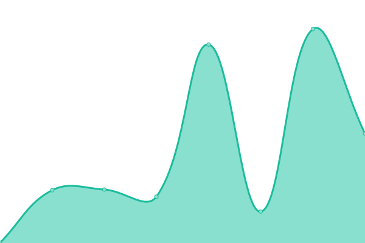
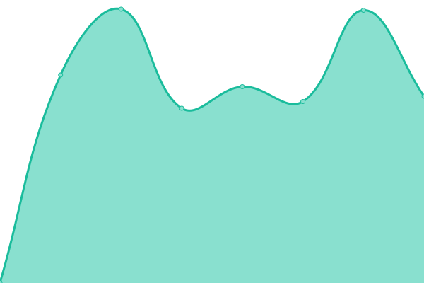

# [📈 Live Status](https://searxng.github.io/searx-instances-uptime): <!--live status--> **🟩 All systems operational**

This repository contains the open-source uptime monitor and status page for [SearXNG](https://searxng.org), powered by [Upptime](https://github.com/upptime/upptime).

With [Upptime](https://upptime.js.org), you can get your own unlimited and free uptime monitor and status page, powered entirely by a GitHub repository. We use [Issues](https://github.com/searxng/searx-instances-uptime/issues) as incident reports, [Actions](https://github.com/searxng/searx-instances-uptime/actions) as uptime monitors, and [Pages](https://searxng.github.io/searx-instances-uptime) for the status page.

<!--start: status pages-->
<!-- This summary is generated by Upptime (https://github.com/upptime/upptime) -->
<!-- Do not edit this manually, your changes will be overwritten -->
<!-- prettier-ignore -->
| URL | Status | History | Response Time | Uptime |
| --- | ------ | ------- | ------------- | ------ |
|  [searx.space](https://searx.space) | 🟩 Up | [searx-space.yml](https://github.com/searxng/searx-instances-uptime/commits/HEAD/history/searx-space.yml) | 

 877ms
     
 | 

<a href="https://uptime.searxng.org/history/searx-space">100.00%</a>
    

|  [baresearch.org](https://baresearch.org) | 🟩 Up | [baresearch-org.yml](https://github.com/searxng/searx-instances-uptime/commits/HEAD/history/baresearch-org.yml) | 

 180ms
     
 | 

<a href="https://uptime.searxng.org/history/baresearch-org">100.00%</a>
    

|  [copp.gg](https://copp.gg) | 🟩 Up | [copp-gg.yml](https://github.com/searxng/searx-instances-uptime/commits/HEAD/history/copp-gg.yml) | 

 244ms
     
 | 

<a href="https://uptime.searxng.org/history/copp-gg">99.88%</a>
    

|  [darmarit.org](https://darmarit.org/searx) | 🟩 Up | [darmarit-org.yml](https://github.com/searxng/searx-instances-uptime/commits/HEAD/history/darmarit-org.yml) | 

 993ms
     
 | 

<a href="https://uptime.searxng.org/history/darmarit-org">100.00%</a>
    

|  [etsi.me](https://etsi.me) | 🟩 Up | [etsi-me.yml](https://github.com/searxng/searx-instances-uptime/commits/HEAD/history/etsi-me.yml) | 

 239ms
     
 | 

<a href="https://uptime.searxng.org/history/etsi-me">99.58%</a>
    

|  [freesearch.club](https://freesearch.club) | 🟩 Up | [freesearch-club.yml](https://github.com/searxng/searx-instances-uptime/commits/HEAD/history/freesearch-club.yml) | 

 566ms
     
 | 

<a href="https://uptime.searxng.org/history/freesearch-club">100.00%</a>
    

|  [northboot.xyz](https://northboot.xyz) | 🟩 Up | [northboot-xyz.yml](https://github.com/searxng/searx-instances-uptime/commits/HEAD/history/northboot-xyz.yml) | 

 3237ms
     
 | 

<a href="https://uptime.searxng.org/history/northboot-xyz">100.00%</a>
    

|  [nyc1.sx.ggtyler.dev](https://nyc1.sx.ggtyler.dev) | 🟩 Up | [nyc1-sx-ggtyler-dev.yml](https://github.com/searxng/searx-instances-uptime/commits/HEAD/history/nyc1-sx-ggtyler-dev.yml) | 

 265ms
     
 | 

<a href="https://uptime.searxng.org/history/nyc1-sx-ggtyler-dev">100.00%</a>
    

|  [ooglester.com](https://ooglester.com) | 🟩 Up | [ooglester-com.yml](https://github.com/searxng/searx-instances-uptime/commits/HEAD/history/ooglester-com.yml) | 

 194ms
     
 | 

<a href="https://uptime.searxng.org/history/ooglester-com">100.00%</a>
    

|  [opnxng.com](https://opnxng.com) | 🟩 Up | [opnxng-com.yml](https://github.com/searxng/searx-instances-uptime/commits/HEAD/history/opnxng-com.yml) | 

 692ms
     
 | 

<a href="https://uptime.searxng.org/history/opnxng-com">100.00%</a>
    

|  [paulgo.io](https://paulgo.io) | 🟩 Up | [paulgo-io.yml](https://github.com/searxng/searx-instances-uptime/commits/HEAD/history/paulgo-io.yml) | 

 565ms
     
 | 

<a href="https://uptime.searxng.org/history/paulgo-io">100.00%</a>
    

|  [priv.au](https://priv.au) | 🟩 Up | [priv-au.yml](https://github.com/searxng/searx-instances-uptime/commits/HEAD/history/priv-au.yml) | 

 464ms
     
 | 

<a href="https://uptime.searxng.org/history/priv-au">100.00%</a>
    

|  [s.mble.dk](https://s.mble.dk) | 🟩 Up | [s-mble-dk.yml](https://github.com/searxng/searx-instances-uptime/commits/HEAD/history/s-mble-dk.yml) | 

 469ms
     
 | 

<a href="https://uptime.searxng.org/history/s-mble-dk">100.00%</a>
    

|  [s.trung.fun](https://s.trung.fun) | 🟩 Up | [s-trung-fun.yml](https://github.com/searxng/searx-instances-uptime/commits/HEAD/history/s-trung-fun.yml) | 

 1258ms
     
 | 

<a href="https://uptime.searxng.org/history/s-trung-fun">100.00%</a>
    

|  [search.broker](https://search.broker) | 🟩 Up | [search-broker.yml](https://github.com/searxng/searx-instances-uptime/commits/HEAD/history/search-broker.yml) | 

 610ms
     
 | 

<a href="https://uptime.searxng.org/history/search-broker">81.49%</a>
    

|  [search.bus-hit.me](https://search.bus-hit.me) | 🟩 Up | [search-bus-hit-me.yml](https://github.com/searxng/searx-instances-uptime/commits/HEAD/history/search-bus-hit-me.yml) | 

 297ms
     
 | 

<a href="https://uptime.searxng.org/history/search-bus-hit-me">100.00%</a>
    

|  [search.demoniak.ch](https://search.demoniak.ch) | 🟩 Up | [search-demoniak-ch.yml](https://github.com/searxng/searx-instances-uptime/commits/HEAD/history/search-demoniak-ch.yml) | 

 562ms
     
 | 

<a href="https://uptime.searxng.org/history/search-demoniak-ch">99.76%</a>
    

|  [search.gcomm.ch](https://search.gcomm.ch) | 🟩 Up | [search-gcomm-ch.yml](https://github.com/searxng/searx-instances-uptime/commits/HEAD/history/search-gcomm-ch.yml) | 

 476ms
     
 | 

<a href="https://uptime.searxng.org/history/search-gcomm-ch">100.00%</a>
    

|  [search.hbubli.cc](https://search.hbubli.cc) | 🟩 Up | [search-hbubli-cc.yml](https://github.com/searxng/searx-instances-uptime/commits/HEAD/history/search-hbubli-cc.yml) | 

 414ms
     
 | 

<a href="https://uptime.searxng.org/history/search-hbubli-cc">100.00%</a>
    

|  [search.im-in.space](https://search.im-in.space) | 🟩 Up | [search-im-in-space.yml](https://github.com/searxng/searx-instances-uptime/commits/HEAD/history/search-im-in-space.yml) | 

 414ms
     
 | 

<a href="https://uptime.searxng.org/history/search-im-in-space">100.00%</a>
    

|  [search.in.projectsegfau.lt](https://search.in.projectsegfau.lt) | 🟩 Up | [search-in-projectsegfau-lt.yml](https://github.com/searxng/searx-instances-uptime/commits/HEAD/history/search-in-projectsegfau-lt.yml) | 

 985ms
     
 | 

<a href="https://uptime.searxng.org/history/search-in-projectsegfau-lt">95.54%</a>
    

|  [search.inetol.net](https://search.inetol.net) | 🟩 Up | [search-inetol-net.yml](https://github.com/searxng/searx-instances-uptime/commits/HEAD/history/search-inetol-net.yml) | 

 527ms
     
 | 

<a href="https://uptime.searxng.org/history/search-inetol-net">100.00%</a>
    

|  [search.itstechtime.com](https://search.itstechtime.com) | 🟩 Up | [search-itstechtime-com.yml](https://github.com/searxng/searx-instances-uptime/commits/HEAD/history/search-itstechtime-com.yml) | 

 152ms
     
 | 

<a href="https://uptime.searxng.org/history/search-itstechtime-com">100.00%</a>
    

|  [search.leptons.xyz](https://search.leptons.xyz) | 🟩 Up | [search-leptons-xyz.yml](https://github.com/searxng/searx-instances-uptime/commits/HEAD/history/search-leptons-xyz.yml) | 

 338ms
     
 | 

<a href="https://uptime.searxng.org/history/search-leptons-xyz">96.00%</a>
    

|  [search.lvkaszus.pl](https://search.lvkaszus.pl) | 🟩 Up | [search-lvkaszus-pl.yml](https://github.com/searxng/searx-instances-uptime/commits/HEAD/history/search-lvkaszus-pl.yml) | 

 2394ms
     
 | 

<a href="https://uptime.searxng.org/history/search-lvkaszus-pl">92.59%</a>
    

|  [search.mdosch.de](https://search.mdosch.de) | 🟩 Up | [search-mdosch-de.yml](https://github.com/searxng/searx-instances-uptime/commits/HEAD/history/search-mdosch-de.yml) | 

 632ms
     
 | 

<a href="https://uptime.searxng.org/history/search-mdosch-de">100.00%</a>
    

|  [search.ononoki.org](https://search.ononoki.org) | 🟩 Up | [search-ononoki-org.yml](https://github.com/searxng/searx-instances-uptime/commits/HEAD/history/search-ononoki-org.yml) | 

 635ms
     
 | 

<a href="https://uptime.searxng.org/history/search-ononoki-org">100.00%</a>
    

|  [search.projectsegfau.lt](https://search.projectsegfau.lt) | 🟩 Up | [search-projectsegfau-lt.yml](https://github.com/searxng/searx-instances-uptime/commits/HEAD/history/search-projectsegfau-lt.yml) | 

 742ms
     
 | 

<a href="https://uptime.searxng.org/history/search-projectsegfau-lt">99.36%</a>
    

|  [search.rhscz.eu](https://search.rhscz.eu) | 🟩 Up | [search-rhscz-eu.yml](https://github.com/searxng/searx-instances-uptime/commits/HEAD/history/search-rhscz-eu.yml) | 

 428ms
     
 | 

<a href="https://uptime.searxng.org/history/search-rhscz-eu">100.00%</a>
    

|  [search.rowie.at](https://search.rowie.at) | 🟩 Up | [search-rowie-at.yml](https://github.com/searxng/searx-instances-uptime/commits/HEAD/history/search-rowie-at.yml) | 

 715ms
     
 | 

<a href="https://uptime.searxng.org/history/search-rowie-at">100.00%</a>
    

|  [search.sapti.me](https://search.sapti.me) | 🟩 Up | [search-sapti-me.yml](https://github.com/searxng/searx-instances-uptime/commits/HEAD/history/search-sapti-me.yml) | 

 512ms
     
 | 

<a href="https://uptime.searxng.org/history/search-sapti-me">100.00%</a>
    

|  [search.smnz.de](https://search.smnz.de) | 🟩 Up | [search-smnz-de.yml](https://github.com/searxng/searx-instances-uptime/commits/HEAD/history/search-smnz-de.yml) | 

 926ms
     
 | 

<a href="https://uptime.searxng.org/history/search-smnz-de">100.00%</a>
    

|  [search.upinmars.com](https://search.upinmars.com) | 🟩 Up | [search-upinmars-com.yml](https://github.com/searxng/searx-instances-uptime/commits/HEAD/history/search-upinmars-com.yml) | 

 186ms
     
 | 

<a href="https://uptime.searxng.org/history/search-upinmars-com">99.88%</a>
    

|  [searx.ankha.ac](https://searx.ankha.ac) | 🟩 Up | [searx-ankha-ac.yml](https://github.com/searxng/searx-instances-uptime/commits/HEAD/history/searx-ankha-ac.yml) | 

 487ms
     
 | 

<a href="https://uptime.searxng.org/history/searx-ankha-ac">99.79%</a>
    

|  [searx.baczek.me](https://searx.baczek.me) | 🟩 Up | [searx-baczek-me.yml](https://github.com/searxng/searx-instances-uptime/commits/HEAD/history/searx-baczek-me.yml) | 

 1115ms
     
 | 

<a href="https://uptime.searxng.org/history/searx-baczek-me">92.32%</a>
    

|  [searx.be](https://searx.be) | 🟩 Up | [searx-be.yml](https://github.com/searxng/searx-instances-uptime/commits/HEAD/history/searx-be.yml) | 

 646ms
     
 | 

<a href="https://uptime.searxng.org/history/searx-be">100.00%</a>
    

|  [searx.catfluori.de](https://searx.catfluori.de) | 🟩 Up | [searx-catfluori-de.yml](https://github.com/searxng/searx-instances-uptime/commits/HEAD/history/searx-catfluori-de.yml) | 

 921ms
     
 | 

<a href="https://uptime.searxng.org/history/searx-catfluori-de">100.00%</a>
    

|  [searx.cthd.icu](https://searx.cthd.icu) | 🟩 Up | [searx-cthd-icu.yml](https://github.com/searxng/searx-instances-uptime/commits/HEAD/history/searx-cthd-icu.yml) | 

 1455ms
     
 | 

<a href="https://uptime.searxng.org/history/searx-cthd-icu">100.00%</a>
    

|  [searx.daetalytica.io](https://searx.daetalytica.io) | 🟩 Up | [searx-daetalytica-io.yml](https://github.com/searxng/searx-instances-uptime/commits/HEAD/history/searx-daetalytica-io.yml) | 

 264ms
     
 | 

<a href="https://uptime.searxng.org/history/searx-daetalytica-io">100.00%</a>
    

|  [searx.fmhy.net](https://searx.fmhy.net) | 🟩 Up | [searx-fmhy-net.yml](https://github.com/searxng/searx-instances-uptime/commits/HEAD/history/searx-fmhy-net.yml) | 

 401ms
     
 | 

<a href="https://uptime.searxng.org/history/searx-fmhy-net">100.00%</a>
    

|  [searx.headpat.exchange](https://searx.headpat.exchange) | 🟩 Up | [searx-headpat-exchange.yml](https://github.com/searxng/searx-instances-uptime/commits/HEAD/history/searx-headpat-exchange.yml) | 

 738ms
     
 | 

<a href="https://uptime.searxng.org/history/searx-headpat-exchange">100.00%</a>
    

|  [searx.juancord.xyz](https://searx.juancord.xyz) | 🟩 Up | [searx-juancord-xyz.yml](https://github.com/searxng/searx-instances-uptime/commits/HEAD/history/searx-juancord-xyz.yml) | 

 489ms
     
 | 

<a href="https://uptime.searxng.org/history/searx-juancord-xyz">100.00%</a>
    

|  [searx.kutay.dev](https://searx.kutay.dev) | 🟩 Up | [searx-kutay-dev.yml](https://github.com/searxng/searx-instances-uptime/commits/HEAD/history/searx-kutay-dev.yml) | 

 396ms
     
 | 

<a href="https://uptime.searxng.org/history/searx-kutay-dev">100.00%</a>
    

|  [searx.lunar.icu](https://searx.lunar.icu) | 🟩 Up | [searx-lunar-icu.yml](https://github.com/searxng/searx-instances-uptime/commits/HEAD/history/searx-lunar-icu.yml) | 

 1761ms
     
 | 

<a href="https://uptime.searxng.org/history/searx-lunar-icu">89.66%</a>
    

|  [searx.namejeff.xyz](https://searx.namejeff.xyz) | 🟩 Up | [searx-namejeff-xyz.yml](https://github.com/searxng/searx-instances-uptime/commits/HEAD/history/searx-namejeff-xyz.yml) | 

 403ms
     
 | 

<a href="https://uptime.searxng.org/history/searx-namejeff-xyz">100.00%</a>
    

|  [searx.nobulart.com](https://searx.nobulart.com) | 🟩 Up | [searx-nobulart-com.yml](https://github.com/searxng/searx-instances-uptime/commits/HEAD/history/searx-nobulart-com.yml) | 

 496ms
     
 | 

<a href="https://uptime.searxng.org/history/searx-nobulart-com">99.55%</a>
    

|  [searx.oakleycord.dev](https://searx.oakleycord.dev) | 🟩 Up | [searx-oakleycord-dev.yml](https://github.com/searxng/searx-instances-uptime/commits/HEAD/history/searx-oakleycord-dev.yml) | 

 140ms
     
 | 

<a href="https://uptime.searxng.org/history/searx-oakleycord-dev">100.00%</a>
    

|  [searx.ox2.fr](https://searx.ox2.fr) | 🟩 Up | [searx-ox2-fr.yml](https://github.com/searxng/searx-instances-uptime/commits/HEAD/history/searx-ox2-fr.yml) | 

 698ms
     
 | 

<a href="https://uptime.searxng.org/history/searx-ox2-fr">100.00%</a>
    

|  [searx.perennialte.ch](https://searx.perennialte.ch) | 🟩 Up | [searx-perennialte-ch.yml](https://github.com/searxng/searx-instances-uptime/commits/HEAD/history/searx-perennialte-ch.yml) | 

 706ms
     
 | 

<a href="https://uptime.searxng.org/history/searx-perennialte-ch">100.00%</a>
    

|  [searx.rhscz.eu](https://searx.rhscz.eu) | 🟩 Up | [searx-rhscz-eu.yml](https://github.com/searxng/searx-instances-uptime/commits/HEAD/history/searx-rhscz-eu.yml) | 

 529ms
     
 | 

<a href="https://uptime.searxng.org/history/searx-rhscz-eu">100.00%</a>
    

|  [searx.sev.monster](https://searx.sev.monster) | 🟩 Up | [searx-sev-monster.yml](https://github.com/searxng/searx-instances-uptime/commits/HEAD/history/searx-sev-monster.yml) | 

 861ms
     
 | 

<a href="https://uptime.searxng.org/history/searx-sev-monster">72.38%</a>
    

|  [searx.si](https://searx.si) | 🟩 Up | [searx-si.yml](https://github.com/searxng/searx-instances-uptime/commits/HEAD/history/searx-si.yml) | 

 515ms
     
 | 

<a href="https://uptime.searxng.org/history/searx-si">100.00%</a>
    

|  [searx.techsaviours.org](https://searx.techsaviours.org) | 🟩 Up | [searx-techsaviours-org.yml](https://github.com/searxng/searx-instances-uptime/commits/HEAD/history/searx-techsaviours-org.yml) | 

 788ms
     
 | 

<a href="https://uptime.searxng.org/history/searx-techsaviours-org">100.00%</a>
    

|  [searx.tuxcloud.net](https://searx.tuxcloud.net) | 🟩 Up | [searx-tuxcloud-net.yml](https://github.com/searxng/searx-instances-uptime/commits/HEAD/history/searx-tuxcloud-net.yml) | 

 643ms
     
 | 

<a href="https://uptime.searxng.org/history/searx-tuxcloud-net">99.83%</a>
    

|  [searx.work](https://searx.work) | 🟩 Up | [searx-work.yml](https://github.com/searxng/searx-instances-uptime/commits/HEAD/history/searx-work.yml) | 

 172ms
     
 | 

<a href="https://uptime.searxng.org/history/searx-work">99.88%</a>
    

|  [searx.zhenyapav.com](https://searx.zhenyapav.com) | 🟩 Up | [searx-zhenyapav-com.yml](https://github.com/searxng/searx-instances-uptime/commits/HEAD/history/searx-zhenyapav-com.yml) | 

 1010ms
     
 | 

<a href="https://uptime.searxng.org/history/searx-zhenyapav-com">100.00%</a>
    

|  [searxng.ch](https://searxng.ch) | 🟩 Up | [searxng-ch.yml](https://github.com/searxng/searx-instances-uptime/commits/HEAD/history/searxng-ch.yml) | 

 495ms
     
 | 

<a href="https://uptime.searxng.org/history/searxng-ch">100.00%</a>
    

|  [searxng.site](https://searxng.site) | 🟩 Up | [searxng-site.yml](https://github.com/searxng/searx-instances-uptime/commits/HEAD/history/searxng-site.yml) | 

 609ms
     
 | 

<a href="https://uptime.searxng.org/history/searxng-site">100.00%</a>
    

|  [sex.finaltek.net](https://sex.finaltek.net) | 🟩 Up | [sex-finaltek-net.yml](https://github.com/searxng/searx-instances-uptime/commits/HEAD/history/sex-finaltek-net.yml) | 

 589ms
     
 | 

<a href="https://uptime.searxng.org/history/sex-finaltek-net">100.00%</a>
    

|  [sx.catgirl.cloud](https://sx.catgirl.cloud) | 🟩 Up | [sx-catgirl-cloud.yml](https://github.com/searxng/searx-instances-uptime/commits/HEAD/history/sx-catgirl-cloud.yml) | 

 848ms
     
 | 

<a href="https://uptime.searxng.org/history/sx-catgirl-cloud">100.00%</a>
    

|  [www.gruble.de](https://www.gruble.de) | 🟩 Up | [www-gruble-de.yml](https://github.com/searxng/searx-instances-uptime/commits/HEAD/history/www-gruble-de.yml) | 

 657ms
     
 | 

<a href="https://uptime.searxng.org/history/www-gruble-de">100.00%</a>
    

|  [www.jabber-germany.de](https://www.jabber-germany.de/searx) | 🟩 Up | [www-jabber-germany-de.yml](https://github.com/searxng/searx-instances-uptime/commits/HEAD/history/www-jabber-germany-de.yml) | 

 1057ms
     
 | 

<a href="https://uptime.searxng.org/history/www-jabber-germany-de">100.00%</a>
    

|  [xo.wtf](https://xo.wtf) | 🟩 Up | [xo-wtf.yml](https://github.com/searxng/searx-instances-uptime/commits/HEAD/history/xo-wtf.yml) | 

 432ms
     
 | 

<a href="https://uptime.searxng.org/history/xo-wtf">100.00%</a>
    

|  [searx.neocities.org](https://searx.neocities.org) | 🟩 Up | [searx-neocities-org.yml](https://github.com/searxng/searx-instances-uptime/commits/HEAD/history/searx-neocities-org.yml) | 

 182ms
     
 | 

<a href="https://uptime.searxng.org/history/searx-neocities-org">100.00%</a>
    

<!--end: status pages-->

[**Visit our status website →**](https://searxng.github.io/searx-instances-uptime)

## 📄 License

- Powered by: [Upptime](https://github.com/upptime/upptime)
- Code: [MIT](./LICENSE) © [SearXNG](https://searxng.org)
- Data in the `./history` directory: [Open Database License](https://opendatacommons.org/licenses/odbl/1-0/)
