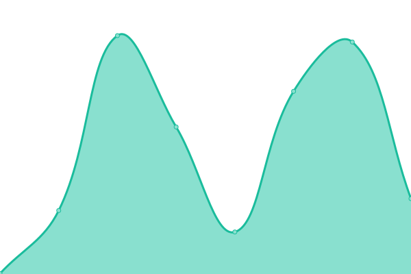

# [📈 Live Status](https://searxng.github.io/searx-instances-uptime): <!--live status--> **🟧 Partial outage**

This repository contains the open-source uptime monitor and status page for [SearXNG](https://searxng.org), powered by [Upptime](https://github.com/upptime/upptime).

With [Upptime](https://upptime.js.org), you can get your own unlimited and free uptime monitor and status page, powered entirely by a GitHub repository. We use [Issues](https://github.com/searxng/searx-instances-uptime/issues) as incident reports, [Actions](https://github.com/searxng/searx-instances-uptime/actions) as uptime monitors, and [Pages](https://searxng.github.io/searx-instances-uptime) for the status page.

<!--start: status pages-->
<!-- This summary is generated by Upptime (https://github.com/upptime/upptime) -->
<!-- Do not edit this manually, your changes will be overwritten -->
<!-- prettier-ignore -->
| URL | Status | History | Response Time | Uptime |
| --- | ------ | ------- | ------------- | ------ |
|  [searx.space](https://searx.space) | 🟩 Up | [searx-space.yml](https://github.com/searxng/searx-instances-uptime/commits/HEAD/history/searx-space.yml) | 

 687ms
     
 | 

<a href="https://uptime.searxng.org/history/searx-space">100.00%</a>
    

|  [331221.xyz](https://331221.xyz) | 🟩 Up | [331221-xyz.yml](https://github.com/searxng/searx-instances-uptime/commits/HEAD/history/331221-xyz.yml) | 

 134ms
     
 | 

<a href="https://uptime.searxng.org/history/331221-xyz">100.00%</a>
    

|  [baresearch.org](https://baresearch.org) | 🟩 Up | [baresearch-org.yml](https://github.com/searxng/searx-instances-uptime/commits/HEAD/history/baresearch-org.yml) | 

 203ms
     
 | 

<a href="https://uptime.searxng.org/history/baresearch-org">100.00%</a>
    

|  [copp.gg](https://copp.gg) | 🟩 Up | [copp-gg.yml](https://github.com/searxng/searx-instances-uptime/commits/HEAD/history/copp-gg.yml) | 

 203ms
     
 | 

<a href="https://uptime.searxng.org/history/copp-gg">100.00%</a>
    

|  [darmarit.org](https://darmarit.org/searx) | 🟩 Up | [darmarit-org.yml](https://github.com/searxng/searx-instances-uptime/commits/HEAD/history/darmarit-org.yml) | 

 1332ms
     
 | 

<a href="https://uptime.searxng.org/history/darmarit-org">100.00%</a>
    

|  [etsi.me](https://etsi.me) | 🟩 Up | [etsi-me.yml](https://github.com/searxng/searx-instances-uptime/commits/HEAD/history/etsi-me.yml) | 

 292ms
     
 | 

<a href="https://uptime.searxng.org/history/etsi-me">99.68%</a>
    

|  [fgiggle.com](https://fgiggle.com) | 🟩 Up | [fgiggle-com.yml](https://github.com/searxng/searx-instances-uptime/commits/HEAD/history/fgiggle-com.yml) | 

 597ms
     
 | 

<a href="https://uptime.searxng.org/history/fgiggle-com">99.80%</a>
    

|  [find.m3wz.su](https://find.m3wz.su) | 🟩 Up | [find-m3wz-su.yml](https://github.com/searxng/searx-instances-uptime/commits/HEAD/history/find-m3wz-su.yml) | 

 921ms
     
 | 

<a href="https://uptime.searxng.org/history/find-m3wz-su">99.83%</a>
    

|  [freesearch.club](https://freesearch.club) | 🟩 Up | [freesearch-club.yml](https://github.com/searxng/searx-instances-uptime/commits/HEAD/history/freesearch-club.yml) | 

 483ms
     
 | 

<a href="https://uptime.searxng.org/history/freesearch-club">100.00%</a>
    

|  [northboot.xyz](https://northboot.xyz) | 🟩 Up | [northboot-xyz.yml](https://github.com/searxng/searx-instances-uptime/commits/HEAD/history/northboot-xyz.yml) | 

 1469ms
     
 | 

<a href="https://uptime.searxng.org/history/northboot-xyz">100.00%</a>
    

|  [nyc1.sx.ggtyler.dev](https://nyc1.sx.ggtyler.dev) | 🟩 Up | [nyc1-sx-ggtyler-dev.yml](https://github.com/searxng/searx-instances-uptime/commits/HEAD/history/nyc1-sx-ggtyler-dev.yml) | 

 210ms
     
 | 

<a href="https://uptime.searxng.org/history/nyc1-sx-ggtyler-dev">98.41%</a>
    

|  [offtheradar.info](https://offtheradar.info) | 🟩 Up | [offtheradar-info.yml](https://github.com/searxng/searx-instances-uptime/commits/HEAD/history/offtheradar-info.yml) | 

 263ms
     
 | 

<a href="https://uptime.searxng.org/history/offtheradar-info">100.00%</a>
    

|  [ooglester.com](https://ooglester.com) | 🟩 Up | [ooglester-com.yml](https://github.com/searxng/searx-instances-uptime/commits/HEAD/history/ooglester-com.yml) | 

 230ms
     
 | 

<a href="https://uptime.searxng.org/history/ooglester-com">100.00%</a>
    

|  [opnxng.com](https://opnxng.com) | 🟩 Up | [opnxng-com.yml](https://github.com/searxng/searx-instances-uptime/commits/HEAD/history/opnxng-com.yml) | 

 678ms
     
 | 

<a href="https://uptime.searxng.org/history/opnxng-com">99.76%</a>
    

|  [paulgo.io](https://paulgo.io) | 🟩 Up | [paulgo-io.yml](https://github.com/searxng/searx-instances-uptime/commits/HEAD/history/paulgo-io.yml) | 

 556ms
     
 | 

<a href="https://uptime.searxng.org/history/paulgo-io">100.00%</a>
    

|  [priv.au](https://priv.au) | 🟩 Up | [priv-au.yml](https://github.com/searxng/searx-instances-uptime/commits/HEAD/history/priv-au.yml) | 

 702ms
     
 | 

<a href="https://uptime.searxng.org/history/priv-au">100.00%</a>
    

|  [s.trung.fun](https://s.trung.fun) | 🟩 Up | [s-trung-fun.yml](https://github.com/searxng/searx-instances-uptime/commits/HEAD/history/s-trung-fun.yml) | 

 2004ms
     
 | 

<a href="https://uptime.searxng.org/history/s-trung-fun">99.43%</a>
    

|  [search.bowlman.org](https://search.bowlman.org) | 🟩 Up | [search-bowlman-org.yml](https://github.com/searxng/searx-instances-uptime/commits/HEAD/history/search-bowlman-org.yml) | 

 457ms
     
 | 

<a href="https://uptime.searxng.org/history/search-bowlman-org">100.00%</a>
    

|  [search.bus-hit.me](https://search.bus-hit.me) | 🟩 Up | [search-bus-hit-me.yml](https://github.com/searxng/searx-instances-uptime/commits/HEAD/history/search-bus-hit-me.yml) | 

 277ms
     
 | 

<a href="https://uptime.searxng.org/history/search-bus-hit-me">100.00%</a>
    

|  [search.citw.lgbt](https://search.citw.lgbt) | 🟩 Up | [search-citw-lgbt.yml](https://github.com/searxng/searx-instances-uptime/commits/HEAD/history/search-citw-lgbt.yml) | 

 670ms
     
 | 

<a href="https://uptime.searxng.org/history/search-citw-lgbt">99.47%</a>
    

|  [search.cronobox.one](https://search.cronobox.one) | 🟩 Up | [search-cronobox-one.yml](https://github.com/searxng/searx-instances-uptime/commits/HEAD/history/search-cronobox-one.yml) | 

 703ms
     
 | 

<a href="https://uptime.searxng.org/history/search-cronobox-one">100.00%</a>
    

|  [search.demoniak.ch](https://search.demoniak.ch) | 🟩 Up | [search-demoniak-ch.yml](https://github.com/searxng/searx-instances-uptime/commits/HEAD/history/search-demoniak-ch.yml) | 

 510ms
     
 | 

<a href="https://uptime.searxng.org/history/search-demoniak-ch">100.00%</a>
    

|  [search.disroot.org](https://search.disroot.org) | 🟩 Up | [search-disroot-org.yml](https://github.com/searxng/searx-instances-uptime/commits/HEAD/history/search-disroot-org.yml) | 

 892ms
     
 | 

<a href="https://uptime.searxng.org/history/search-disroot-org">100.00%</a>
    

|  [search.dojoro.de](https://search.dojoro.de) | 🟩 Up | [search-dojoro-de.yml](https://github.com/searxng/searx-instances-uptime/commits/HEAD/history/search-dojoro-de.yml) | 

 785ms
     
 | 

<a href="https://uptime.searxng.org/history/search-dojoro-de">100.00%</a>
    

|  [search.fawkesguy.com](https://search.fawkesguy.com) | 🟩 Up | [search-fawkesguy-com.yml](https://github.com/searxng/searx-instances-uptime/commits/HEAD/history/search-fawkesguy-com.yml) | 

 152ms
     
 | 

<a href="https://uptime.searxng.org/history/search-fawkesguy-com">100.00%</a>
    

|  [search.gcomm.ch](https://search.gcomm.ch) | 🟥 Down | [search-gcomm-ch.yml](https://github.com/searxng/searx-instances-uptime/commits/HEAD/history/search-gcomm-ch.yml) | 

 496ms
     
 | 

<a href="https://uptime.searxng.org/history/search-gcomm-ch">99.99%</a>
    

|  [search.hbubli.cc](https://search.hbubli.cc) | 🟩 Up | [search-hbubli-cc.yml](https://github.com/searxng/searx-instances-uptime/commits/HEAD/history/search-hbubli-cc.yml) | 

 467ms
     
 | 

<a href="https://uptime.searxng.org/history/search-hbubli-cc">98.63%</a>
    

|  [search.im-in.space](https://search.im-in.space) | 🟩 Up | [search-im-in-space.yml](https://github.com/searxng/searx-instances-uptime/commits/HEAD/history/search-im-in-space.yml) | 

 402ms
     
 | 

<a href="https://uptime.searxng.org/history/search-im-in-space">100.00%</a>
    

|  [search.in.projectsegfau.lt](https://search.in.projectsegfau.lt) | 🟩 Up | [search-in-projectsegfau-lt.yml](https://github.com/searxng/searx-instances-uptime/commits/HEAD/history/search-in-projectsegfau-lt.yml) | 

 963ms
     
 | 

<a href="https://uptime.searxng.org/history/search-in-projectsegfau-lt">99.88%</a>
    

|  [search.laksith.dev](https://search.laksith.dev) | 🟩 Up | [search-laksith-dev.yml](https://github.com/searxng/searx-instances-uptime/commits/HEAD/history/search-laksith-dev.yml) | 

 208ms
     
 | 

<a href="https://uptime.searxng.org/history/search-laksith-dev">100.00%</a>
    

|  [search.leptons.xyz](https://search.leptons.xyz) | 🟩 Up | [search-leptons-xyz.yml](https://github.com/searxng/searx-instances-uptime/commits/HEAD/history/search-leptons-xyz.yml) | 

 365ms
     
 | 

<a href="https://uptime.searxng.org/history/search-leptons-xyz">100.00%</a>
    

|  [search.lvkaszus.pl](https://search.lvkaszus.pl) | 🟩 Up | [search-lvkaszus-pl.yml](https://github.com/searxng/searx-instances-uptime/commits/HEAD/history/search-lvkaszus-pl.yml) | 

 681ms
     
 | 

<a href="https://uptime.searxng.org/history/search-lvkaszus-pl">100.00%</a>
    

|  [search.mdosch.de](https://search.mdosch.de) | 🟩 Up | [search-mdosch-de.yml](https://github.com/searxng/searx-instances-uptime/commits/HEAD/history/search-mdosch-de.yml) | 

 673ms
     
 | 

<a href="https://uptime.searxng.org/history/search-mdosch-de">100.00%</a>
    

|  [search.modalogi.com](https://search.modalogi.com) | 🟩 Up | [search-modalogi-com.yml](https://github.com/searxng/searx-instances-uptime/commits/HEAD/history/search-modalogi-com.yml) | 

 571ms
     
 | 

<a href="https://uptime.searxng.org/history/search-modalogi-com">100.00%</a>
    

|  [search.ononoki.org](https://search.ononoki.org) | 🟩 Up | [search-ononoki-org.yml](https://github.com/searxng/searx-instances-uptime/commits/HEAD/history/search-ononoki-org.yml) | 

 469ms
     
 | 

<a href="https://uptime.searxng.org/history/search-ononoki-org">100.00%</a>
    

|  [search.ovh](https://search.ovh) | 🟩 Up | [search-ovh.yml](https://github.com/searxng/searx-instances-uptime/commits/HEAD/history/search-ovh.yml) | 

 460ms
     
 | 

<a href="https://uptime.searxng.org/history/search-ovh">100.00%</a>
    

|  [search.projectsegfau.lt](https://search.projectsegfau.lt) | 🟩 Up | [search-projectsegfau-lt.yml](https://github.com/searxng/searx-instances-uptime/commits/HEAD/history/search-projectsegfau-lt.yml) | 

 865ms
     
 | 

<a href="https://uptime.searxng.org/history/search-projectsegfau-lt">100.00%</a>
    

|  [search.rabbit-company.com](https://search.rabbit-company.com) | 🟩 Up | [search-rabbit-company-com.yml](https://github.com/searxng/searx-instances-uptime/commits/HEAD/history/search-rabbit-company-com.yml) | 

 450ms
     
 | 

<a href="https://uptime.searxng.org/history/search-rabbit-company-com">100.00%</a>
    

|  [search.rhscz.eu](https://search.rhscz.eu) | 🟩 Up | [search-rhscz-eu.yml](https://github.com/searxng/searx-instances-uptime/commits/HEAD/history/search-rhscz-eu.yml) | 

 526ms
     
 | 

<a href="https://uptime.searxng.org/history/search-rhscz-eu">100.00%</a>
    

|  [search.rowie.at](https://search.rowie.at) | 🟩 Up | [search-rowie-at.yml](https://github.com/searxng/searx-instances-uptime/commits/HEAD/history/search-rowie-at.yml) | 

 762ms
     
 | 

<a href="https://uptime.searxng.org/history/search-rowie-at">100.00%</a>
    

|  [search.sapti.me](https://search.sapti.me) | 🟩 Up | [search-sapti-me.yml](https://github.com/searxng/searx-instances-uptime/commits/HEAD/history/search-sapti-me.yml) | 

 739ms
     
 | 

<a href="https://uptime.searxng.org/history/search-sapti-me">99.68%</a>
    

|  [search.smnz.de](https://search.smnz.de) | 🟩 Up | [search-smnz-de.yml](https://github.com/searxng/searx-instances-uptime/commits/HEAD/history/search-smnz-de.yml) | 

 807ms
     
 | 

<a href="https://uptime.searxng.org/history/search-smnz-de">100.00%</a>
    

|  [search.whateveritworks.org](https://search.whateveritworks.org) | 🟩 Up | [search-whateveritworks-org.yml](https://github.com/searxng/searx-instances-uptime/commits/HEAD/history/search-whateveritworks-org.yml) | 

 548ms
     
 | 

<a href="https://uptime.searxng.org/history/search-whateveritworks-org">100.00%</a>
    

|  [search.zzls.xyz](https://search.zzls.xyz) | 🟩 Up | [search-zzls-xyz.yml](https://github.com/searxng/searx-instances-uptime/commits/HEAD/history/search-zzls-xyz.yml) | 

 504ms
     
 | 

<a href="https://uptime.searxng.org/history/search-zzls-xyz">100.00%</a>
    

|  [searx.baczek.me](https://searx.baczek.me) | 🟩 Up | [searx-baczek-me.yml](https://github.com/searxng/searx-instances-uptime/commits/HEAD/history/searx-baczek-me.yml) | 

 656ms
     
 | 

<a href="https://uptime.searxng.org/history/searx-baczek-me">100.00%</a>
    

|  [searx.be](https://searx.be) | 🟩 Up | [searx-be.yml](https://github.com/searxng/searx-instances-uptime/commits/HEAD/history/searx-be.yml) | 

 644ms
     
 | 

<a href="https://uptime.searxng.org/history/searx-be">100.00%</a>
    

|  [searx.bissisoft.com](https://searx.bissisoft.com) | 🟩 Up | [searx-bissisoft-com.yml](https://github.com/searxng/searx-instances-uptime/commits/HEAD/history/searx-bissisoft-com.yml) | 

 491ms
     
 | 

<a href="https://uptime.searxng.org/history/searx-bissisoft-com">100.00%</a>
    

|  [searx.catfluori.de](https://searx.catfluori.de) | 🟩 Up | [searx-catfluori-de.yml](https://github.com/searxng/searx-instances-uptime/commits/HEAD/history/searx-catfluori-de.yml) | 

 513ms
     
 | 

<a href="https://uptime.searxng.org/history/searx-catfluori-de">100.00%</a>
    

|  [searx.cthd.icu](https://searx.cthd.icu) | 🟩 Up | [searx-cthd-icu.yml](https://github.com/searxng/searx-instances-uptime/commits/HEAD/history/searx-cthd-icu.yml) | 

 531ms
     
 | 

<a href="https://uptime.searxng.org/history/searx-cthd-icu">100.00%</a>
    

|  [searx.daetalytica.io](https://searx.daetalytica.io) | 🟩 Up | [searx-daetalytica-io.yml](https://github.com/searxng/searx-instances-uptime/commits/HEAD/history/searx-daetalytica-io.yml) | 

 197ms
     
 | 

<a href="https://uptime.searxng.org/history/searx-daetalytica-io">100.00%</a>
    

|  [searx.divided-by-zero.eu](https://searx.divided-by-zero.eu) | 🟩 Up | [searx-divided-by-zero-eu.yml](https://github.com/searxng/searx-instances-uptime/commits/HEAD/history/searx-divided-by-zero-eu.yml) | 

 584ms
     
 | 

<a href="https://uptime.searxng.org/history/searx-divided-by-zero-eu">100.00%</a>
    

|  [searx.ericaftereric.top](https://searx.ericaftereric.top) | 🟩 Up | [searx-ericaftereric-top.yml](https://github.com/searxng/searx-instances-uptime/commits/HEAD/history/searx-ericaftereric-top.yml) | 

 638ms
     
 | 

<a href="https://uptime.searxng.org/history/searx-ericaftereric-top">100.00%</a>
    

|  [searx.fmac.xyz](https://searx.fmac.xyz) | 🟩 Up | [searx-fmac-xyz.yml](https://github.com/searxng/searx-instances-uptime/commits/HEAD/history/searx-fmac-xyz.yml) | 

 839ms
     
 | 

<a href="https://uptime.searxng.org/history/searx-fmac-xyz">100.00%</a>
    

|  [searx.headpat.exchange](https://searx.headpat.exchange) | 🟩 Up | [searx-headpat-exchange.yml](https://github.com/searxng/searx-instances-uptime/commits/HEAD/history/searx-headpat-exchange.yml) | 

 707ms
     
 | 

<a href="https://uptime.searxng.org/history/searx-headpat-exchange">100.00%</a>
    

|  [searx.juancord.xyz](https://searx.juancord.xyz) | 🟩 Up | [searx-juancord-xyz.yml](https://github.com/searxng/searx-instances-uptime/commits/HEAD/history/searx-juancord-xyz.yml) | 

 486ms
     
 | 

<a href="https://uptime.searxng.org/history/searx-juancord-xyz">100.00%</a>
    

|  [searx.kutay.dev](https://searx.kutay.dev) | 🟩 Up | [searx-kutay-dev.yml](https://github.com/searxng/searx-instances-uptime/commits/HEAD/history/searx-kutay-dev.yml) | 

 410ms
     
 | 

<a href="https://uptime.searxng.org/history/searx-kutay-dev">100.00%</a>
    

|  [searx.mha.fi](https://searx.mha.fi) | 🟩 Up | [searx-mha-fi.yml](https://github.com/searxng/searx-instances-uptime/commits/HEAD/history/searx-mha-fi.yml) | 

 535ms
     
 | 

<a href="https://uptime.searxng.org/history/searx-mha-fi">100.00%</a>
    

|  [searx.namejeff.xyz](https://searx.namejeff.xyz) | 🟩 Up | [searx-namejeff-xyz.yml](https://github.com/searxng/searx-instances-uptime/commits/HEAD/history/searx-namejeff-xyz.yml) | 

 407ms
     
 | 

<a href="https://uptime.searxng.org/history/searx-namejeff-xyz">100.00%</a>
    

|  [searx.oakleycord.dev](https://searx.oakleycord.dev) | 🟩 Up | [searx-oakleycord-dev.yml](https://github.com/searxng/searx-instances-uptime/commits/HEAD/history/searx-oakleycord-dev.yml) | 

 165ms
     
 | 

<a href="https://uptime.searxng.org/history/searx-oakleycord-dev">93.85%</a>
    

|  [searx.ox2.fr](https://searx.ox2.fr) | 🟩 Up | [searx-ox2-fr.yml](https://github.com/searxng/searx-instances-uptime/commits/HEAD/history/searx-ox2-fr.yml) | 

 725ms
     
 | 

<a href="https://uptime.searxng.org/history/searx-ox2-fr">100.00%</a>
    

|  [searx.perennialte.ch](https://searx.perennialte.ch) | 🟩 Up | [searx-perennialte-ch.yml](https://github.com/searxng/searx-instances-uptime/commits/HEAD/history/searx-perennialte-ch.yml) | 

 692ms
     
 | 

<a href="https://uptime.searxng.org/history/searx-perennialte-ch">99.75%</a>
    

|  [searx.prvcy.eu](https://searx.prvcy.eu) | 🟩 Up | [searx-prvcy-eu.yml](https://github.com/searxng/searx-instances-uptime/commits/HEAD/history/searx-prvcy-eu.yml) | 

 656ms
     
 | 

<a href="https://uptime.searxng.org/history/searx-prvcy-eu">100.00%</a>
    

|  [searx.sev.monster](https://searx.sev.monster) | 🟩 Up | [searx-sev-monster.yml](https://github.com/searxng/searx-instances-uptime/commits/HEAD/history/searx-sev-monster.yml) | 

 384ms
     
 | 

<a href="https://uptime.searxng.org/history/searx-sev-monster">100.00%</a>
    

|  [searx.si](https://searx.si) | 🟩 Up | [searx-si.yml](https://github.com/searxng/searx-instances-uptime/commits/HEAD/history/searx-si.yml) | 

 508ms
     
 | 

<a href="https://uptime.searxng.org/history/searx-si">99.87%</a>
    

|  [searx.techsaviours.org](https://searx.techsaviours.org) | 🟩 Up | [searx-techsaviours-org.yml](https://github.com/searxng/searx-instances-uptime/commits/HEAD/history/searx-techsaviours-org.yml) | 

 766ms
     
 | 

<a href="https://uptime.searxng.org/history/searx-techsaviours-org">99.49%</a>
    

|  [searx.thefloatinglab.world](https://searx.thefloatinglab.world) | 🟩 Up | [searx-thefloatinglab-world.yml](https://github.com/searxng/searx-instances-uptime/commits/HEAD/history/searx-thefloatinglab-world.yml) | 

 545ms
     
 | 

<a href="https://uptime.searxng.org/history/searx-thefloatinglab-world">100.00%</a>
    

|  [searx.tiekoetter.com](https://searx.tiekoetter.com) | 🟩 Up | [searx-tiekoetter-com.yml](https://github.com/searxng/searx-instances-uptime/commits/HEAD/history/searx-tiekoetter-com.yml) | 

 650ms
     
 | 

<a href="https://uptime.searxng.org/history/searx-tiekoetter-com">100.00%</a>
    

|  [searx.tuxcloud.net](https://searx.tuxcloud.net) | 🟩 Up | [searx-tuxcloud-net.yml](https://github.com/searxng/searx-instances-uptime/commits/HEAD/history/searx-tuxcloud-net.yml) | 

 733ms
     
 | 

<a href="https://uptime.searxng.org/history/searx-tuxcloud-net">99.80%</a>
    

|  [searx.work](https://searx.work) | 🟩 Up | [searx-work.yml](https://github.com/searxng/searx-instances-uptime/commits/HEAD/history/searx-work.yml) | 

 229ms
     
 | 

<a href="https://uptime.searxng.org/history/searx-work">100.00%</a>
    

|  [searx.zhenyapav.com](https://searx.zhenyapav.com) | 🟩 Up | [searx-zhenyapav-com.yml](https://github.com/searxng/searx-instances-uptime/commits/HEAD/history/searx-zhenyapav-com.yml) | 

 1012ms
     
 | 

<a href="https://uptime.searxng.org/history/searx-zhenyapav-com">100.00%</a>
    

|  [searxng.ch](https://searxng.ch) | 🟩 Up | [searxng-ch.yml](https://github.com/searxng/searx-instances-uptime/commits/HEAD/history/searxng-ch.yml) | 

 480ms
     
 | 

<a href="https://uptime.searxng.org/history/searxng-ch">100.00%</a>
    

|  [searxng.no-logs.com](https://searxng.no-logs.com) | 🟩 Up | [searxng-no-logs-com.yml](https://github.com/searxng/searx-instances-uptime/commits/HEAD/history/searxng-no-logs-com.yml) | 

 489ms
     
 | 

<a href="https://uptime.searxng.org/history/searxng-no-logs-com">99.88%</a>
    

|  [searxng.online](https://searxng.online) | 🟩 Up | [searxng-online.yml](https://github.com/searxng/searx-instances-uptime/commits/HEAD/history/searxng-online.yml) | 

 182ms
     
 | 

<a href="https://uptime.searxng.org/history/searxng-online">100.00%</a>
    

|  [searxng.xcxc.eu](https://searxng.xcxc.eu) | 🟩 Up | [searxng-xcxc-eu.yml](https://github.com/searxng/searx-instances-uptime/commits/HEAD/history/searxng-xcxc-eu.yml) | 

 582ms
     
 | 

<a href="https://uptime.searxng.org/history/searxng-xcxc-eu">100.00%</a>
    

|  [suche.tromdienste.de](https://suche.tromdienste.de) | 🟩 Up | [suche-tromdienste-de.yml](https://github.com/searxng/searx-instances-uptime/commits/HEAD/history/suche-tromdienste-de.yml) | 

 725ms
     
 | 

<a href="https://uptime.searxng.org/history/suche-tromdienste-de">99.20%</a>
    

|  [sx.catgirl.cloud](https://sx.catgirl.cloud) | 🟩 Up | [sx-catgirl-cloud.yml](https://github.com/searxng/searx-instances-uptime/commits/HEAD/history/sx-catgirl-cloud.yml) | 

 604ms
     
 | 

<a href="https://uptime.searxng.org/history/sx-catgirl-cloud">100.00%</a>
    

|  [www.gruble.de](https://www.gruble.de) | 🟩 Up | [www-gruble-de.yml](https://github.com/searxng/searx-instances-uptime/commits/HEAD/history/www-gruble-de.yml) | 

 660ms
     
 | 

<a href="https://uptime.searxng.org/history/www-gruble-de">100.00%</a>
    

|  [www.jabber-germany.de](https://www.jabber-germany.de/searx) | 🟩 Up | [www-jabber-germany-de.yml](https://github.com/searxng/searx-instances-uptime/commits/HEAD/history/www-jabber-germany-de.yml) | 

 1017ms
     
 | 

<a href="https://uptime.searxng.org/history/www-jabber-germany-de">100.00%</a>
    

|  [xo.wtf](https://xo.wtf) | 🟩 Up | [xo-wtf.yml](https://github.com/searxng/searx-instances-uptime/commits/HEAD/history/xo-wtf.yml) | 

 360ms
     
 | 

<a href="https://uptime.searxng.org/history/xo-wtf">100.00%</a>
    

|  [searx.neocities.org](https://searx.neocities.org) | 🟩 Up | [searx-neocities-org.yml](https://github.com/searxng/searx-instances-uptime/commits/HEAD/history/searx-neocities-org.yml) | 

 273ms
     
 | 

<a href="https://uptime.searxng.org/history/searx-neocities-org">100.00%</a>
    

<!--end: status pages-->

[**Visit our status website →**](https://searxng.github.io/searx-instances-uptime)

## 📄 License

- Powered by: [Upptime](https://github.com/upptime/upptime)
- Code: [MIT](./LICENSE) © [SearXNG](https://searxng.org)
- Data in the `./history` directory: [Open Database License](https://opendatacommons.org/licenses/odbl/1-0/)
