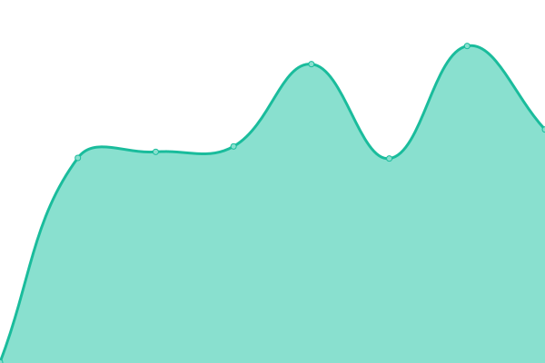

# [📈 Live Status](https://searxng.github.io/searx-instances-uptime): <!--live status--> **🟧 Partial outage**

This repository contains the open-source uptime monitor and status page for [SearXNG](https://searxng.org), powered by [Upptime](https://github.com/upptime/upptime).

With [Upptime](https://upptime.js.org), you can get your own unlimited and free uptime monitor and status page, powered entirely by a GitHub repository. We use [Issues](https://github.com/searxng/searx-instances-uptime/issues) as incident reports, [Actions](https://github.com/searxng/searx-instances-uptime/actions) as uptime monitors, and [Pages](https://searxng.github.io/searx-instances-uptime) for the status page.

<!--start: status pages-->
<!-- This summary is generated by Upptime (https://github.com/upptime/upptime) -->
<!-- Do not edit this manually, your changes will be overwritten -->
<!-- prettier-ignore -->
| URL | Status | History | Response Time | Uptime |
| --- | ------ | ------- | ------------- | ------ |
|  [searx.space](https://searx.space) | 🟩 Up | [searx-space.yml](https://github.com/searxng/searx-instances-uptime/commits/HEAD/history/searx-space.yml) | 

 674ms
     
 | 

<a href="https://uptime.searxng.org/history/searx-space">100.00%</a>
    

|  [anon.sx](https://anon.sx) | 🟩 Up | [anon-sx.yml](https://github.com/searxng/searx-instances-uptime/commits/HEAD/history/anon-sx.yml) | 

 535ms
     
 | 

<a href="https://uptime.searxng.org/history/anon-sx">100.00%</a>
    

|  [darmarit.org](https://darmarit.org/searx) | 🟩 Up | [darmarit-org.yml](https://github.com/searxng/searx-instances-uptime/commits/HEAD/history/darmarit-org.yml) | 

 667ms
     
 | 

<a href="https://uptime.searxng.org/history/darmarit-org">100.00%</a>
    

|  [de.xcxc.ml](https://de.xcxc.ml) | 🟩 Up | [de-xcxc-ml.yml](https://github.com/searxng/searx-instances-uptime/commits/HEAD/history/de-xcxc-ml.yml) | 

 758ms
     
 | 

<a href="https://uptime.searxng.org/history/de-xcxc-ml">100.00%</a>
    

|  [dynabyte.ca](https://dynabyte.ca) | 🟩 Up | [dynabyte-ca.yml](https://github.com/searxng/searx-instances-uptime/commits/HEAD/history/dynabyte-ca.yml) | 

 835ms
     
 | 

<a href="https://uptime.searxng.org/history/dynabyte-ca">100.00%</a>
    

|  [etsi.me](https://etsi.me) | 🟩 Up | [etsi-me.yml](https://github.com/searxng/searx-instances-uptime/commits/HEAD/history/etsi-me.yml) | 

 197ms
     
 | 

<a href="https://uptime.searxng.org/history/etsi-me">100.00%</a>
    

|  [icanfindit.online](https://icanfindit.online) | 🟩 Up | [icanfindit-online.yml](https://github.com/searxng/searx-instances-uptime/commits/HEAD/history/icanfindit-online.yml) | 

 235ms
     
 | 

<a href="https://uptime.searxng.org/history/icanfindit-online">100.00%</a>
    

|  [jsearch.pw](https://jsearch.pw) | 🟩 Up | [jsearch-pw.yml](https://github.com/searxng/searx-instances-uptime/commits/HEAD/history/jsearch-pw.yml) | 

 171ms
     
 | 

<a href="https://uptime.searxng.org/history/jsearch-pw">99.85%</a>
    

|  [northboot.xyz](https://northboot.xyz) | 🟩 Up | [northboot-xyz.yml](https://github.com/searxng/searx-instances-uptime/commits/HEAD/history/northboot-xyz.yml) | 

 623ms
     
 | 

<a href="https://uptime.searxng.org/history/northboot-xyz">100.00%</a>
    

|  [notgoogle.win](https://notgoogle.win) | 🟥 Down | [notgoogle-win.yml](https://github.com/searxng/searx-instances-uptime/commits/HEAD/history/notgoogle-win.yml) | 

 241ms
     
 | 

<a href="https://uptime.searxng.org/history/notgoogle-win">71.55%</a>
    

|  [opnxng.com](https://opnxng.com) | 🟩 Up | [opnxng-com.yml](https://github.com/searxng/searx-instances-uptime/commits/HEAD/history/opnxng-com.yml) | 

 606ms
     
 | 

<a href="https://uptime.searxng.org/history/opnxng-com">100.00%</a>
    

|  [paulgo.io](https://paulgo.io) | 🟩 Up | [paulgo-io.yml](https://github.com/searxng/searx-instances-uptime/commits/HEAD/history/paulgo-io.yml) | 

 604ms
     
 | 

<a href="https://uptime.searxng.org/history/paulgo-io">100.00%</a>
    

|  [private-searx.ml](https://private-searx.ml) | 🟩 Up | [private-searx-ml.yml](https://github.com/searxng/searx-instances-uptime/commits/HEAD/history/private-searx-ml.yml) | 

 418ms
     
 | 

<a href="https://uptime.searxng.org/history/private-searx-ml">100.00%</a>
    

|  [privatus.live](https://privatus.live) | 🟩 Up | [privatus-live.yml](https://github.com/searxng/searx-instances-uptime/commits/HEAD/history/privatus-live.yml) | 

 581ms
     
 | 

<a href="https://uptime.searxng.org/history/privatus-live">99.79%</a>
    

|  [s.frlt.one](https://s.frlt.one) | 🟩 Up | [s-frlt-one.yml](https://github.com/searxng/searx-instances-uptime/commits/HEAD/history/s-frlt-one.yml) | 

 745ms
     
 | 

<a href="https://uptime.searxng.org/history/s-frlt-one">100.00%</a>
    

|  [s.zhaocloud.net](https://s.zhaocloud.net) | 🟩 Up | [s-zhaocloud-net.yml](https://github.com/searxng/searx-instances-uptime/commits/HEAD/history/s-zhaocloud-net.yml) | 

 839ms
     
 | 

<a href="https://uptime.searxng.org/history/s-zhaocloud-net">100.00%</a>
    

|  [search.ashs.club](https://search.ashs.club) | 🟩 Up | [search-ashs-club.yml](https://github.com/searxng/searx-instances-uptime/commits/HEAD/history/search-ashs-club.yml) | 

 233ms
     
 | 

<a href="https://uptime.searxng.org/history/search-ashs-club">100.00%</a>
    

|  [search.bingowaves.xyz](https://search.bingowaves.xyz) | 🟩 Up | [search-bingowaves-xyz.yml](https://github.com/searxng/searx-instances-uptime/commits/HEAD/history/search-bingowaves-xyz.yml) | 

 478ms
     
 | 

<a href="https://uptime.searxng.org/history/search-bingowaves-xyz">99.64%</a>
    

|  [search.bus-hit.me](https://search.bus-hit.me) | 🟩 Up | [search-bus-hit-me.yml](https://github.com/searxng/searx-instances-uptime/commits/HEAD/history/search-bus-hit-me.yml) | 

 254ms
     
 | 

<a href="https://uptime.searxng.org/history/search-bus-hit-me">100.00%</a>
    

|  [search.chemicals-in-the-water.eu](https://search.chemicals-in-the-water.eu) | 🟩 Up | [search-chemicals-in-the-water-eu.yml](https://github.com/searxng/searx-instances-uptime/commits/HEAD/history/search-chemicals-in-the-water-eu.yml) | 

 825ms
     
 | 

<a href="https://uptime.searxng.org/history/search-chemicals-in-the-water-eu">99.09%</a>
    

|  [search.disroot.org](https://search.disroot.org) | 🟩 Up | [search-disroot-org.yml](https://github.com/searxng/searx-instances-uptime/commits/HEAD/history/search-disroot-org.yml) | 

 779ms
     
 | 

<a href="https://uptime.searxng.org/history/search-disroot-org">100.00%</a>
    

|  [search.ethibox.fr](https://search.ethibox.fr) | 🟩 Up | [search-ethibox-fr.yml](https://github.com/searxng/searx-instances-uptime/commits/HEAD/history/search-ethibox-fr.yml) | 

 904ms
     
 | 

<a href="https://uptime.searxng.org/history/search-ethibox-fr">100.00%</a>
    

|  [search.gcomm.ch](https://search.gcomm.ch) | 🟩 Up | [search-gcomm-ch.yml](https://github.com/searxng/searx-instances-uptime/commits/HEAD/history/search-gcomm-ch.yml) | 

 521ms
     
 | 

<a href="https://uptime.searxng.org/history/search-gcomm-ch">99.50%</a>
    

|  [search.kiwitalk.de](https://search.kiwitalk.de) | 🟩 Up | [search-kiwitalk-de.yml](https://github.com/searxng/searx-instances-uptime/commits/HEAD/history/search-kiwitalk-de.yml) | 

 599ms
     
 | 

<a href="https://uptime.searxng.org/history/search-kiwitalk-de">100.00%</a>
    

|  [search.mdosch.de](https://search.mdosch.de) | 🟩 Up | [search-mdosch-de.yml](https://github.com/searxng/searx-instances-uptime/commits/HEAD/history/search-mdosch-de.yml) | 

 677ms
     
 | 

<a href="https://uptime.searxng.org/history/search-mdosch-de">100.00%</a>
    

|  [search.neet.works](https://search.neet.works) | 🟩 Up | [search-neet-works.yml](https://github.com/searxng/searx-instances-uptime/commits/HEAD/history/search-neet-works.yml) | 

 304ms
     
 | 

<a href="https://uptime.searxng.org/history/search-neet-works">100.00%</a>
    

|  [search.ononoki.org](https://search.ononoki.org) | 🟩 Up | [search-ononoki-org.yml](https://github.com/searxng/searx-instances-uptime/commits/HEAD/history/search-ononoki-org.yml) | 

 271ms
     
 | 

<a href="https://uptime.searxng.org/history/search-ononoki-org">99.79%</a>
    

|  [search.privacyguides.net](https://search.privacyguides.net) | 🟩 Up | [search-privacyguides-net.yml](https://github.com/searxng/searx-instances-uptime/commits/HEAD/history/search-privacyguides-net.yml) | 

 151ms
     
 | 

<a href="https://uptime.searxng.org/history/search-privacyguides-net">100.00%</a>
    

|  [search.projectsegfau.lt](https://search.projectsegfau.lt) | 🟩 Up | [search-projectsegfau-lt.yml](https://github.com/searxng/searx-instances-uptime/commits/HEAD/history/search-projectsegfau-lt.yml) | 

 1076ms
     
 | 

<a href="https://uptime.searxng.org/history/search-projectsegfau-lt">100.00%</a>
    

|  [search.rabbit-company.com](https://search.rabbit-company.com) | 🟩 Up | [search-rabbit-company-com.yml](https://github.com/searxng/searx-instances-uptime/commits/HEAD/history/search-rabbit-company-com.yml) | 

 411ms
     
 | 

<a href="https://uptime.searxng.org/history/search-rabbit-company-com">100.00%</a>
    

|  [search.sapti.me](https://search.sapti.me) | 🟩 Up | [search-sapti-me.yml](https://github.com/searxng/searx-instances-uptime/commits/HEAD/history/search-sapti-me.yml) | 

 587ms
     
 | 

<a href="https://uptime.searxng.org/history/search-sapti-me">99.87%</a>
    

|  [search.snopyta.org](https://search.snopyta.org) | 🟩 Up | [search-snopyta-org.yml](https://github.com/searxng/searx-instances-uptime/commits/HEAD/history/search-snopyta-org.yml) | 

 719ms
     
 | 

<a href="https://uptime.searxng.org/history/search-snopyta-org">100.00%</a>
    

|  [search.stinpriza.org](https://search.stinpriza.org) | 🟩 Up | [search-stinpriza-org.yml](https://github.com/searxng/searx-instances-uptime/commits/HEAD/history/search-stinpriza-org.yml) | 

 865ms
     
 | 

<a href="https://uptime.searxng.org/history/search-stinpriza-org">100.00%</a>
    

|  [search.teamriverbubbles.com](https://search.teamriverbubbles.com) | 🟩 Up | [search-teamriverbubbles-com.yml](https://github.com/searxng/searx-instances-uptime/commits/HEAD/history/search-teamriverbubbles-com.yml) | 

 131ms
     
 | 

<a href="https://uptime.searxng.org/history/search-teamriverbubbles-com">100.00%</a>
    

|  [search.trom.tf](https://search.trom.tf) | 🟩 Up | [search-trom-tf.yml](https://github.com/searxng/searx-instances-uptime/commits/HEAD/history/search-trom-tf.yml) | 

 638ms
     
 | 

<a href="https://uptime.searxng.org/history/search-trom-tf">100.00%</a>
    

|  [search.unlocked.link](https://search.unlocked.link) | 🟩 Up | [search-unlocked-link.yml](https://github.com/searxng/searx-instances-uptime/commits/HEAD/history/search-unlocked-link.yml) | 

 655ms
     
 | 

<a href="https://uptime.searxng.org/history/search-unlocked-link">99.48%</a>
    

|  [search.vojkovic.xyz](https://search.vojkovic.xyz) | 🟩 Up | [search-vojkovic-xyz.yml](https://github.com/searxng/searx-instances-uptime/commits/HEAD/history/search-vojkovic-xyz.yml) | 

 663ms
     
 | 

<a href="https://uptime.searxng.org/history/search-vojkovic-xyz">100.00%</a>
    

|  [search.zzls.xyz](https://search.zzls.xyz) | 🟩 Up | [search-zzls-xyz.yml](https://github.com/searxng/searx-instances-uptime/commits/HEAD/history/search-zzls-xyz.yml) | 

 1350ms
     
 | 

<a href="https://uptime.searxng.org/history/search-zzls-xyz">98.79%</a>
    

|  [searx.be](https://searx.be) | 🟩 Up | [searx-be.yml](https://github.com/searxng/searx-instances-uptime/commits/HEAD/history/searx-be.yml) | 

 718ms
     
 | 

<a href="https://uptime.searxng.org/history/searx-be">100.00%</a>
    

|  [searx.becomesovran.com](https://searx.becomesovran.com) | 🟩 Up | [searx-becomesovran-com.yml](https://github.com/searxng/searx-instances-uptime/commits/HEAD/history/searx-becomesovran-com.yml) | 

 271ms
     
 | 

<a href="https://uptime.searxng.org/history/searx-becomesovran-com">100.00%</a>
    

|  [searx.bissisoft.com](https://searx.bissisoft.com) | 🟩 Up | [searx-bissisoft-com.yml](https://github.com/searxng/searx-instances-uptime/commits/HEAD/history/searx-bissisoft-com.yml) | 

 665ms
     
 | 

<a href="https://uptime.searxng.org/history/searx-bissisoft-com">100.00%</a>
    

|  [searx.chocoflan.net](https://searx.chocoflan.net) | 🟩 Up | [searx-chocoflan-net.yml](https://github.com/searxng/searx-instances-uptime/commits/HEAD/history/searx-chocoflan-net.yml) | 

 2608ms
     
 | 

<a href="https://uptime.searxng.org/history/searx-chocoflan-net">98.11%</a>
    

|  [searx.divided-by-zero.eu](https://searx.divided-by-zero.eu) | 🟩 Up | [searx-divided-by-zero-eu.yml](https://github.com/searxng/searx-instances-uptime/commits/HEAD/history/searx-divided-by-zero-eu.yml) | 

 688ms
     
 | 

<a href="https://uptime.searxng.org/history/searx-divided-by-zero-eu">100.00%</a>
    

|  [searx.dresden.network](https://searx.dresden.network) | 🟩 Up | [searx-dresden-network.yml](https://github.com/searxng/searx-instances-uptime/commits/HEAD/history/searx-dresden-network.yml) | 

 758ms
     
 | 

<a href="https://uptime.searxng.org/history/searx-dresden-network">100.00%</a>
    

|  [searx.ebnar.xyz](https://searx.ebnar.xyz) | 🟩 Up | [searx-ebnar-xyz.yml](https://github.com/searxng/searx-instances-uptime/commits/HEAD/history/searx-ebnar-xyz.yml) | 

 582ms
     
 | 

<a href="https://uptime.searxng.org/history/searx-ebnar-xyz">100.00%</a>
    

|  [searx.ericaftereric.top](https://searx.ericaftereric.top) | 🟩 Up | [searx-ericaftereric-top.yml](https://github.com/searxng/searx-instances-uptime/commits/HEAD/history/searx-ericaftereric-top.yml) | 

 846ms
     
 | 

<a href="https://uptime.searxng.org/history/searx-ericaftereric-top">100.00%</a>
    

|  [searx.esmailelbob.xyz](https://searx.esmailelbob.xyz) | 🟩 Up | [searx-esmailelbob-xyz.yml](https://github.com/searxng/searx-instances-uptime/commits/HEAD/history/searx-esmailelbob-xyz.yml) | 

 370ms
     
 | 

<a href="https://uptime.searxng.org/history/searx-esmailelbob-xyz">100.00%</a>
    

|  [searx.fi](https://searx.fi) | 🟩 Up | [searx-fi.yml](https://github.com/searxng/searx-instances-uptime/commits/HEAD/history/searx-fi.yml) | 

 580ms
     
 | 

<a href="https://uptime.searxng.org/history/searx-fi">100.00%</a>
    

|  [searx.fmac.xyz](https://searx.fmac.xyz) | 🟩 Up | [searx-fmac-xyz.yml](https://github.com/searxng/searx-instances-uptime/commits/HEAD/history/searx-fmac-xyz.yml) | 

 588ms
     
 | 

<a href="https://uptime.searxng.org/history/searx-fmac-xyz">100.00%</a>
    

|  [searx.fossencdi.org](https://searx.fossencdi.org) | 🟩 Up | [searx-fossencdi-org.yml](https://github.com/searxng/searx-instances-uptime/commits/HEAD/history/searx-fossencdi-org.yml) | 

 716ms
     
 | 

<a href="https://uptime.searxng.org/history/searx-fossencdi-org">100.00%</a>
    

|  [searx.gnous.eu](https://searx.gnous.eu) | 🟩 Up | [searx-gnous-eu.yml](https://github.com/searxng/searx-instances-uptime/commits/HEAD/history/searx-gnous-eu.yml) | 

 743ms
     
 | 

<a href="https://uptime.searxng.org/history/searx-gnous-eu">100.00%</a>
    

|  [searx.gnu.style](https://searx.gnu.style) | 🟩 Up | [searx-gnu-style.yml](https://github.com/searxng/searx-instances-uptime/commits/HEAD/history/searx-gnu-style.yml) | 

 684ms
     
 | 

<a href="https://uptime.searxng.org/history/searx-gnu-style">100.00%</a>
    

|  [searx.kujonello.cf](https://searx.kujonello.cf) | 🟩 Up | [searx-kujonello-cf.yml](https://github.com/searxng/searx-instances-uptime/commits/HEAD/history/searx-kujonello-cf.yml) | 

 1415ms
     
 | 

<a href="https://uptime.searxng.org/history/searx-kujonello-cf">97.87%</a>
    

|  [searx.loafland.xyz](https://searx.loafland.xyz) | 🟩 Up | [searx-loafland-xyz.yml](https://github.com/searxng/searx-instances-uptime/commits/HEAD/history/searx-loafland-xyz.yml) | 

 137ms
     
 | 

<a href="https://uptime.searxng.org/history/searx-loafland-xyz">100.00%</a>
    

|  [searx.mastodontech.de](https://searx.mastodontech.de) | 🟩 Up | [searx-mastodontech-de.yml](https://github.com/searxng/searx-instances-uptime/commits/HEAD/history/searx-mastodontech-de.yml) | 

 799ms
     
 | 

<a href="https://uptime.searxng.org/history/searx-mastodontech-de">100.00%</a>
    

|  [searx.mha.fi](https://searx.mha.fi) | 🟩 Up | [searx-mha-fi.yml](https://github.com/searxng/searx-instances-uptime/commits/HEAD/history/searx-mha-fi.yml) | 

 554ms
     
 | 

<a href="https://uptime.searxng.org/history/searx-mha-fi">100.00%</a>
    

|  [searx.mistli.net](https://searx.mistli.net) | 🟩 Up | [searx-mistli-net.yml](https://github.com/searxng/searx-instances-uptime/commits/HEAD/history/searx-mistli-net.yml) | 

 346ms
     
 | 

<a href="https://uptime.searxng.org/history/searx-mistli-net">100.00%</a>
    

|  [searx.mxchange.org](https://searx.mxchange.org) | 🟩 Up | [searx-mxchange-org.yml](https://github.com/searxng/searx-instances-uptime/commits/HEAD/history/searx-mxchange-org.yml) | 

 1510ms
     
 | 

<a href="https://uptime.searxng.org/history/searx-mxchange-org">100.00%</a>
    

|  [searx.nakhan.net](https://searx.nakhan.net) | 🟩 Up | [searx-nakhan-net.yml](https://github.com/searxng/searx-instances-uptime/commits/HEAD/history/searx-nakhan-net.yml) | 

 942ms
     
 | 

<a href="https://uptime.searxng.org/history/searx-nakhan-net">100.00%</a>
    

|  [searx.namejeff.xyz](https://searx.namejeff.xyz) | 🟩 Up | [searx-namejeff-xyz.yml](https://github.com/searxng/searx-instances-uptime/commits/HEAD/history/searx-namejeff-xyz.yml) | 

 429ms
     
 | 

<a href="https://uptime.searxng.org/history/searx-namejeff-xyz">100.00%</a>
    

|  [searx.netzspielplatz.de](https://searx.netzspielplatz.de) | 🟩 Up | [searx-netzspielplatz-de.yml](https://github.com/searxng/searx-instances-uptime/commits/HEAD/history/searx-netzspielplatz-de.yml) | 

 647ms
     
 | 

<a href="https://uptime.searxng.org/history/searx-netzspielplatz-de">100.00%</a>
    

|  [searx.nixnet.services](https://searx.nixnet.services) | 🟩 Up | [searx-nixnet-services.yml](https://github.com/searxng/searx-instances-uptime/commits/HEAD/history/searx-nixnet-services.yml) | 

 782ms
     
 | 

<a href="https://uptime.searxng.org/history/searx-nixnet-services">100.00%</a>
    

|  [searx.org](https://searx.org) | 🟩 Up | [searx-org.yml](https://github.com/searxng/searx-instances-uptime/commits/HEAD/history/searx-org.yml) | 

 683ms
     
 | 

<a href="https://uptime.searxng.org/history/searx-org">100.00%</a>
    

|  [searx.orion-hub.fr](https://searx.orion-hub.fr) | 🟩 Up | [searx-orion-hub-fr.yml](https://github.com/searxng/searx-instances-uptime/commits/HEAD/history/searx-orion-hub-fr.yml) | 

 673ms
     
 | 

<a href="https://uptime.searxng.org/history/searx-orion-hub-fr">100.00%</a>
    

|  [searx.priv.pw](https://searx.priv.pw) | 🟩 Up | [searx-priv-pw.yml](https://github.com/searxng/searx-instances-uptime/commits/HEAD/history/searx-priv-pw.yml) | 

 462ms
     
 | 

<a href="https://uptime.searxng.org/history/searx-priv-pw">100.00%</a>
    

|  [searx.prvcy.eu](https://searx.prvcy.eu) | 🟩 Up | [searx-prvcy-eu.yml](https://github.com/searxng/searx-instances-uptime/commits/HEAD/history/searx-prvcy-eu.yml) | 

 732ms
     
 | 

<a href="https://uptime.searxng.org/history/searx-prvcy-eu">100.00%</a>
    

|  [searx.pwoss.org](https://searx.pwoss.org) | 🟩 Up | [searx-pwoss-org.yml](https://github.com/searxng/searx-instances-uptime/commits/HEAD/history/searx-pwoss-org.yml) | 

 621ms
     
 | 

<a href="https://uptime.searxng.org/history/searx-pwoss-org">100.00%</a>
    

|  [searx.rasp.fr](https://searx.rasp.fr) | 🟩 Up | [searx-rasp-fr.yml](https://github.com/searxng/searx-instances-uptime/commits/HEAD/history/searx-rasp-fr.yml) | 

 1806ms
     
 | 

<a href="https://uptime.searxng.org/history/searx-rasp-fr">100.00%</a>
    

|  [searx.ru](https://searx.ru) | 🟩 Up | [searx-ru.yml](https://github.com/searxng/searx-instances-uptime/commits/HEAD/history/searx-ru.yml) | 

 856ms
     
 | 

<a href="https://uptime.searxng.org/history/searx-ru">100.00%</a>
    

|  [searx.run](https://searx.run) | 🟩 Up | [searx-run.yml](https://github.com/searxng/searx-instances-uptime/commits/HEAD/history/searx-run.yml) | 

 716ms
     
 | 

<a href="https://uptime.searxng.org/history/searx-run">100.00%</a>
    

|  [searx.semipvt.com](https://searx.semipvt.com) | 🟩 Up | [searx-semipvt-com.yml](https://github.com/searxng/searx-instances-uptime/commits/HEAD/history/searx-semipvt-com.yml) | 

 673ms
     
 | 

<a href="https://uptime.searxng.org/history/searx-semipvt-com">100.00%</a>
    

|  [searx.sethforprivacy.com](https://searx.sethforprivacy.com) | 🟩 Up | [searx-sethforprivacy-com.yml](https://github.com/searxng/searx-instances-uptime/commits/HEAD/history/searx-sethforprivacy-com.yml) | 

 434ms
     
 | 

<a href="https://uptime.searxng.org/history/searx-sethforprivacy-com">100.00%</a>
    

|  [searx.sev.monster](https://searx.sev.monster) | 🟩 Up | [searx-sev-monster.yml](https://github.com/searxng/searx-instances-uptime/commits/HEAD/history/searx-sev-monster.yml) | 

 362ms
     
 | 

<a href="https://uptime.searxng.org/history/searx-sev-monster">100.00%</a>
    

|  [searx.slipfox.xyz](https://searx.slipfox.xyz/searx) | 🟩 Up | [searx-slipfox-xyz.yml](https://github.com/searxng/searx-instances-uptime/commits/HEAD/history/searx-slipfox-xyz.yml) | 

 241ms
     
 | 

<a href="https://uptime.searxng.org/history/searx-slipfox-xyz">100.00%</a>
    

|  [searx.sp-codes.de](https://searx.sp-codes.de) | 🟩 Up | [searx-sp-codes-de.yml](https://github.com/searxng/searx-instances-uptime/commits/HEAD/history/searx-sp-codes-de.yml) | 

 1023ms
     
 | 

<a href="https://uptime.searxng.org/history/searx-sp-codes-de">100.00%</a>
    

|  [searx.stuehieyr.com](https://searx.stuehieyr.com) | 🟩 Up | [searx-stuehieyr-com.yml](https://github.com/searxng/searx-instances-uptime/commits/HEAD/history/searx-stuehieyr-com.yml) | 

 963ms
     
 | 

<a href="https://uptime.searxng.org/history/searx-stuehieyr-com">100.00%</a>
    

|  [searx.tiekoetter.com](https://searx.tiekoetter.com) | 🟩 Up | [searx-tiekoetter-com.yml](https://github.com/searxng/searx-instances-uptime/commits/HEAD/history/searx-tiekoetter-com.yml) | 

 705ms
     
 | 

<a href="https://uptime.searxng.org/history/searx-tiekoetter-com">99.60%</a>
    

|  [searx.tuxcloud.net](https://searx.tuxcloud.net) | 🟩 Up | [searx-tuxcloud-net.yml](https://github.com/searxng/searx-instances-uptime/commits/HEAD/history/searx-tuxcloud-net.yml) | 

 599ms
     
 | 

<a href="https://uptime.searxng.org/history/searx-tuxcloud-net">100.00%</a>
    

|  [searx.tyil.nl](https://searx.tyil.nl) | 🟩 Up | [searx-tyil-nl.yml](https://github.com/searxng/searx-instances-uptime/commits/HEAD/history/searx-tyil-nl.yml) | 

 1021ms
     
 | 

<a href="https://uptime.searxng.org/history/searx-tyil-nl">100.00%</a>
    

|  [searx.vanwa.tech](https://searx.vanwa.tech) | 🟩 Up | [searx-vanwa-tech.yml](https://github.com/searxng/searx-instances-uptime/commits/HEAD/history/searx-vanwa-tech.yml) | 

 553ms
     
 | 

<a href="https://uptime.searxng.org/history/searx-vanwa-tech">82.87%</a>
    

|  [searx.vimproved.me](https://searx.vimproved.me) | 🟩 Up | [searx-vimproved-me.yml](https://github.com/searxng/searx-instances-uptime/commits/HEAD/history/searx-vimproved-me.yml) | 

 988ms
     
 | 

<a href="https://uptime.searxng.org/history/searx-vimproved-me">99.10%</a>
    

|  [searx.webheberg.info](https://searx.webheberg.info) | 🟩 Up | [searx-webheberg-info.yml](https://github.com/searxng/searx-instances-uptime/commits/HEAD/history/searx-webheberg-info.yml) | 

 818ms
     
 | 

<a href="https://uptime.searxng.org/history/searx-webheberg-info">100.00%</a>
    

|  [searx.xyz](https://searx.xyz) | 🟩 Up | [searx-xyz.yml](https://github.com/searxng/searx-instances-uptime/commits/HEAD/history/searx-xyz.yml) | 

 493ms
     
 | 

<a href="https://uptime.searxng.org/history/searx-xyz">99.87%</a>
    

|  [searx.youshitsune.me](https://searx.youshitsune.me) | 🟩 Up | [searx-youshitsune-me.yml](https://github.com/searxng/searx-instances-uptime/commits/HEAD/history/searx-youshitsune-me.yml) | 

 153ms
     
 | 

<a href="https://uptime.searxng.org/history/searx-youshitsune-me">88.15%</a>
    

|  [searx.zapashcanon.fr](https://searx.zapashcanon.fr) | 🟩 Up | [searx-zapashcanon-fr.yml](https://github.com/searxng/searx-instances-uptime/commits/HEAD/history/searx-zapashcanon-fr.yml) | 

 710ms
     
 | 

<a href="https://uptime.searxng.org/history/searx-zapashcanon-fr">97.66%</a>
    

|  [searx.zcyph.cc](https://searx.zcyph.cc) | 🟩 Up | [searx-zcyph-cc.yml](https://github.com/searxng/searx-instances-uptime/commits/HEAD/history/searx-zcyph-cc.yml) | 

 520ms
     
 | 

<a href="https://uptime.searxng.org/history/searx-zcyph-cc">99.83%</a>
    

|  [searxng.au](https://searxng.au/searx) | 🟩 Up | [searxng-au.yml](https://github.com/searxng/searx-instances-uptime/commits/HEAD/history/searxng-au.yml) | 

 937ms
     
 | 

<a href="https://uptime.searxng.org/history/searxng-au">100.00%</a>
    

|  [searxng.ir](https://searxng.ir) | 🟥 Down | [searxng-ir.yml](https://github.com/searxng/searx-instances-uptime/commits/HEAD/history/searxng-ir.yml) | 

 1250ms
     
 | 

<a href="https://uptime.searxng.org/history/searxng-ir">99.80%</a>
    

|  [searxng.tordenskjold.de](https://searxng.tordenskjold.de) | 🟩 Up | [searxng-tordenskjold-de.yml](https://github.com/searxng/searx-instances-uptime/commits/HEAD/history/searxng-tordenskjold-de.yml) | 

 701ms
     
 | 

<a href="https://uptime.searxng.org/history/searxng-tordenskjold-de">99.82%</a>
    

|  [searxng.zackptg5.com](https://searxng.zackptg5.com) | 🟩 Up | [searxng-zackptg5-com.yml](https://github.com/searxng/searx-instances-uptime/commits/HEAD/history/searxng-zackptg5-com.yml) | 

 187ms
     
 | 

<a href="https://uptime.searxng.org/history/searxng-zackptg5-com">96.25%</a>
    

|  [serx.ml](https://serx.ml) | 🟩 Up | [serx-ml.yml](https://github.com/searxng/searx-instances-uptime/commits/HEAD/history/serx-ml.yml) | 

 371ms
     
 | 

<a href="https://uptime.searxng.org/history/serx-ml">100.00%</a>
    

|  [spot.ecloud.global](https://spot.ecloud.global) | 🟩 Up | [spot-ecloud-global.yml](https://github.com/searxng/searx-instances-uptime/commits/HEAD/history/spot-ecloud-global.yml) | 

 1120ms
     
 | 

<a href="https://uptime.searxng.org/history/spot-ecloud-global">100.00%</a>
    

|  [srx.cosmohub.io](https://srx.cosmohub.io) | 🟩 Up | [srx-cosmohub-io.yml](https://github.com/searxng/searx-instances-uptime/commits/HEAD/history/srx-cosmohub-io.yml) | 

 617ms
     
 | 

<a href="https://uptime.searxng.org/history/srx-cosmohub-io">100.00%</a>
    

|  [suche.dasnetzundich.de](https://suche.dasnetzundich.de) | 🟩 Up | [suche-dasnetzundich-de.yml](https://github.com/searxng/searx-instances-uptime/commits/HEAD/history/suche-dasnetzundich-de.yml) | 

 978ms
     
 | 

<a href="https://uptime.searxng.org/history/suche-dasnetzundich-de">100.00%</a>
    

|  [suche.tromdienste.de](https://suche.tromdienste.de) | 🟩 Up | [suche-tromdienste-de.yml](https://github.com/searxng/searx-instances-uptime/commits/HEAD/history/suche-tromdienste-de.yml) | 

 624ms
     
 | 

<a href="https://uptime.searxng.org/history/suche-tromdienste-de">99.57%</a>
    

|  [suche.uferwerk.org](https://suche.uferwerk.org) | 🟩 Up | [suche-uferwerk-org.yml](https://github.com/searxng/searx-instances-uptime/commits/HEAD/history/suche-uferwerk-org.yml) | 

 623ms
     
 | 

<a href="https://uptime.searxng.org/history/suche-uferwerk-org">100.00%</a>
    

|  [swag.pw](https://swag.pw) | 🟩 Up | [swag-pw.yml](https://github.com/searxng/searx-instances-uptime/commits/HEAD/history/swag-pw.yml) | 

 209ms
     
 | 

<a href="https://uptime.searxng.org/history/swag-pw">100.00%</a>
    

|  [sx.catgirl.cloud](https://sx.catgirl.cloud) | 🟩 Up | [sx-catgirl-cloud.yml](https://github.com/searxng/searx-instances-uptime/commits/HEAD/history/sx-catgirl-cloud.yml) | 

 645ms
     
 | 

<a href="https://uptime.searxng.org/history/sx-catgirl-cloud">100.00%</a>
    

|  [timdor.noip.me](https://timdor.noip.me/searx) | 🟩 Up | [timdor-noip-me.yml](https://github.com/searxng/searx-instances-uptime/commits/HEAD/history/timdor-noip-me.yml) | 

 344ms
     
 | 

<a href="https://uptime.searxng.org/history/timdor-noip-me">100.00%</a>
    

|  [wtf.roflcopter.fr](https://wtf.roflcopter.fr/searx) | 🟩 Up | [wtf-roflcopter-fr.yml](https://github.com/searxng/searx-instances-uptime/commits/HEAD/history/wtf-roflcopter-fr.yml) | 

 1098ms
     
 | 

<a href="https://uptime.searxng.org/history/wtf-roflcopter-fr">100.00%</a>
    

|  [www.gruble.de](https://www.gruble.de) | 🟩 Up | [www-gruble-de.yml](https://github.com/searxng/searx-instances-uptime/commits/HEAD/history/www-gruble-de.yml) | 

 629ms
     
 | 

<a href="https://uptime.searxng.org/history/www-gruble-de">99.80%</a>
    

|  [www.webrats.xyz](https://www.webrats.xyz) | 🟩 Up | [www-webrats-xyz.yml](https://github.com/searxng/searx-instances-uptime/commits/HEAD/history/www-webrats-xyz.yml) | 

 232ms
     
 | 

<a href="https://uptime.searxng.org/history/www-webrats-xyz">100.00%</a>
    

|  [xcxc.ml](https://xcxc.ml) | 🟩 Up | [xcxc-ml.yml](https://github.com/searxng/searx-instances-uptime/commits/HEAD/history/xcxc-ml.yml) | 

 765ms
     
 | 

<a href="https://uptime.searxng.org/history/xcxc-ml">99.88%</a>
    

<!--end: status pages-->

[**Visit our status website →**](https://searxng.github.io/searx-instances-uptime)

## 📄 License

- Powered by: [Upptime](https://github.com/upptime/upptime)
- Code: [MIT](./LICENSE) © [SearXNG](https://searxng.org)
- Data in the `./history` directory: [Open Database License](https://opendatacommons.org/licenses/odbl/1-0/)
